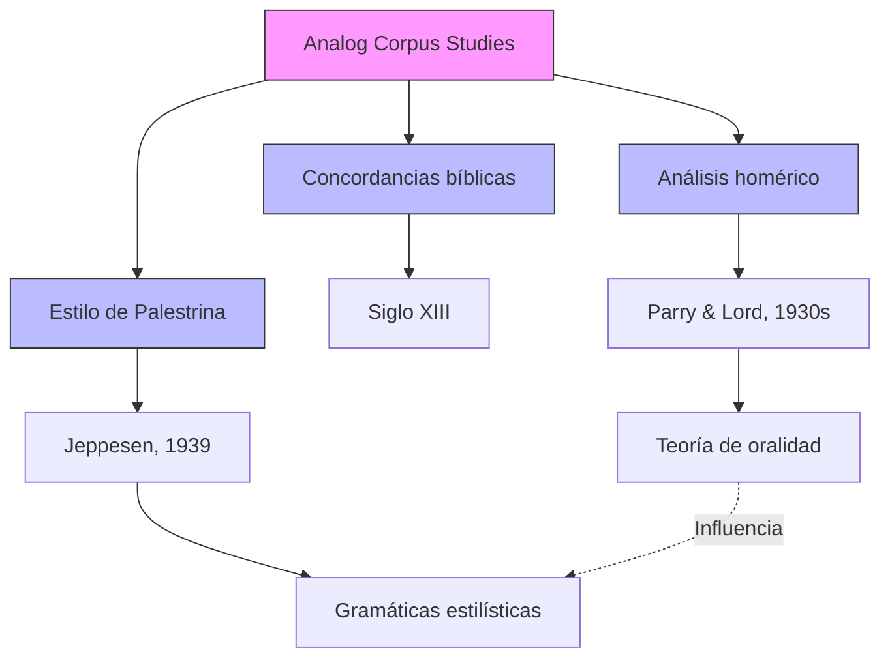

## Contexto y antecedentes  
Los estudios de corpus analógicos emergen como respuesta a la necesidad de analizar grandes colecciones de obras antes de la era digital. Se enmarcan en tradiciones como la filología (concordancias bíblicas) y la etnomusicología (análisis de tradiciones orales). La limitación tecnológica incentivó métodos manuales para identificar patrones estilísticos y estructuras recurrentes.

## Objetivo  
Demostrar que el análisis sistemático de corpus musicales y textuales es posible sin herramientas computacionales, centrándose en preguntas sobre estilo, oralidad y transmisión cultural.

## Metodología  
1. **Concordancias manuales**: Identificación de repeticiones léxicas o temáticas (ej. Biblia).  
2. **Análisis comparativo**: Estudio de variantes en tradiciones orales (Parry/Lord).  
3. **Taxonomías estilísticas**: Clasificación de características compositivas (Jeppesen en Palestrina).  

## Principales resultados  
- Los patrones de repetición en Homero sustentan la teoría de la oralidad.  
- Las fórmulas melódicas en Palestrina revelan gramáticas estilísticas implícitas.  
- La ausencia de herramientas digitales no invalida el análisis cuantitativo a gran escala.  

## Implicaciones y trabajo futuro  
- Revaluación crítica de métodos pre-digitales en musicología computacional.  
- Integración potencial con IA para entrenar modelos basados en observaciones analógicas.  
- Aplicación a repertorios no occidentales con tradiciones analíticas propias.  

## Crítica  
- Sesgo selectivo: Los corpus analógicos suelen ser limitados por el acceso físico a fuentes.  
- Escalabilidad: El análisis manual es inviable para colecciones masivas (>10k obras).  
- Subjetividad: La identificación de patrones depende de criterios no estandarizados.  

## Contexto musical  
El método de Jeppesen en Palestrina (1939) estableció un paradigma para analizar:  
- Proporciones interválicas en cadencias.  
- Uso de consonancias/disonancias.  
- Jerarquías vocales.  
Estos principios influyeron en pedagogías de contrapunto historicista.  

## Visualización  



## Representación musical  
```lily
\version "2.24.0"
\paper { tagline = ##f  paper-height=#(* 5 cm) paper-width=#(* 20 cm)  system-count=#1 }
\score {
    \new Staff {
        \relative c' {
            \time 4/4
            \key c \major
            c4( d e f) | g2( a) | b4( c d e) | f1 |
        }
    }
}
```
*Metáfora: Progresión tonal como "concordancia" de funciones armónicas (I-IV-V-I).*

## Preguntas de estudio  
1. **¿Cómo difieren los corpus analógicos de los digitales?**::En escalabilidad y métodos, no en objetivos.  
2. **Nombre un hallazgo clave de Parry/Lord**::Los epítetos repetidos en Homero reflejan oralidad.  
3. **¿Qué limitación tiene el análisis manual?**::Dependencia de muestras pequeñas y criterios subjetivos.  
4. **Proponga una aplicación contemporánea**::Analizar memes musicales en plataformas digitales usando taxonomías analógicas.  

## Referencias  
```bibtex
@incollection{gjerdingen2022,
  author = {Gjerdingen, Robert O.},
  title = {Analog Corpus Studies},
  booktitle = {Oxford Handbook of Music Corpus Studies},
  year = {2022},
  doi = {10.1093/oxfordhb/9780190945442.013.2}
}
```


> [!important] En mis palabras  
> ### 1  
> *patrones* *oralidad* *estilo*  
> ### 2  
> *manual* *escalabilidad* *subjetividad*  
> ### 3  
> *Jeppesen* *contrapunto* *taxonomías*