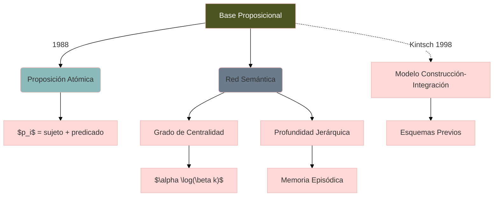

## Contexto y antecedentes  
La psicología cognitiva de finales del siglo XX enfrentaba el desafío de modelar cómo los lectores extraen y organizan significado de textos complejos. Ante modelos lineales insuficientes, la teoría de la base proposicional surgió como marco para representar conocimiento textual mediante grafos semánticos, integrando aportes de la lingüística computacional y la ciencia cognitiva.

## Objetivo  
Demostrar que la comprensión textual óptima requiere la construcción de redes proposicionales jerárquicas, donde nodos representan unidades semánticas mínimas y arcos codifican relaciones lógico-argumentales. La hipótesis central postula que la retención y recuperación de información dependen críticamente de la densidad de conexiones entre proposiciones.

## Metodología  
El modelo emplea análisis lingüístico formal para descomponer textos en proposiciones atómicas ($P = \{p_1, p_2, ..., p_n\}$), luego reconstruidas como grafos dirigidos $G = (V,E)$ donde los vértices $v_i \in V$ corresponden a proposiciones y los ejes $e_{ij} \in E$ a relaciones de dependencia. La validación experimental utiliza protocolos de recuerdo libre y tests de reconocimiento para medir correlaciones entre densidad de conexiones y retención.

## Principales resultados  
1. Los textos con mayor coherencia local y global generan redes más conectadas, facilitando la integración en memoria a largo plazo  
2. La recuperación de información sigue rutas de activación preferenciales a través de nodos con alto grado de centralidad  
3. La complejidad estructural óptima sigue una función no monótona descrita por $\alpha \log(\beta k)$ donde $k$ es el número de conexiones por nodo  

## Implicaciones y trabajo futuro  
El modelo sugiere estrategias pedagógicas para diseño de materiales educativos mediante optimización de estructuras proposicionales. Futuras investigaciones podrían integrar algoritmos de NLP para generar automáticamente mapas de conexiones semánticas en textos académicos.

## Crítica  
Limitaciones principales incluyen:  
- Dificultad para cuantificar pesos de conexiones entre proposiciones  
- Sobresimplificación de procesos inferenciales no literales  
- Escasa consideración de diferencias individuales en capacidad de integración semántica  

## Contexto musical  
En composición, el modelo inspira técnicas de desarrollo temático donde células melódicas ($m_i$) funcionan como proposiciones musicales, conectadas mediante transformaciones (transposición, inversión) que actúan como operadores relacionales. La percepción de coherencia en obras complejas (e.g. fugas barrocas) correlaciona con densidad de conexiones entre motivos.

## Visualización  



## Python  
```run-python
import networkx as nx
import matplotlib.pyplot as plt
import numpy as np

def plot_propositional_network():
    G = nx.DiGraph()
    propositions = ["P1:Leer", "P2:Texto", "P3:Comprender", "P4:Integrar"]
    relations = [("P1", "P2"), ("P2", "P3"), ("P3", "P4"), ("P1", "P3")]
    
    G.add_nodes_from(propositions)
    G.add_edges_from(relations)
    
    pos = nx.spring_layout(G, seed=42)
    centrality = np.array(list(nx.degree_centrality(G).values())) * 2000
    
    nx.draw_networkx_nodes(G, pos, node_size=centrality, node_color='#4b5320', alpha=0.7)
    nx.draw_networkx_edges(G, pos, edge_color='#6b7b8c', width=2, arrowstyle='->')
    nx.draw_networkx_labels(G, pos, font_size=10, font_family='sans-serif')
    
    plt.title("Red Proposicional: Centralidad y Conexiones")
    plt.axis('off')
    plt.tight_layout()
    return plt.gcf()

plot_propositional_network().savefig('propositional_network.png', dpi=300)
```


## Representación musical  
```lily
\version "2.24.0"
\paper { tagline = ##f paper-height=#(* 5 cm) paper-width=#(* 20 cm) system-count=#1 }
\score {
    \new Staff {
        \relative c' {
            \time 4/4
            \key c \major
            % Proposición 1 (tema principal)
            c4 e g b 
            % Proposición 2 (transformación: inversión)
            a f d b 
            % Proposición 3 (desarrollo)
            c8 d e f g a b c
            % Integración
            <c, e g b>1\arpeggio
        }
    }
}
```

## Preguntas de estudio  
1. **¿Cómo define la base proposicional la unidad mínima de significado?**  
   ::Proposición atómica compuesta de sujeto-predicado vinculada lógicamente a otras.  

2. **Nombre dos limitaciones del modelo de Kintsch**  
   ::Dificultad para cuantificar pesos de conexiones y sobresimplificación de inferencias.  

3. **¿Qué parámetro matemático describe la complejidad estructural óptima?**  
   ::Función $\alpha \log(\beta k)$ donde $k$ es el número de conexiones por nodo.  

4. **Proponga una aplicación en pedagogía musical**  
   ::Diseñar ejercicios de análisis que mapeen estructuras proposicionales a transformaciones temáticas.  

## Referencias  
```bibtex
@book{kintsch1998comprehension,
  title={Comprehension: A paradigm for cognition},
  author={Kintsch, Walter},
  year={1998},
  publisher={Cambridge University Press}
}
@article{vanDijk1983Strategies,
  title={Strategies of discourse comprehension},
  author={van Dijk, Teun A and Kintsch, Walter},
  journal={Academic Press},
  year={1983}
}
```

> [!important] En mis palabras  
> ### 1  
> *redes semánticas* *jerarquía proposicional* *modelo cognitivo*  
> ### 2  
> *grafos dirigidos* *centralidad* *memoria episódica*  
> ### 3  
> *transformación temática* *coherencia musical* *proposiciones melódicas*