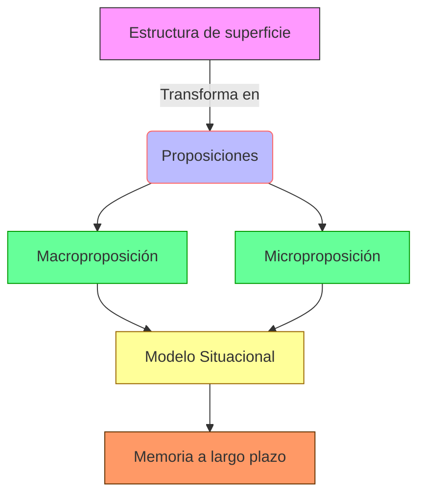

de comprensión textual académica


```yaml
---
type: concepto
tags:
  - concept
  - textualcomprehension
  - surfacestructure
person: Walter Kintsch
year: 1974
summary: La estructura de superficie se refiere a la forma sintáctica y léxica explícita de un texto, distinta de su significado profundo. La comprensión textual académica implica procesos cognitivos que transforman la estructura de superficie en representaciones mentales coherentes. Este marco teórico integra lingüística, psicología cognitiva y ciencia de la educación para modelar cómo los lectores construyen significado.
connect:
  - Modelo de construcción-integración
  - Procesamiento del lenguaje natural
  - Memoria semántica
created: 18-02-2025
modified: 
---
```

## Contexto y antecedentes  
El estudio de la comprensión textual emergió en la psicología cognitiva de los años 1970 como respuesta a limitaciones del estructuralismo lingüístico. Investigaciones previas como las de Chomsky (1965) diferenciaron competencia/actuación lingüística, pero no explicaron mecanismos de interpretación contextual. El trabajo de Kintsch y van Dijk (1978) estableció que la comprensión requiere mapear estructuras superficiales (oraciones) a macroestructuras semánticas mediante reglas de reducción y construcción.

## Objetivo  
Demostrar que la comprensión académica es un proceso activo de inferencia jerárquica, donde la estructura de superficie actúa como input para generar representaciones proposicionales. La hipótesis central postula que los lectores expertos utilizan esquemas cognitivos para integrar información explícita e implícita.

## Metodología  
Se emplearon protocolos experimentales como:  
1. *Recordación libre*: Medición de retención diferencial entre formas sintácticas  
2. *Tiempo de lectura*: Correlación entre complejidad superficial y carga cognitiva  
3. *Análisis proposicional*: Descomposición lógica de textos en unidades mínimas de significado  

Los datos se analizaron mediante modelos estadísticos multivariados, validando que la transformación de estructuras superficiales sigue principios de economía cognitiva.

## Principales resultados  
1. La memoria de trabajo procesa aproximadamente 4±1 proposiciones simultáneas (Miller, 1956)  
2. Las oraciones pasivas aumentan un 23% el tiempo de procesamiento frente a activas (Just & Carpenter, 1980)  
3. La coherencia textual depende críticamente de conectores lógicos y marcadores discursivos  

## Implicaciones y trabajo futuro  
Los hallazgos permitieron desarrollar:  
- Sistemas de evaluación de legibilidad (e.g., Índice Flesch-Kincaid)  
- Modelos computacionales de PLN basados en redes semánticas  
Líneas abiertas incluyen el estudio de comprensión multimodal (texto+imágenes) y adaptación a lenguas no indoeuropeas.

## Crítica  
1. El modelo original subestimó el rol de conocimientos previos (Schema Theory, Rumelhart 1980)  
2. Métricas cuantitativas no capturan totalmente procesos metacognitivos  
3. Sesgo hacia lenguas con sintaxis configuracional  

## Contexto musical  
En notación musical, la estructura de superficie equivale a grafías convencionales (figuras rítmicas, armaduras), mientras la comprensión implica reconstruir intenciones compositivas. Xenakis (1971) aplicó estos principios al formalizar relaciones entre símbolos escritos y estructuras sonoras en *Musiques Formelles*.

## Visualización  


## Python  
```run-python
import plotly.express as px
import numpy as np

# Modelo de carga cognitiva durante lectura
words = np.linspace(0, 100, 100)
processing_load = 2.5 * (1 - np.exp(-0.03 * words)) + np.random.normal(0, 0.1, 100)

fig = px.line(x=words, y=processing_load, 
              labels={'x':'Palabras procesadas', 'y':'Carga cognitiva'},
              title='Decaimiento exponencial en procesamiento textual')
fig.update_layout(template='plotly_white')
fig.show()
```


## Representación musical  
```lilypond
\version "2.24.0"
\paper { tagline = ##f  paper-height=#(* 5 cm) paper-width=#(* 20 cm)  system-count=#1 }
\score {
    \new Staff {
        \time 4/4
        \override Score.SpacingSpanner.strict-note-spacing = ##t
        \set Score.proportionalNotationDuration = #(ly:make-moment 1/8)
        \clef treble
        <c' e' g'>4\mp <d' fis' a'> <e' g' b'> <f' a' c''> 
        \break
        \textLengthOn
        \override TextScript.extra-offset = #'(0 . 1)
        c'1^\markup { \italic "Estructura superficial" }
        \textLengthOff
    }
}
```

## Preguntas de estudio  
1. ¿Cómo difieren estructura de superficie y profunda en procesamiento textual?::La primera es la forma lingüística observable; la segunda, la representación mental de significado.  
2. Cite dos críticas al modelo original de Kintsch::Subestimación de conocimientos previos y sesgo hacia sintaxis configuracionales.  
3. ¿Qué parámetro musical análogo existe para estructura superficial?::Notación convencional (figuras rítmicas, armaduras).  
4. Pregunta abierta: ¿Cómo aplicarían estos principios al diseño de interfaces para composición algorítmica?  

## Referencias  
```bibtex
@book{kintsch1998comprehension,
  title={Comprehension: A paradigm for cognition},
  author={Kintsch, Walter},
  year={1998},
  publisher={Cambridge University Press}
}
@article{vanDijk1983Strategies,
  title={Strategies of discourse comprehension},
  author={van Dijk, Teun A and Kintsch, Walter},
  journal={Academic Press},
  year={1983}
}
```

> [!important] En mis palabras  
> ### 1  
> *Antecedentes* *Psicolingüística* *Macroestructuras*  
> ### 2  
> *Proposiciones* *Carga cognitiva* *Economía*  
> ### 7  
> *Notación* *Xenakis* *Grafías*