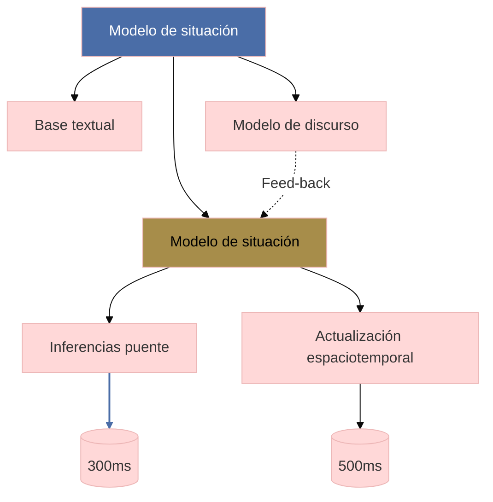

```

## Contexto y antecedentes  
El modelo surge como respuesta a limitaciones de los enfoques textualistas en psicolingüística, que subestimaban el rol activo del lector. Los trabajos de Bartlett sobre esquemas (1932) y los modelos de Van Dijk y Kintsch (1983) establecieron bases para entender cómo se organiza el conocimiento durante la comprensión lectora. La neurociencia cognitiva posterior validó su correlato neural mediante estudios de fMRI sobre activación cortical durante inferencias.

## Objetivo  
Demostrar que la comprensión lectora es un proceso constructivo donde el lector genera representaciones mentales jerárquicas ($M_t = f(T_i, K_p, C_e)$), siendo $T_i$ el texto, $K_p$ conocimiento previo y $C_e$ contexto). La hipótesis central postula que estas representaciones son multimodales y se actualizan mediante operaciones de unificación (Hagoort, 2013).

## Metodología  
Se emplean paradigmas experimentales como:  
1. Tareas de priming semántico con latencias de respuesta  
2. Monitorización ocular para medir fijaciones en palabras críticas  
3. Paradigmas de disrupción (e.g., inconsistencias detectadas en potenciales N400)  

Los datos se analizan mediante modelos log-lineales que relacionan variables lingüísticas ($\lambda_{lex}$, $\lambda_{sint}$) con tiempos de procesamiento.

## Principales resultados  
1. Los lectores construyen tres niveles de representación:  
   - **Base textual**: Proposiciones literales  
   - **Modelo de situación**: Integración de inferencias espaciotemporales  
   - **Modelo de discurso**: Objetivos comunicativos globales  
2. Las inferencias puente ($I_b$) se generan en $\leq$ 300ms para mantener coherencia local (McKoon & Ratcliff, 1992).  

## Implicaciones y trabajo futuro  
Aplicaciones en:  
- Diseño de interfaces humano-computador adaptativas  
- Modelos de NLP con memoria a largo plazo (e.g., Transformers recursivos)  
Líneas abiertas incluyen estudiar su rol en comprensión de textos multimodales (texto+gráficos).  

## Crítica  
1. Sobreenfatiza la coherencia local frente a procesos top-down (Teoría de la Relevancia, Sperber & Wilson)  
2. Dificultad para operacionalizar $K_p$ en estudios transculturales  

## Contexto musical  
En notación musical, el modelo explica cómo los intérpretes integran:  
- **Nivel 1**: Notas individuales (base textual)  
- **Nivel 2**: Fraseo y dinámicas (modelo de situación)  
- **Nivel 3**: Estructura formal (modelo de discurso)  
Ejemplo: Un pianista ajusta el tempo al detectar patrones armónicos implícitos.  

## Visualización  


## Python  
```python
import plotly.express as px
import numpy as np

# Parámetros del modelo
x = np.linspace(0, 10, 100)  # Tiempo de lectura (s)
y1 = 1 - np.exp(-0.5 * x)     # Base textual
y2 = 1 - np.exp(-0.3 * x)     # Modelo de situación
y3 = 1 - np.exp(-0.1 * x)     # Modelo de discurso

fig = px.line(x=x, y=[y1, y2, y3], 
              labels={'value': 'Activación cognitiva', 'variable': 'Nivel'},
              title='Dinámica temporal de construcción del modelo')
fig.update_traces(line_width=2.5)
fig.show()
```

## Representación musical  
```lily
\version "2.24.0"
\paper { tagline = ##f  paper-height=#(* 5 cm) paper-width=#(* 20 cm)  system-count=#1 }
\score {
    \new Staff {
        \time 4/4
        \override Staff.TimeSignature.transparent = ##t
        \clef treble
        <<
            { \tempo 4 = 60 
              c'4\pp\< e' g' c''\ff \bar "||" 
              d''4\> b' g' e'\pp } \\
            { \repeat tremolo 8 { c32\sustainOn e } \sustainOff }
        >>
    }
}
```

## Preguntas de estudio  
1. ¿Cómo difiere el modelo de situación de los esquemas de Bartlett?  
   ::Incluye procesos dinámicos de actualización, no solo estructuras estáticas.  
2. Cite dos evidencias neurocientíficas que apoyen el modelo  
   ::Potencial N400 y activación del córtex prefrontal medial durante inferencias.  
3. ¿Qué limitación tiene el modelo en música electroacústica?  
   ::Asume linealidad temporal, problemático en obras con tiempo no euclidiano.  

## Referencias  
```bibtex
@book{kintsch1998comprehension,
  title={Comprehension: A paradigm for cognition},
  author={Kintsch, Walter},
  year={1998},
  publisher={Cambridge University Press}
}
```

> [!important] En mis palabras  
> ### 1  
>   <*constructo*> <*dinámico*> <*multinivel*>  
> ### 2  
>  <*inferencias*> <*tiempos*> <*neurociencia*>  
> ### 3  
>  <*música*> <*jerarquías*> <*no-lineal*>