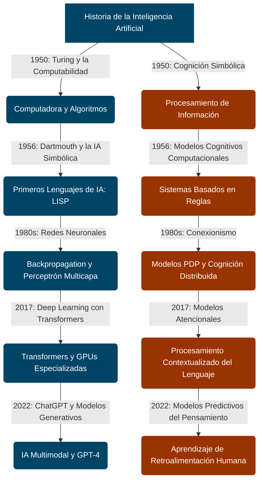

<grid drag="60 55" drop="5 10" bg="black" align="left">
## Introducción a la Inteligencia Artificial en Música
</grid>
<grid drag="-5 10" drop="5 -10" bg="black">
![[i1-header]]
</grid>
<grid drag="25 55" drop="-5 10" bg="black" align="top">
→ Historia y paradigmas<br>
→ Conceptos técnicos esenciales<br>
→ Estrategias de prompting<br>
</grid>

---
# Introducción a la Inteligencia Artificial

La Inteligencia Artificial (IA) es un campo interdisciplinario que combina matemáticas, computación y neurociencia para crear sistemas capaces de realizar tareas que tradicionalmente requieren inteligencia humana. 

note:  
La IA en música no solo automatiza procesos, sino que redefine la creatividad y la relación entre el compositor y la tecnología.
https://www.youtube.com/watch?v=N1TEjTeQeg0

---

# los dos paradigmas de la IA

---


## lógico-simbólico

<p class="fragment">- la esencia de la IA es razonar.</p>
<p class="fragment">- se logra a través de reglas simbólicas para manipular expresiones simbólicas</p>
<p class="fragment">- aprender puede esperar, primero debemos saber como se representa el  conocimiento</p>

## biológico-inspirado

<p class="fragment">- la esencia de la inteligencia es aprender las potencias de las conexiones en una red neuronal</p>
<p class="fragment">- razonar puede esperar. Primero debemos entender  como funciona el aprendizaje</p>

---
# Momentos Claves en la Historia de la IA


---


<p class="fragment">1950 - Alan Turing propone la prueba de Turing.</p>
<p class="fragment">1956 - Conferencia de Dartmouth: nacimiento oficial de la IA.</p>
<p class="fragment">1980s - Resurgimiento con redes neuronales y aprendizaje profundo.</p>
<p class="fragment">2017 - Introducción de Transformer (Vaswani et al.).</p>
<p class="fragment">2022 - Popularización de ChatGPT 3.</p>

note:  
Cada uno de estos hitos marcó un cambio en el paradigma de la IA, pasando de reglas explícitas a modelos basados en aprendizaje de datos.

---

### **1950 – Alan Turing propone la Prueba de Turing**

- **La Máquina de Turing (1936, conceptualizada antes de 1950)**: Modelo teórico de computación que define los límites de lo que puede calcularse algorítmicamente.
- **Primeras computadoras electrónicas** como la **Manchester Mark I** (Ferranti Mark I, 1951) y la **ENIAC** (1945), que permitieron correr programas rudimentarios de simulación de pensamiento lógico.

---

#### Paradigmas matemáticos y cognitivos

- **Formalismo lógico y computabilidad**: Se basaba en la **teoría de la computación** desarrollada por **Kurt Gödel, Alonzo Church y Alan Turing**, estableciendo los límites de los algoritmos matemáticos.
- **Cognición simbólica**: La mente se concebía como una máquina que manipulaba símbolos en secuencias lógicas (precursor de la IA simbólica).
- **Teoría de la Información (Claude Shannon, 1948)**: Definió cómo se podía cuantificar la información en bits, influenciando el procesamiento algorítmico del lenguaje.

---

### 1956 – Conferencia de Dartmouth

- **Primeros programas de IA simbólica**:
  - **Logic Theorist (1956)** de Newell y Simon: Capaz de demostrar teoremas matemáticos como lo haría un humano.
  - **General Problem Solver (1957)**: Algoritmo de resolución de problemas basado en reglas lógicas.
- **LISP (1958, John McCarthy)**: Primer lenguaje de programación específicamente diseñado para IA.

---

#### **Paradigmas matemáticos y cognitivos**
- **Paradigma de la IA simbólica o "Good Old-Fashioned AI" (GOFAI)**:
  - La inteligencia se modelaba como **manipulación de símbolos lógicos**.
  - Influencia del **cognitivismo temprano**, que veía la mente como un sistema de procesamiento de información análogo a una computadora.
  
- **Teoría de autómatas y gramáticas formales** (Noam Chomsky, 1957):
  - Sentó bases para el procesamiento del lenguaje natural mediante reglas sintácticas.

---

### **1980s – redes neuronales y aprendizaje profundo**

- **Computadoras paralelas y VLSI (Very Large Scale Integration)**:
  - Permitieron la ejecución masiva de cálculos en paralelo, esenciales para redes neuronales profundas.
- **Redes neuronales multicapa** (backpropagation, 1986):
  - **Modelo de perceptrón multicapa (MLP)** resucitó el interés en el aprendizaje automático.
  - Usado en OCR (Reconocimiento óptico de caracteres), reconocimiento de voz y visión artificial.
- **IBM Deep Blue (1997)**:
  - Computadora que venció al campeón mundial de ajedrez Gary Kasparov, aplicando heurísticas de búsqueda profunda.

---

#### **Paradigmas matemáticos y cognitivos**
- **Paradigma conexionista**:
  - La cognición se explica mediante redes de procesamiento paralelo distribuido (PDP, Rumelhart & McClelland, 1986).
- **Optimización mediante descenso de gradiente y retropropagación**:
  - Permitió entrenar redes neuronales de múltiples capas, facilitando la expansión del **aprendizaje profundo**.
- **Teoría de la complejidad computacional**:
  - Se estableció qué problemas podían resolverse en tiempo polinómico y cuáles eran intratables computacionalmente.

---

### **2017 – Introducción de Transformers (Vaswani et al.)**

- **Transformers**: Modelo de IA para el procesamiento del lenguaje natural basado en el mecanismo de **autoatención**.
- **TPU (Tensor Processing Units)** de Google: Hardware optimizado para redes neuronales profundas y modelos de IA a gran escala.
- **BERT (Bidirectional Encoder Representations from Transformers, 2018)**:
  - Primer modelo de comprensión profunda de lenguaje basado en Transformers.

---


---


#### **Paradigmas matemáticos y cognitivos**
- **Paradigma probabilístico y estadístico**:
  - Uso de modelos probabilísticos sobre grandes volúmenes de datos en lugar de reglas explícitas.
- **Aprendizaje no supervisado y modelos de atención**:
  - La IA aprende estructuras y patrones sin necesidad de etiquetado manual de datos.
- **Modelado de la memoria de trabajo**:
  - Los Transformers replican aspectos de la memoria de corto plazo humana en el procesamiento del lenguaje.

---

### **2022 – Popularización de ChatGPT-3**


---


---

- **ChatGPT-3 (OpenAI, 2020, masificado en 2022)**:
  - Uso masivo de **modelos de lenguaje autoregresivos** en interacciones conversacionales.
- **GPT-4 (2023)**: Expansión de capacidades multimodales (texto e imágenes).
- **Aceleradores de IA (NVIDIA A100, H100)**:
  - GPUs diseñadas específicamente para modelos de lenguaje de gran escala.

---

#### **Paradigmas matemáticos y cognitivos**
- **Paradigma de redes neuronales generativas**:
  - Modelos capaces de producir texto coherente basados en distribución probabilística de palabras.
- **Interacción con el usuario y ajuste fino por RLHF (Reinforcement Learning from Human Feedback)**:
  - Modelos ajustados con retroalimentación humana para mejorar la relevancia de las respuestas.
- **Simulación del pensamiento humano a través de modelos de lenguaje**:
  - Enfoque **"predictivo"** de la cognición: el cerebro humano también se basa en modelos de predicción probabilística del entorno.

---




---

# Conceptos  de IA

---

### 1. Artificial Intelligence (AI)
<p class="fragment">  Definición: Simulación de la inteligencia humana en máquinas para realizar tareas como resolver problemas, reconocer patrones y tomar decisiones.</p>
<p class="fragment"> <strong> ejemplo → </strong>Cuando usas Siri o Alexa para obtener una respuesta, estás interactuando con IA.</p>

---

### 2. Machine Learning (ML)
<p class="fragment">  Subcampo de la IA que permite a las máquinas aprender de datos en lugar de ser programadas explícitamente.</p>
<p class="fragment"> <strong> ejemplo → </strong>Netflix recomienda películas basándose en tus hábitos de visualización previos.</p>

---

### 3. Deep Learning
<p class="fragment">  Subcampo del Machine Learning basado en redes neuronales profundas que analiza datos en múltiples capas.</p>
<p class="fragment"> <strong> ejemplo → </strong>Facebook etiqueta automáticamente a las personas en fotos reconociendo sus rostros.</p>

---

### 4. Weak AI (Narrow AI)
<p class="fragment">  IA diseñada para realizar tareas específicas sin comprender más allá de su propósito.</p>
<p class="fragment"> <strong> ejemplo → </strong>Un programa de ajedrez puede ser excelente jugando, pero no puede escribir un poema.</p>

---

### 5. Artificial General Intelligence (AGI)
<p class="fragment">  Inteligencia artificial con capacidad de aprendizaje general en múltiples dominios, similar a la inteligencia humana.</p>
<p class="fragment"> <strong> ejemplo → </strong>Un robot que puede aprender a cocinar, escribir historias y resolver problemas matemáticos sin entrenamiento específico para cada tarea.</p>

---

### 6. Neural Network
<p class="fragment">  Modelo de IA que imita la estructura del cerebro humano para reconocer patrones en datos.</p>
<p class="fragment"> <strong> ejemplo → </strong>La transcripción de voz a texto en teléfonos utiliza redes neuronales para convertir el sonido en palabras.</p>

---

### 7. Algorithm
<p class="fragment">  Conjunto de pasos o instrucciones utilizadas para resolver problemas.</p>
<p class="fragment"> <strong> ejemplo → </strong>Los motores de búsqueda como Google usan algoritmos para clasificar resultados relevantes.</p>

note:  
Estos conceptos son esenciales para comprender cómo funciona la IA y su impacto en la música y otras áreas creativas.

---

# Transformer (2017)

### Principales ideas establecidas
<p class="fragment"> Eliminación de la recurrencia en redes neuronales.</p>
<p class="fragment"> Introducción del mecanismo de atención.</p>
<p class="fragment"> Aceleración del entrenamiento en paralelo.</p>

### Autores principales
<p class="fragment"> Ashish Vaswani</p>
<p class="fragment"> Noam Shazeer</p>
<p class="fragment"> Jakob Uszkoreit</p>

### Paper clave
<p class="fragment"> "Attention is All You Need" (Vaswani et al., 2017).</p>

note:  
El modelo Transformer sentó las bases para el desarrollo de modelos como GPT y BERT, revolucionando la IA generativa.

---

# ChatGPT 3 (2022)

### Innovaciones y cambio de paradigma
<p class="fragment"> - Modelos generativos con gran cantidad de parámetros.</p>
<p class="fragment"> - Capacidad de entender y generar texto de forma coherente.</p>
<p class="fragment"> - Expansión de la IA al público general.</p>

### Autores principales
<p class="fragment"> - Alec Radford</p>
<p class="fragment"> - Jeffrey Wu</p>
<p class="fragment"> - Ilya Sutskever</p>

### Paper clave
<p class="fragment"> "Language Models are Few-Shot Learners" (Brown et al., 2020).</p>

note:  
ChatGPT 3 marcó la transición de la IA de investigación a aplicación masiva, con implicaciones en educación y composición musical.

---

## Conceptos Claves en IA

*ver también [[1214 parámetros de IA]]*

- Token: Unidad mínima de información en un modelo.
- Benchmark: Prueba estándar para evaluar modelos.
- LLM: Modelos de lenguaje de gran escala.
- Hallucination: Generación de información falsa por IA.
---

- Context window: Cantidad de tokens procesados en un solo input.
- Attention mechanism: Algoritmo para ponderar la relevancia de palabras en una secuencia.
- Backpropagation: Algoritmo de entrenamiento en redes neuronales.
- Batch learning: Entrenamiento de modelos en grupos de datos.

---
- BERT: Modelo de lenguaje bidireccional.
- RNN: Redes neuronales recurrentes.
- GANs: Redes Generativas Antagónicas.
- Embedding: Representación vectorial de palabras.
---

- Encoders-Decoders: Arquitectura para procesamiento de lenguaje.
- Capsule Networks: Redes que modelan relaciones espaciales en datos.
- Fine-tuning: Ajuste de un modelo preentrenado a una tarea específica.
- Parámetros: Número de conexiones entrenadas en un modelo.

note:  
Estos términos permiten entender cómo funciona la IA a nivel técnico y su aplicación en la música.

---

# Estrategias de Prompting

### Estructura de un prompt
<p class="fragment"> - Role: Define el papel de la IA.</p>
<p class="fragment"> - Contextual prompt: Proporciona información relevante.</p>
<p class="fragment"> - Chain-of-thought: Divide la respuesta en pasos lógicos.</p>

### Estrategias avanzadas
<p class="fragment"> - Prompting iterativo.</p>
<p class="fragment"> - Especificación de formato de salida.</p>
<p class="fragment"> - Uso de ejemplos en el input.</p>

note:  
Un buen prompt mejora significativamente la calidad de las respuestas generadas por IA.

---

#  IS and ML avazandos

---

### 1. Attention Mechanism
<p class="fragment">  En deep learning, los mecanismos de atención permiten que los modelos se enfoquen en partes específicas de los datos de entrada, de manera similar a cómo los humanos prestan atención a la información relevante.</p>
<p class="fragment"><strong> ejemplo → </strong> Al leer una historia larga, solo recordamos los eventos o personajes principales. El mecanismo de atención funciona de manera similar, enfocándose en las partes más importantes de los datos.</p>

---
### 2. Backpropagation
<p class="fragment">  Algoritmo fundamental para entrenar redes neuronales. Calcula el gradiente de la función de pérdida con respecto a cada peso usando la regla de la cadena y luego actualiza los pesos para minimizar la pérdida.</p>
<p class="fragment"><strong> ejemplo → </strong> Un golfista ajusta su swing basándose en el error del tiro anterior. Backpropagation ajusta la red neuronal en función de los errores en sus predicciones.</p>

---
### 3. Batch Learning
<p class="fragment">  Método de entrenamiento en el que el modelo se entrena con todo el conjunto de datos a la vez, en lugar de hacerlo de manera incremental con lotes pequeños de datos.</p>
<p class="fragment"><strong> ejemplo → </strong> En lugar de estudiar un capítulo a la vez para un examen, estudiar todo el temario de una sola vez. Eso es batch learning.</p>

---
### 4. BERT (Bidirectional Encoder Representations from Transformers)
<p class="fragment">  Modelo basado en transformers desarrollado por Google para tareas de procesamiento de lenguaje natural. Lee el texto de forma bidireccional para comprender mejor el significado de cada palabra.</p>
<p class="fragment"> <strong> ejemplo → </strong> En la frase “Él fue al banco a retirar dinero”, BERT reconoce que “banco” se refiere a una institución financiera y no a la orilla de un río.</p>

---
### 5. RNN (Recurrent Neural Network)
<p class="fragment">  Redes neuronales diseñadas para datos secuenciales. Tienen bucles que permiten que la información se transfiera entre pasos de la secuencia, lo que las hace ideales para datos de series temporales o texto.</p>
<p class="fragment"><strong> ejemplo → </strong> Para predecir la siguiente palabra en una canción, una RNN recuerda las palabras anteriores para hacer una predicción más precisa.</p>

---
### 6. Generative Adversarial Networks (GANs)
<p class="fragment">  Redes neuronales compuestas por dos modelos: un generador que intenta crear datos falsos y un discriminador que intenta distinguir entre datos reales y falsos.</p>
<p class="fragment"><strong> ejemplo → </strong> Un falsificador intenta hacer una copia perfecta de un cuadro, mientras que un detective de arte intenta identificar cuál es falso. Con el tiempo, el falsificador mejora tanto que el detective no puede distinguir la diferencia.</p>

---
### 7. Embeddings
<p class="fragment">  Representaciones vectoriales de datos categóricos o discretos en un espacio continuo de menor dimensión, lo que facilita su procesamiento por modelos de machine learning.</p>
<p class="fragment"><strong> ejemplo → </strong> Representar ciudades en un mapa con coordenadas en lugar de nombres; los embeddings hacen algo similar con los datos en ML.</p>

---
### 8. Word Embeddings
<p class="fragment">  Tipo específico de embedding utilizado para palabras, convirtiéndolas en vectores que capturan su significado semántico.</p>
<p class="fragment"><strong> ejemplo → </strong> En word embeddings, palabras similares como “rey” y “reina” aparecen cercanas en el espacio vectorial, mientras que palabras no relacionadas como “rey” y “manzana” están más separadas.</p>

---
### 9. Decoders y Encoders
<p class="fragment">  Arquitectura donde los encoders convierten las entradas en una representación compacta y los decoders las transforman de vuelta en la salida deseada. Se usan comúnmente en traducción automática.</p>
<p class="fragment"><strong> ejemplo → </strong> Para traducir una oración del inglés al francés, el encoder la convierte en una representación intermedia y el decoder la traduce al francés.</p>

---
### 10. Capsule Networks
<p class="fragment">  Redes neuronales diseñadas para reconocer patrones en los datos sin importar su posición, orientación o escala, superando algunas limitaciones de las CNN.</p>
<p class="fragment"><strong> ejemplo → </strong> Reconocer un gato en una imagen, sin importar si está de cabeza, lejos o girado. Las Capsule Networks identifican estos patrones sin depender de la posición espacial.</p>

note:  
Estos conceptos avanzados permiten comprender cómo funcionan las arquitecturas de IA modernas y su aplicación en la música y el arte generativo.

---

# integración 


---

1.	**Tokens** – Unidades mínimas de procesamiento en modelos de lenguaje.
2.	**Parámetros** – Pesos ajustables en redes neuronales que determinan la salida de la IA.
3.	**Context Window** – Límite de tokens que un modelo puede procesar en una sola consulta.
4.	**Prompt Engineering** – Técnica de redacción de instrucciones para obtener respuestas óptimas de la IA.

---
5.	**Fine-Tuning** – Ajuste de un modelo preentrenado con datos específicos para mejorar su desempeño en tareas concretas.
6.	**Attention Mechanism** – Algoritmo que permite a los modelos enfocarse en información relevante dentro de un contexto.
7.	**Hallucination** – Cuando la IA genera información incorrecta o inventada.
8.	**Embeddings** – Representación vectorial de palabras o conceptos para capturar relaciones semánticas.

---
9.	**Chain-of-Thought (CoT)** – Técnica para guiar el razonamiento del modelo paso a paso.
10.	**Benchmarking** – Evaluación comparativa de modelos de IA mediante métricas estandarizadas.
11.	**Zero-Shot Learning** – Capacidad del modelo de responder a tareas sin haber sido entrenado explícitamente en ellas.
12.	**Few-Shot Learning** – Técnica en la que el modelo aprende con pocos ejemplos antes de generar una respuesta.

---
13.	**Transfer Learning** – Uso de un modelo entrenado en una tarea para aplicarlo en otra similar.
14.	**Bias en IA** – Tendencia del modelo a generar respuestas influenciadas por los datos con los que fue entrenado.
15.	**Temperature** – Parámetro que controla la aleatoriedad de las respuestas generadas por la IA.
16.	**Sampling Methods** – Técnicas como Top-k y Top-p (nucleus sampling) para influir en la generación de texto.

---
17.	**Reinforcement Learning from Human Feedback (RLHF)** – Técnica que mejora el comportamiento de la IA a partir de evaluaciones humanas.
18.	**Gradient Descent** – Algoritmo de optimización usado en el entrenamiento de redes neuronales.
19.	**Latent Space** – Representación abstracta de datos en modelos generativos.
20.	**Multimodal AI** – Modelos capaces de procesar múltiples tipos de datos (texto, imagen, audio).

---

# chat vs reasoning
---

# Trabajo Práctico:  333

### **Objetivo**
<p class="fragment"> - Comprender conceptos fundamentales de IA mediante una presentación estructurada.</p>
<p class="fragment"> - Desarrollar habilidades de síntesis, visualización y aplicación creativa.</p>
<p class="fragment"> - Aprender a explicar IA de manera accesible y clara.</p>

---
### **Instrucciones**
<p class="fragment"> - Se formarán grupos de 3 estudiantes.</p>
<p class="fragment"> - Cada grupo seleccionará un concepto de IA de la lista proporcionada.</p>
<p class="fragment"> - Realizarán una presentación de 3 minutos aplicando la técnica 333.</p>

---
### **Estructura de la Presentación**
<p class="fragment"> - <b>Definir en 3 frases</b>: Explicar el concepto de forma clara y concisa.</p>
<p class="fragment"> - <b>3 imágenes</b>: Ilustrar el concepto con gráficos o esquemas relevantes.</p>
<p class="fragment"> - <b>3 ejemplos</b>: 1) Explicación mediante metáfora. 2) Ejemplo en código. 3) Aplicación creativa.</p>

note:  
El objetivo es explicar conceptos técnicos de IA de manera efectiva y comprensible, combinando teoría, imagen y práctica.

---

### *Ejemplo de Presentación*
# Attention Mechanism

## **Definición en 3 Frases**
<p class="fragment"> - Un mecanismo de atención permite que los modelos de IA enfoquen su procesamiento en partes relevantes de los datos de entrada.</p>
<p class="fragment"> - Funciona asignando pesos a diferentes elementos del input, destacando aquellos más importantes.</p>
<p class="fragment"> - Es clave en modelos como Transformers, mejorando la comprensión contextual en tareas de lenguaje y visión.</p>

---

## **3 Imágenes Claves**

---
![[https://d3lkc3n5th01x7.cloudfront.net/wp-content/uploads/2023/11/08031612/Attention-mechanism-27190-01-1.png]]
<p class="fragment">Ejemplo visual del mecanismo de atención destacando palabras en una oración.</p>

---
![[https://i.imgur.com/rR60F7V.png]]

<p class="fragment">Representación del cálculo de pesos en una red neuronal.</p>

---


<p class="fragment">Ejemplo de atención en visión por computadora: IA detectando objetos en una imagen.</p>

---

## **Ejemplo 1: Metáfora**
<p class="fragment">Imagina que estás en una fiesta ruidosa y alguien dice <em>tu nombre</em>. A pesar del ruido, tu cerebro automáticamente dirige tu atención a esa <em>voz</em>, ignorando el resto. El mecanismo de atención en IA hace algo similar: ignora la información irrelevante y se centra en lo importante.</p>

---

## **Ejemplo 2: Código**
<pre><code data-line-numbers="2-3|6|7|8-9|">
import torch
import torch.nn.functional as F

# Simulación de pesos de atención
query = torch.tensor([0.8, 0.2, 0.6])
keys = torch.tensor([[0.7, 0.1, 0.5], [0.2, 0.9, 0.4]])
attention_scores = F.softmax(torch.matmul(query, keys.T), dim=-1)
print(attention_scores)
</code></pre>
<p class="fragment">Este código muestra una implementación básica del mecanismo de atención en PyTorch.</p>

note: 
# Explicación del Mecanismo de Atención en PyTorch

## Código Base
```python
import torch
import torch.nn.functional as F

# Simulación de pesos de atención
query = torch.tensor([0.8, 0.2, 0.6])
keys = torch.tensor([[0.7, 0.1, 0.5], [0.2, 0.9, 0.4]])
attention_scores = F.softmax(torch.matmul(query, keys.T), dim=-1)
print(attention_scores)
```

## Explicación Paso a Paso

### 1. Importaciones
```python
import torch
import torch.nn.functional as F
```
* `torch`: biblioteca principal de PyTorch para operaciones con tensores 

> [!info](Un tensor es una generalización matemática y computacional de escalares, vectores y matrices a cualquier número de dimensiones. Podemos entenderlo como una estructura de datos multidimensional que organiza números en base a un orden específico.

>Para visualizarlo de manera práctica:
- Un tensor de orden 0 es un escalar (un único número)
- Un tensor de orden 1 es un vector (una lista de números en una dimensión)
- Un tensor de orden 2 es una matriz (números organizados en filas y columnas)
- Un tensor de orden 3 o superior organiza números en más dimensiones (como un cubo de datos y más allá)

>En el contexto del aprendizaje profundo, los tensores son fundamentales porque:
- Permiten representar y procesar datos complejos (imágenes, texto, señales)
- Facilitan operaciones matemáticas en paralelo
- Pueden aprovechar la aceleración por GPU
- Son la base para representar pesos y activaciones en redes neuronales

>Por ejemplo, una imagen en color se puede representar como un tensor de orden 3:
- Primera dimensión: altura
- Segunda dimensión: anchura
- Tercera dimensión: canales de color (RGB)

>Los tensores son la estructura de datos principal en frameworks como PyTorch y TensorFlow, permitiendo operaciones eficientes y cálculo de gradientes automático.)

* `F`: módulo functional de PyTorch que contiene operaciones comunes como softmax

### 2. Vector Query
```python
query = torch.tensor([0.8, 0.2, 0.6])
```
* Vector de consulta (query) de dimensión 3
* Representa la consulta a comparar con las claves
* En contexto real: característica que queremos buscar

### 3. Matriz de Keys
```python
keys = torch.tensor([[0.7, 0.1, 0.5], 
                     [0.2, 0.9, 0.4]])
```
* Matriz de claves (keys) de dimensión 2x3
* Cada fila representa una clave diferente
* En contexto real: características para comparar con la consulta

### 4. Cálculo de Puntajes de Atención
```python
attention_scores = F.softmax(torch.matmul(query, keys.T), dim=-1)
```

#### a. Producto Matricial
* `torch.matmul(query, keys.T)`
* Transpone la matriz de claves
* Calcula similitud entre consulta y cada clave
* Resultado: vector con puntajes de similitud sin normalizar

#### b. Softmax
* `F.softmax(..., dim=-1)`
* Normaliza puntajes para suma = 1
* Convierte puntajes en probabilidades
* `dim=-1`: softmax se aplica en última dimensión

### 5. Resultados
```python
print(attention_scores)
```
* Muestra pesos de atención normalizados
* Cada valor: relevancia de cada clave para la consulta
* Valores entre 0 y 1, suma = 1

## Interpretación de Resultados
* Valor alto en primera posición: primera clave ([0.7, 0.1, 0.5]) más similar
* Valor alto en segunda posición: segunda clave ([0.2, 0.9, 0.4]) más similar
* Pesos usados para ponderar valores según relevancia

## Aplicación Práctica
* Ejemplo simplificado del mecanismo de atención en transformers
* Consulta: palabra en una oración
* Claves: otras palabras en el contexto
* Pesos de atención: relevancia de palabras para entender palabra actual

---

## **Ejemplo 3: Aplicación Creativa**
<p class="fragment">Proponer una aplicación musical donde la IA utilice mecanismos de atención para analizar patrones en una partitura y sugerir variaciones armónicas en tiempo real.</p>

note:  
El modelo podría detectar y enfatizar patrones melódicos dentro de una pieza musical, proporcionando recomendaciones compositivas basadas en su análisis de datos históricos.

---

# Ejemplo de uso

ver torch.py


