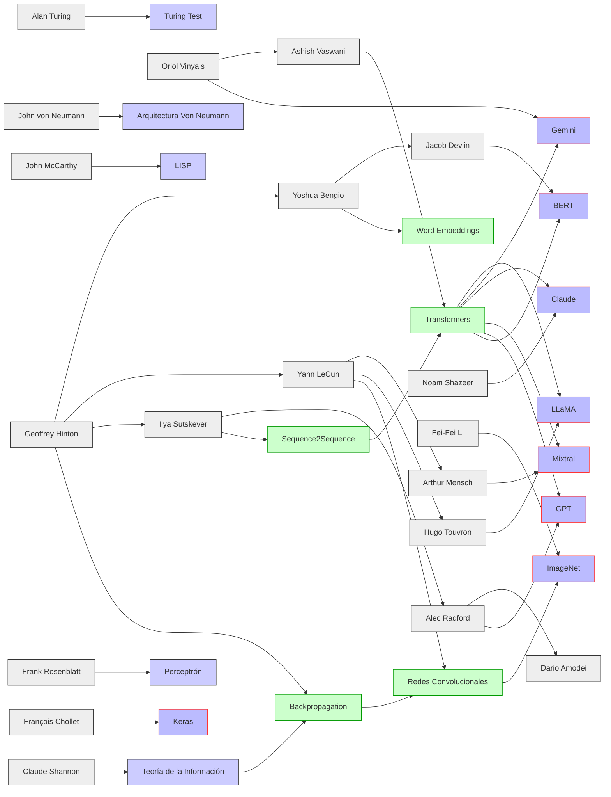
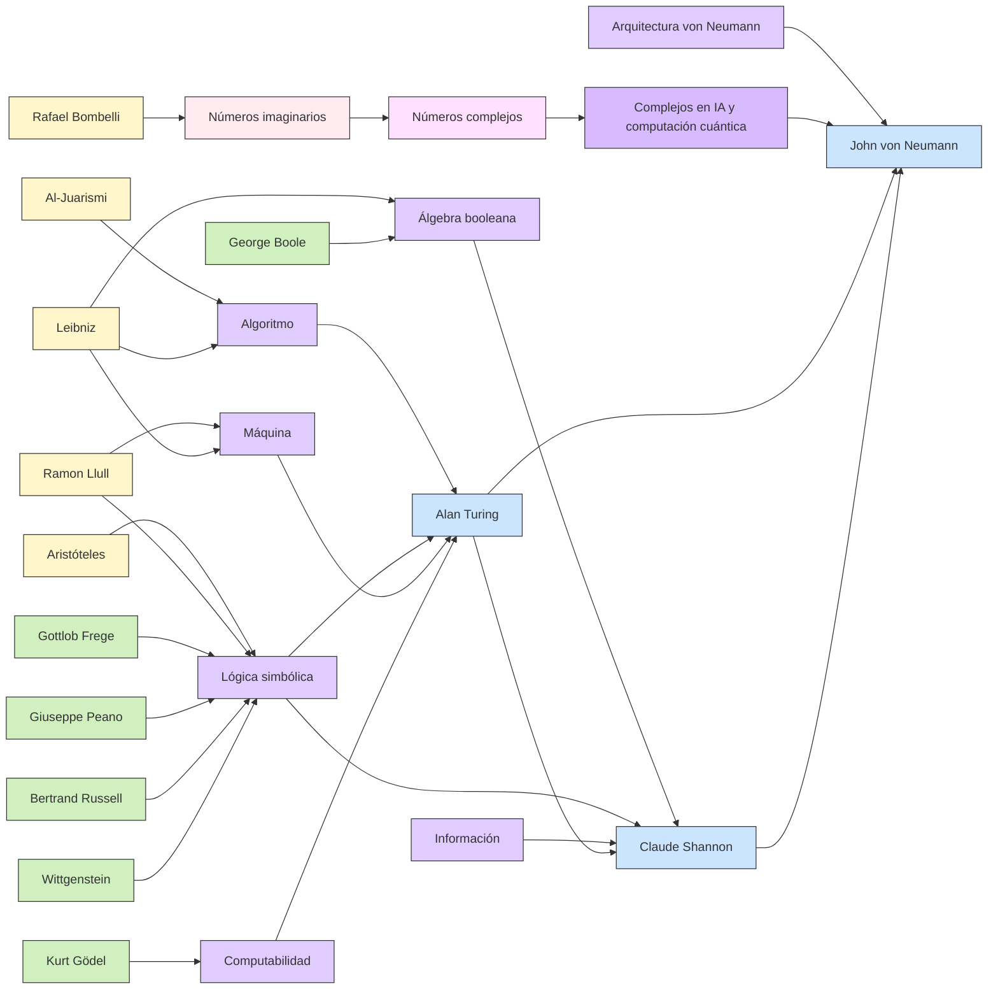
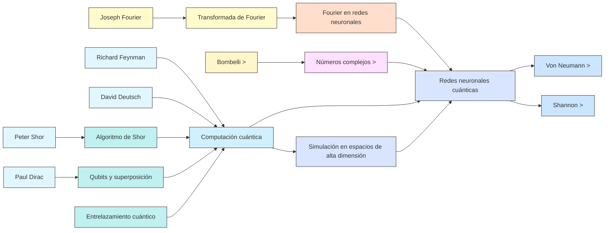

## Alan Turing  
1912–1954, Reino Unido, Londres  
**Paper y obra más relevante**: 1950 – *Computing Machinery and Intelligence*  
**Formación**: Matemáticas, King's College, Cambridge  

Pionero del concepto de máquina universal y test de Turing; propuso que las máquinas pueden simular cualquier proceso cognitivo.

---

## John McCarthy  
1927–2011, EE.UU., Boston  
**Paper y obra más relevante**: 1958 – *Programs with Common Sense*  
**Formación**: Matemáticas, Caltech y Princeton  

Inventó el término "inteligencia artificial" y desarrolló el lenguaje LISP para representar conocimiento en IA simbólica.

---

## Frank Rosenblatt  
1928–1971, EE.UU., Nueva York  
**Paper y obra más relevante**: 1958 – *The Perceptron: A Probabilistic Model...*  
**Formación**: Psicología y neurociencia, Cornell University  

Creó el perceptrón, primer modelo computacional de red neuronal con aprendizaje supervisado.

---

## John von Neumann  
1903–1957, Hungría–EE.UU., Budapest  
**Paper y obra más relevante**: 1945 – *First Draft of a Report on the EDVAC*  
**Formación**: Matemáticas, química y física, ETH Zürich y Universidad de Budapest  

Fundó la arquitectura de computadoras modernas y planteó la auto-replicación como base de sistemas inteligentes.

---

## Claude Shannon  
1916–2001, EE.UU., Petoskey (Michigan)  
**Paper y obra más relevante**: 1948 – *A Mathematical Theory of Communication*  
**Formación**: Ingeniería eléctrica y matemáticas, MIT  

Padre de la teoría de la información; sentó bases matemáticas para el procesamiento de señales en IA y telecomunicaciones.

---

## Geoffrey Hinton  
1947– , Reino Unido, Wimbledon  
**Paper y obra más relevante**: 1986 – *Learning Representations by Back-Propagating Errors*  
**Formación**: Psicología experimental e IA, Cambridge y Edimburgo  

Impulsó las redes neuronales profundas y el backpropagation, bases del deep learning moderno.

---

## Yoshua Bengio  
1964– , Marruecos–Canadá, Rabat  
**Paper y obra más relevante**: 2003 – *A Neural Probabilistic Language Model*  
**Formación**: Ciencias de la computación, McGill University  

Desarrolló modelos neuronales probabilísticos y contribuyó a word embeddings y arquitecturas secuenciales.

---

## Yann LeCun  
1960– , Francia, París  
**Paper y obra más relevante**: 1998 – *Gradient-Based Learning Applied to Document Recognition*  
**Formación**: Ingeniería, Université Pierre et Marie Curie  

Pionero de las redes convolucionales (ConvNets), fundamentales para la visión por computadora.

## Ashish Vaswani  
?– , India–EE.UU.  
**Paper y obra más relevante**: 2017 – *Attention is All You Need*  
**Formación**: Ciencias de la computación, University of Illinois Urbana-Champaign  

Lideró el equipo que propuso la arquitectura Transformer, base de todos los modelos LLM modernos.

---

## Jacob Devlin  
?– , EE.UU.  
**Paper y obra más relevante**: 2018 – *BERT: Pre-training of Deep Bidirectional Transformers...*  
**Formación**: Ingeniería eléctrica e informática, Universidad de Maryland  

Creador principal de BERT, modelo bidireccional preentrenado para tareas de lenguaje natural.

---

## François Chollet  
1977– , Francia  
**Paper y obra más relevante**: 2015 – *Keras (framework de deep learning)*  
**Formación**: Ingeniería, autodidacta en AI y software  

Diseñó Keras, el framework que popularizó el deep learning accesible para investigadores y artistas.

---

## Alec Radford  
?– , EE.UU.  
**Paper y obra más relevante**: 2018–2023 – *GPT, GPT-2, GPT-3*  
**Formación**: Dropout de la universidad, OpenAI Researcher  

Lideró los desarrollos iniciales de GPT en OpenAI, estableciendo el paradigma de LLM autoregresivo escalado.

---

## Ilya Sutskever  
1985– , Rusia–Canadá  
**Paper y obra más relevante**: 2014 – *Sequence to Sequence Learning with Neural Networks*  
**Formación**: IA, Universidad de Toronto (Hinton's lab)  

Co-creador de Seq2Seq y cofundador de OpenAI; pieza clave en la transición al entrenamiento de LLMs generalistas.

---

## Fei-Fei Li  
1976– , China–EE.UU.  
**Paper y obra más relevante**: 2009 – *ImageNet: A Large-Scale Hierarchical Image Database*  
**Formación**: Física, Princeton; Ciencia Computacional, Caltech  

Fundó ImageNet, transformando el aprendizaje supervisado en visión por computadora; impulsa IA ética y humana.

---

## Demis Hassabis  
1976– , Reino Unido  
**Paper y obra más relevante**: 2016 – *Mastering the game of Go with deep neural networks and tree search*  
**Formación**: Neurociencia cognitiva, UCL  

CEO de DeepMind, líder en IA general, AlphaGo, AlphaFold, Gemini y arquitectura de IA cognitiva integrada.

---

## Yannic Kilcher  
?– , Suiza  
**Paper y obra más relevante**: 2020–presente – Divulgación técnica de SOTA models  
**Formación**: Machine Learning, ETH Zürich  

Divulgador técnico y científico que ha popularizado con claridad decenas de papers top en IA reciente.

---

## Yi Tay  
?– , Singapur–EE.UU.  
**Paper y obra más relevante**: 2023 – *Fuyu, Gemini, CoLT5, LongNet*  
**Formación**: NLP, Nanyang Technological University  

Líder en Google DeepMind; trabaja en arquitecturas de largo contexto, IA multimodal y escalamiento eficiente.

---

## Tim Dettmers  
?– , Alemania  
**Paper y obra más relevante**: 2022 – *8-bit Optimizers and Quantized Transformers*  
**Formación**: ML, University of Washington  

Investigador central en HuggingFace y BitNet; pionero en modelos grandes con eficiencia extrema (bitsandbytes, quantization).

## Hugo Touvron  
?– , Francia  
**Paper y obra más relevante**: 2023 – *LLaMA: Open and Efficient Foundation Language Models*  
**Formación**: Ciencia computacional, Inria / Meta AI  

Creador principal de LLaMA (Meta AI), impulsó el acceso abierto a modelos fundacionales eficientes y replicables.

---

## Noam Shazeer  
?– , EE.UU.  
**Paper y obra más relevante**: 2023 – *Claude 1–3 (Anthropic)*  
**Formación**: IA y ML, ex-Google Brain, coautor de Transformers  

Co-fundador de Anthropic; lideró el diseño de Claude (IA constitucional), centrado en seguridad y alineamiento.

---

## Oriol Vinyals  
?– , España–Reino Unido  
**Paper y obra más relevante**: 2023 – *Gemini 1.5: Efficient Long Context Foundation Models*  
**Formación**: Física, UAB; ML, Cambridge  

Lidera Gemini en Google DeepMind; especialista en arquitecturas escalables, multimodalidad y razonamiento estructurado.

---

## Guillaume Lample  
?– , Francia  
**Paper y obra más relevante**: 2023 – *Mixtral: Sparse Mixture of Experts at Scale*  
**Formación**: Ciencia computacional, Meta / FAIR  

Coautor de Mixtral, que combina eficiencia extrema y modularidad escalable mediante routing dinámico de expertos.

---

## Tay Yi & DeepMind Gemini Team  
2020s, internacional  
**Paper y obra más relevante**: 2024 – *Gemini 1.5 Technical Report*  
**Formación**: Mixto (Google Brain + DeepMind merge)  

Diseñaron la arquitectura Gemini con contexto ultraextenso (1M tokens), memoria, razonamiento y visión avanzada.

---

## Mistral AI Team (Arthur Mensch, G. Lample, etc.)  
2023– , Francia  
**Paper y obra más relevante**: 2023 – *Mistral 7B, Mixtral, Codestral*  
**Formación**: ENS, Polytechnique, Inria  

Fundaron Mistral AI con énfasis en modelos compactos, open-weight y rendimiento SOTA sin infraestructura extrema.

---

## Alec Radford y GPT Team (OpenAI)  
2018–2023, EE.UU.  
**Paper y obra más relevante**: 2018–2020 – *GPT, GPT-2, GPT-3*  
**Formación**: Ingeniería, OpenAI Labs  

Lideraron el paradigma autoregresivo en escala, con entrenamiento no supervisado y arquitectura Transformer pura.

---

## Dario Amodei & Anthropic Research  
2021– , EE.UU.  
**Paper y obra más relevante**: 2022 – *Constitutional AI: Harmlessness from AI Feedback*  
**Formación**: Física, Stanford  

Fundó Anthropic tras salir de OpenAI; impulsa modelos alineados a valores éticos mediante técnicas de autoregulación.

---
	Maestros y discípulos → nodos grises (#eee)
	•	Conceptos fundacionales → nodos violetas (#ccf)
	•	Tecnologías derivadas → nodos verdes (#cfc)
	•	Modelos contemporáneos → nodos celestes (#ccf con borde rojo)

```mermaid
graph LR

%% Países
USA[USA]
China[China]
UK[UK]
France[France]
Germany[Germany]
Argentina[Argentina]
Brazil[Brazil]
Finland[Finland]
Italy[Italy]

%% Instituciones
OpenAI[OpenAI]
DeepMind[Google DeepMind]
Meta[Meta AI]
Anthropic[Anthropic]
Mistral[Mistral AI]
Eleuther[EleutherAI]
HuggingFace[HuggingFace]
CONICET[CONICET]
LNCC[LNCC]
EuroHPC[EuroHPC]
FZJ[FZJ - Jülich]
CSC[CSC Finland]
CINECA[CINECA]
Tsinghua[Tsinghua Univ.]
DeepSeek[DeepSeek]
Huawei[Huawei Cloud]

%% Clusters
Frontier[Frontier]
ElCapitan[El Capitan]
GeminiInfra[Gemini Infra]
MetaRSC[Meta RSC]
ClaudeInfra[Claude Infra]
MistralInfra[Mistral Infra]
LLaMAInfra[LLaMA Infra]
Clementina[Clementina XXI]
SantosDumont[Santos Dumont]
JUPITER[JUPITER]
LUMI[LUMI]
Leonardo[Leonardo]
ABCI[ABCI 3.0]
Dojo[Dojo]
DeepSeekInfra[DeepSeek Infra]

%% Modelos
GPT4[GPT-4]
Gemini[Gemini]
Claude[Claude]
Mixtral[Mixtral]
LLaMA[LLaMA]
BERT[BERT]
DeepSeekV3[DeepSeek V3]

%% Relaciones
USA --> OpenAI
USA --> DeepMind
USA --> Meta
USA --> Anthropic
USA --> HuggingFace
USA --> Eleuther
UK --> DeepMind
France --> Mistral
Germany --> FZJ
Argentina --> CONICET
Brazil --> LNCC
Finland --> CSC
Italy --> CINECA
China --> Tsinghua
China --> DeepSeek
China --> Huawei

OpenAI --> Frontier
OpenAI --> ElCapitan
DeepMind --> GeminiInfra
Meta --> MetaRSC
Anthropic --> ClaudeInfra
Mistral --> MistralInfra
Meta --> LLaMAInfra
CONICET --> Clementina
LNCC --> SantosDumont
FZJ --> JUPITER
EuroHPC --> LUMI
EuroHPC --> Leonardo
DeepSeek --> DeepSeekInfra

GPT4 --> Frontier
Gemini --> GeminiInfra
Claude --> ClaudeInfra
Mixtral --> MistralInfra
LLaMA --> LLaMAInfra
DeepSeekV3 --> DeepSeekInfra
BERT --> MetaRSC

EuroHPC --- CSC
EuroHPC --- FZJ
EuroHPC --- CINECA
DeepMind --- OpenAI
HuggingFace --- Eleuther

%% Estilos (deben venir al final)
style USA fill:#eee,stroke:#333
style China fill:#eee,stroke:#333
style UK fill:#eee,stroke:#333
style France fill:#eee,stroke:#333
style Germany fill:#eee,stroke:#333
style Argentina fill:#eee,stroke:#333
style Brazil fill:#eee,stroke:#333
style Finland fill:#eee,stroke:#333
style Italy fill:#eee,stroke:#333

style OpenAI fill:#ddf,stroke:#555
style DeepMind fill:#ddf,stroke:#555
style Meta fill:#ddf,stroke:#555
style Anthropic fill:#ddf,stroke:#555
style Mistral fill:#ddf,stroke:#555
style Eleuther fill:#ddf,stroke:#555
style HuggingFace fill:#ddf,stroke:#555
style CONICET fill:#ddf,stroke:#555
style LNCC fill:#ddf,stroke:#555
style EuroHPC fill:#ddf,stroke:#555
style FZJ fill:#ddf,stroke:#555
style CSC fill:#ddf,stroke:#555
style CINECA fill:#ddf,stroke:#555
style Tsinghua fill:#ddf,stroke:#555
style DeepSeek fill:#ddf,stroke:#555
style Huawei fill:#ddf,stroke:#555

style Frontier fill:#ccf,stroke:#003366
style ElCapitan fill:#ccf,stroke:#003366
style GeminiInfra fill:#ccf,stroke:#003366
style MetaRSC fill:#ccf,stroke:#003366
style ClaudeInfra fill:#ccf,stroke:#003366
style MistralInfra fill:#ccf,stroke:#003366
style LLaMAInfra fill:#ccf,stroke:#003366
style Clementina fill:#ccf,stroke:#003366
style SantosDumont fill:#ccf,stroke:#003366
style JUPITER fill:#ccf,stroke:#003366
style LUMI fill:#ccf,stroke:#003366
style Leonardo fill:#ccf,stroke:#003366
style ABCI fill:#ccf,stroke:#003366
style Dojo fill:#ccf,stroke:#003366
style DeepSeekInfra fill:#ccf,stroke:#003366

style GPT4 fill:#cfc,stroke:#090
style Gemini fill:#cfc,stroke:#090
style Claude fill:#cfc,stroke:#090
style Mixtral fill:#cfc,stroke:#090
style LLaMA fill:#cfc,stroke:#090
style BERT fill:#cfc,stroke:#090
style DeepSeekV3 fill:#cfc,stroke:#090
```

# precursores

