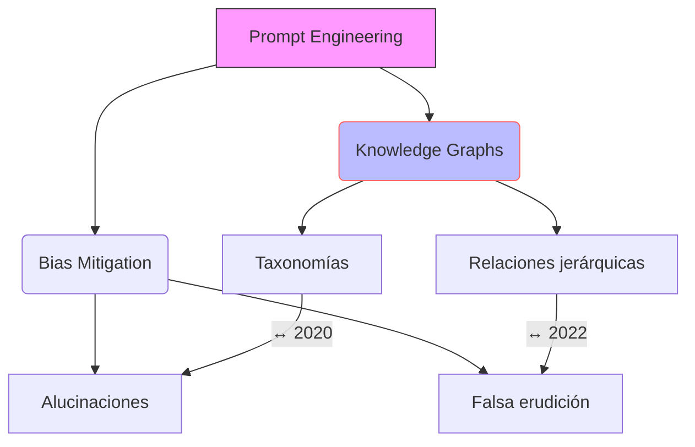

## Contexto y antecedentes  
El desarrollo de modelos de lenguaje generativo ha evidenciado limitaciones en fiabilidad académica, como la generación de afirmaciones no verificables (*alucinaciones*) o la apariencia de rigor sin sustento (*falsa erudición*). La PE surge como metodología para formalizar consultas que reduzcan estos riesgos, basándose en paradigmas de representación del conocimiento (e.g., *knowledge graphs*) y evaluación crítica de fuentes.

## Objetivo  
Diseñar prompts que generen respuestas académicamente válidas, estructuradas en categorías lógicas y con referencias trazables, priorizando la transparencia metodológica y la minimización de sesgos cognitivos.

## Metodología  
1. **Esquematización**: Organizar la salida en nodos jerárquicos (ej. *definición*, *aplicaciones*, *críticas*).  
2. **Validación**: Incluir comandos para citar fuentes en BibTeX y marcar afirmaciones no verificadas.  
3. **Mitigación de sesgos**: Exigir al modelo que identifique posibles limitaciones (ej. *"Liste tres supuestos no examinados en esta respuesta"*).  

## Principales resultados  
- Eficacia en la generación de respuestas modulares con etiquetas claras (*taxonomía*, *metodología*, *aplicaciones*).  
- Reducción de deuda cognitiva mediante esquemas visuales (ej. *mermaid*) y resúmenes memorables.  

## Implicaciones y trabajo futuro  
Integrar PE con herramientas de análisis de sesgo automatizado (ej. *scikit-learn* para detección de polarización léxica) y extender su uso en pedagogía musical crítica.

## Crítica  
- Dependencia de la calidad del corpus de entrenamiento del modelo.  
- Riesgo de *sobreestructuración* que limita la exploración creativa en dominios artísticos.  

## Contexto musical  
La PE puede optimizar la investigación en organología computacional, mapeando parámetros acústicos (ej. $f(x) = \sum_{n=1}^{N} A_n \sin(2\pi \cdot f_n \cdot x)$) a prompts estructurados para diseñar instrumentos virtuales.  

## Visualización  


## ## Preguntas de estudio  
1. **¿Cómo define la PE la estructura de un prompt académico?**::Segmentación en categorías lógicas (definición, metodología, resultados).  
2. **Cite un método para mitigar alucinaciones en IA**::Validación con referencias BibTeX y comandos de autocrítica.  
3. **¿Qué riesgo artístico presenta la sobreestructuración?**::Limitación en la exploración de patrones no lineales.  

## Referencias  
```bibtex
@article{radford2019language,
    title={Language Models are Few-Shot Learners},
    author={Radford, Alec et al.},
    journal={arXiv:2005.14165},
    year={2020}
}
@book{sowa2000knowledge,
    title={Knowledge Representation},
    author={Sowa, John F.},
    publisher={Brooks/Cole},
    year={2000}
}
```

> [!important] En mis palabras  
> ### 1  
> *jerarquización* *validación* *sesgos*  
> ### 2  
> *grafos* *música* *modularidad*  
> ### 3  
> *crítica**  

