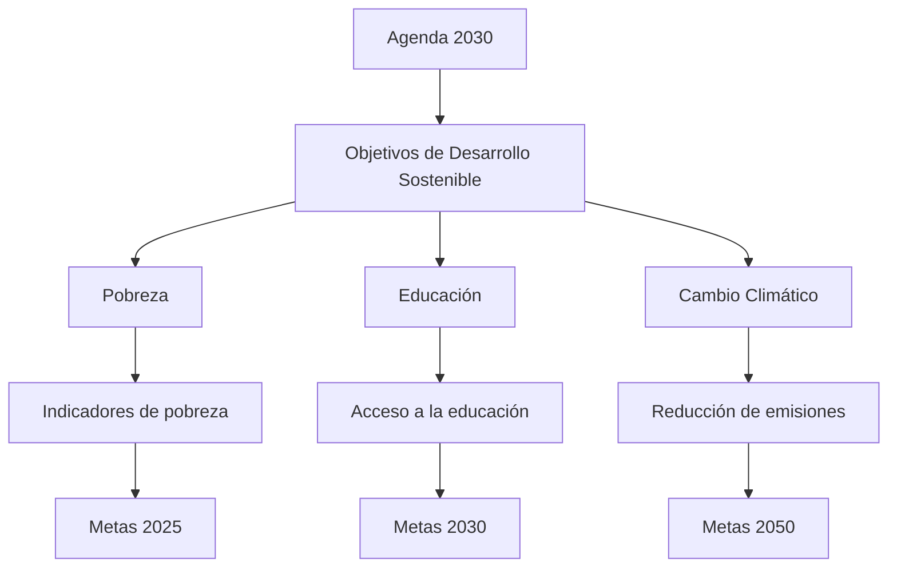

## Contexto y antecedentes
La Agenda 2030 surge como respuesta a la necesidad de un marco global para abordar los desafíos interconectados del siglo XXI. Históricamente, los esfuerzos de desarrollo se han centrado en el crecimiento económico, a menudo a expensas de la equidad social y la sostenibilidad ambiental. La Agenda 2030 integra estas dimensiones bajo un enfoque holístico, reconociendo que los problemas globales requieren soluciones coordinadas y multidisciplinarias.

## Objetivo
El propósito central de la Agenda 2030 es proporcionar un marco para el desarrollo sostenible que sea inclusivo, equitativo y respetuoso con los límites planetarios. Su hipótesis subyacente es que el progreso en un área (por ejemplo, la educación) puede catalizar avances en otras (como la salud o la igualdad de género), creando un efecto multiplicador positivo.

## Metodología
La Agenda 2030 se basa en un enfoque sistémico, utilizando indicadores cuantitativos y cualitativos para medir el progreso hacia los ODS. Estos indicadores se derivan de datos globales y locales, y se ajustan a contextos específicos para garantizar su aplicabilidad universal. La metodología incluye la participación de múltiples actores, desde gobiernos hasta organizaciones civiles y el sector privado.

## Principales resultados
Los principales resultados de la Agenda 2030 incluyen la creación de un lenguaje común para el desarrollo sostenible, la movilización de recursos globales y la promoción de políticas integradas. Sin embargo, el progreso ha sido desigual, con avances significativos en algunas áreas (como la reducción de la pobreza extrema) y retrocesos en otras (como la lucha contra el cambio climático).

## Implicaciones y trabajo futuro
La Agenda 2030 tiene implicaciones profundas para la gobernanza global, la cooperación internacional y la innovación tecnológica. Futuras investigaciones deberían centrarse en mejorar la medición de los ODS, fortalecer la participación local y desarrollar tecnologías que apoyen la sostenibilidad.

## Crítica
Una crítica común a la Agenda 2030 es su ambición desmesurada, que puede dificultar su implementación efectiva. Además, la falta de mecanismos vinculantes para garantizar el cumplimiento de los ODS ha sido señalada como una limitación significativa.

## Contexto musical
La Agenda 2030 puede inspirar nuevas formas de expresión musical que reflejen los valores de sostenibilidad y equidad. Por ejemplo, compositores podrían explorar temas como la justicia climática o la diversidad cultural, utilizando técnicas innovadoras para transmitir mensajes poderosos.

## Visualización

## Preguntas de estudio
1. ¿Cuál es el objetivo principal de la Agenda 2030?::Promover el desarrollo sostenible a través de 17 Objetivos de Desarrollo Sostenible.
2. ¿Qué crítica común se hace a la Agenda 2030?::Su ambición desmesurada y la falta de mecanismos vinculantes.


## Referencias
```bibtex
@article{un2015,
  title={Transforming our world: the 2030 Agenda for Sustainable Development},
  author={United Nations},
  year={2015},
  publisher={United Nations}
}
```

> [!important] En mis palabras 
> ### 1 
>   <*sostenibilidad*> <*equidad*> <*global*>
> ## 2 
>  <*objetivos*> <*indicadores*> <*sistémico*>
> ## 3 
>  <*música*> <*expresión*> <*innovación*>±