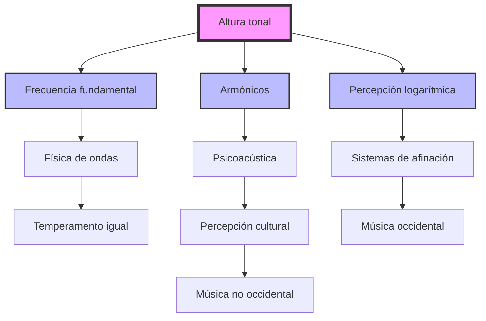

## Contexto y antecedentes  
La altura tonal ha sido un concepto central en la música desde la antigüedad, vinculado a la percepción humana de los sonidos y su organización en sistemas musicales. En el siglo XIX, Hermann von Helmholtz estableció una base científica para su estudio al relacionar la altura con la frecuencia de las ondas sonoras y los fenómenos de resonancia. Este enfoque permitió comprender cómo la física y la fisiología humana interactúan para definir la percepción tonal, sentando las bases para la acústica musical moderna.

## Objetivo  
El objetivo principal es analizar la altura tonal como un fenómeno multidimensional, integrando sus aspectos físicos, perceptuales y culturales. Se busca comprender cómo la frecuencia fundamental, los armónicos y la psicoacústica influyen en la percepción de la altura, y cómo estos principios han sido aplicados en la teoría y práctica musical.

## Metodología  
El estudio de la altura tonal se basa en métodos interdisciplinarios que combinan la física de las ondas sonoras, la fisiología del oído humano y la psicología de la percepción. Se utilizan modelos matemáticos para describir la relación entre frecuencia y altura, como la ecuación:  

$$
f = \frac{1}{T}
$$  

donde \( f \) es la frecuencia en hercios (Hz) y \( T \) es el período de la onda en segundos. Además, se emplean experimentos psicoacústicos para medir la sensibilidad humana a cambios de frecuencia y la influencia de los armónicos en la percepción tonal.

## Principales resultados  
1. La altura tonal está directamente relacionada con la frecuencia fundamental, pero también depende de la presencia y distribución de armónicos.  
2. La percepción de la altura es logarítmica, lo que explica por qué intervalos musicales como la octava se perciben como proporciones de frecuencia (e.g., 2:1).  
3. Los sistemas de afinación, como el temperamento igual, se basan en divisiones matemáticas de la octava para garantizar consistencia tonal en diferentes contextos musicales.

## Implicaciones y trabajo futuro  
La comprensión de la altura tonal tiene implicaciones para el diseño de instrumentos musicales, la síntesis de sonido y la composición musical. Futuras investigaciones podrían explorar cómo las diferencias culturales influyen en la percepción tonal y cómo la inteligencia artificial puede generar nuevas escalas y sistemas armónicos basados en principios psicoacústicos.

## Crítica  
Un aspecto problemático es la simplificación excesiva de la altura tonal como un fenómeno puramente físico. La percepción humana también está influenciada por factores contextuales, como el timbre y la intensidad del sonido, lo que sugiere que los modelos actuales podrían no capturar completamente su complejidad.

## Contexto musical  
La altura tonal ha sido fundamental en la evolución de la música occidental, desde los modos griegos hasta el sistema tonal moderno. En la música contemporánea, su manipulación ha permitido explorar microtonalidad y texturas sonoras complejas, como en obras de compositores como György Ligeti o Iannis Xenakis.

## Visualización  


## Python  
```run-python
import numpy as np
import plotly.graph_objects as go

# Frecuencias fundamentales y armónicos
frequencies = np.array([220, 440, 660, 880])  # Ejemplo: La3, La4, Mi5, La5
amplitudes = np.array([1, 0.5, 0.3, 0.2])  # Amplitudes relativas

# Crear onda compuesta
time = np.linspace(0, 0.01, 1000)
waveform = sum(amp * np.sin(2 * np.pi * freq * time) for freq, amp in zip(frequencies, amplitudes))

# Visualización
fig = go.Figure()
fig.add_trace(go.Scatter(x=time, y=waveform, mode='lines', name='Onda compuesta'))
fig.update_layout(title='Altura tonal y armónicos', xaxis_title='Tiempo (s)', yaxis_title='Amplitud')
fig.show()
```


## Representación musical  
```lily
\version "2.24.0"
\paper { tagline = ##f  paper-height=#(* 5 cm) paper-width=#(* 20 cm)  system-count=#1 }
\score {
    \new Staff {
        \relative c' {
            \time 4/4
            c4 d e f | g a b c' | b a g f | e d c2
        }
    }
}
```

## Preguntas de estudio  
1. ¿Qué es la altura tonal y cómo se relaciona con la frecuencia fundamental?  
   ::La altura tonal es la percepción de un sonido como grave o agudo, determinada principalmente por su frecuencia fundamental.  
2. ¿Por qué la percepción de la altura es logarítmica?  
   ::Porque el oído humano percibe intervalos musicales como proporciones de frecuencia, no como diferencias absolutas.  
3. ¿Cómo influyen los armónicos en la percepción de la altura tonal?  
   ::Los armónicos refuerzan la percepción de la frecuencia fundamental y pueden afectar la claridad tonal.  
4. ¿Qué críticas existen sobre los modelos actuales de altura tonal?  
   ::Se critica su simplificación excesiva, ignorando factores contextuales como el timbre y la intensidad.  
5. ¿Cómo se aplica la altura tonal en la música contemporánea?  
   ::Se utiliza para explorar microtonalidad y texturas sonoras complejas.  

## Referencias  
```bibtex
@book{helmholtz1863,
  title={On the Sensations of Tone},
  author={Helmholtz, Hermann von},
  year={1863},
  publisher={Longmans, Green, and Co.}
}
```

> [!important] En mis palabras  
> ### 1  
>   <*frecuencia*> <*percepción*> <*logarítmico*>  
> ### 2  
>   <*física*> <*psicoacústica*> <*cultura*>  
> ### 3  
>   <*ondas*> <*armónicos*> <*afinación*>  
> ### 4  
>   <*complejidad*> <*contexto*> <*simplificación*>  
> ### 5  
>   <*microtonalidad*> <*texturas*> <*contemporáneo*>