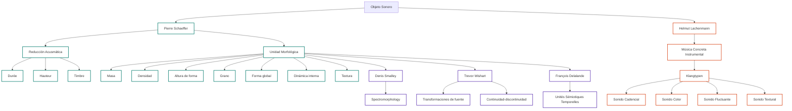
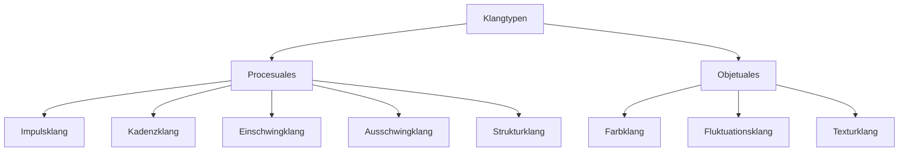

<grid drag="60 55" drop="5 10" bg="black" align="left">
# Instrumentalidad, Timbres y Materiales
### Clase 2
</grid>
<grid drag="-5 10" drop="5 -10" bg="black">
![[i1-header]]
</grid>

<grid drag="25 55" drop="-5 10" bg="black" align="top">
→ organología y timbre 
→ tipologías 
→ descriptores 
</grid>

---

*250422*

estructura de la clase

- *minicoloquio* del tp1
- instrumentalidad
- timbre
- materiales
- trabajo en grupo y exposición

*pausa*

- algunos ejemplos de interfaces
- ia introducción
- trabajo en grupo 333 

--- 

instrumentalidad 

---

1. Notación e imaginario estable (dispo mat sin variabilidad)
2. Técnicas extendidas. 
3. Hibridación instrumental 
4. Invención de instrumentos: DIY, hacker, DigFab.
5. Exorganología. 

---

# Instrumentality: Sobre la Construcción de la Identidad Instrumental

 Sarah Hardjowirogo y Thor Magnusson

---

## Introducción

Los instrumentos musicales del siglo XXI difieren de los de épocas anteriores en muchos aspectos: apariencia, funcionalidad técnica, técnica interpretativa, sonidos .

---

A medida que los instrumentos han cambiado, también lo ha hecho nuestra comprensión de lo que es un instrumento musical .

---
La falta de precisión de la noción actual de instrumento y su incompatibilidad con las formas instrumentales contemporáneas son consecuencias de un proceso tecnocultural .

---

Esto plantea preguntas fundamentales sobre la identidad del instrumento musical: ¿Cuándo (y por qué) algo es un instrumento musical, y cuándo (y por qué) no lo es? .

---

Para comprender las ligeras diferencias entre lo instrumental (aún por definir) y lo que se asume como "otro", parece razonable hablar de **instrumentalidad** .

---

La instrumentalidad denota esa especificidad particular que se supone que presentan los instrumentos .
El objetivo de este capítulo es preparar el terreno para una discusión reflexiva sobre el concepto de instrumentalidad .

---

Se considerarán tanto las diferencias como las similitudes entre los instrumentos musicales tradicionales y electrónicos .

---

## El Concepto de Instrumentalidad

**Instrumentalidad** se define aproximadamente como "aquello que define a un instrumento musical como tal", "la esencia del instrumento musical" y una "cualidad instrumental específica"

---

Más precisamente, denota el **potencial** de las cosas para ser usadas como instrumentos musicales o, dicho de otra manera, su potencial instrumental como tal .

--- 

La instrumentalidad representa una estructura compleja, cultural y temporalmente formada de **acciones, conocimiento y significado** asociados con cosas que pueden usarse para producir sonido [2, 3].

---

La instrumentalidad **no debe entenderse como una propiedad inherente** que un objeto tiene o no [2, 3].

---
 
Más bien, se concibe como un medio para capturar el potencial instrumental de un artefacto dado [2, 3].
La instrumentalidad **no es un término constante**, sino graduable y dinámico [2, 3].

---

Un objeto puede ser más o menos instrumental según su expresión de las características asociadas con la instrumentalidad [2, 3].

---

## Perspectivas sobre la Instrumentalidad

### Similitudes y Diferencias entre Instrumentos Tradicionales y Electrónicos

Sarah Hardjowirogo introduce el concepto de *instrumentalidad* considerando las diferencias, pero también las **similitudes** entre instrumentos musicales tradicionales y electrónicos .

---

Desarrolla un marco teórico para instrumentos musicales que conecta los contemporáneos con los conocidos durante siglos mediante la identificación de **criterios de instrumentalidad** [

### El Enfoque Lingüístico

Caroline Cance aborda el concepto de instrumentalidad a partir de un estudio lingüístico sobre las designaciones de los dispositivos musicales digitales [4].

Sus hallazgos sugieren que, más que el objeto en sí, son los **patrones de acción** en los que se integra el objeto los que deciden si algo se denomina instrumento musical o no

--- 

Según Cance et al. (2013), "parece que 'instrumento' no se refiere realmente a un dispositivo [...] sino que califica su interacción con los usuarios [...]" 

---

En su opinión, la instrumentalidad no depende tanto de las propiedades del dispositivo en sí, sino de las **acciones y significados** en los que está integrado 

---

Esta perspectiva desplaza el foco del instrumento como objeto material a lo que Alperson llama sus características **inmateriales** 

---

## Componentes de la Instrumentalidad

### Relación Músico-Instrumento Incorporada

Amelie Hinrichsen y Johanna Schindler informan sobre sus puntos de vista sobre la integración de las relaciones músico-instrumento incorporadas en el diseño de instrumentos musicales .
Proponen un proceso de diseño donde los prototipos de instrumentos musicales se desarrollan inspirados en prácticas de **improvisación** originarias de la danza contemporánea .

---

### Inversión de Tiempo y Refinamiento

Giuseppe Torre y Kristina Andersen se interesan más en la **impresión sostenida y el desarrollo de la instrumentalidad** .
Su artículo discute cómo el acto de percibir un objeto digital como un instrumento musical puede considerarse directamente proporcional a la **cantidad (y calidad) de tiempo invertido** en su desarrollo y refinamiento para adaptarse a necesidades individuales en lugar de genéricas .
Apoyan sus argumentos con un estudio de caso sobre Michael Waisvisz y su trabajo en The Hands .

---

### Intención del Intérprete

En la interpretación, existe una **correlación entre la intención y la acción** del intérprete [8, 9].
Esta correlación se vuelve particularmente obvia al considerar casos límite instrumentales como el **tocadiscos**, que permite tanto un uso instrumental como no instrumental [8, 9].
En estos casos, es principalmente la **intención del intérprete** lo que marca la diferencia entre los dos usos [8, 9].

---

## Conclusión

---

- La historia de la música comienza con la historia de la voz cantada.
- Esta voz debe ser lisa sin imperfecciones. 
- Hasta el siglo XIX el concepto estético ideal se basa en la noción del ***"timbre neutral"***

---
 > C.F. Michaelis " los instrumentos de cuerda eran "capaces de darnos la verdadera forma de la música y, por tanto, el verdadero placer estético""
 
---

![[Solstices#_]]

---

![[Solstices#score]]

---
===

 la orquestación > el mapa de mediación tiene como única función servir de un color (Klangfarbe)

---

Hermann von Helmholtz, Sensations of Tone (1863/1885)

</img>

note: aparece la noción de sonido compuesto como un término cercano al alemán Klang

---

klang

compound tone

Klangfarbenmelodie
(melodía de timbres)
note:hasta aquí el timbre es un termino primitivo , no se puede ordenar jerarquicamente , hasta que Schoenberg propone 
el klangfarben melodie

---

> “Pienso que el sonido se manifiesta por medio del timbre, y que la altura es una dimensión del timbre mismo. La altura no es sino el timbre medido en una dirección” (Schoenberg [1911)

note: Inclusive proponía una música estructurada a partir del timbre diciendo que “si es posible, con timbres diferenciados sólo por la altura, formar imágenes sonoras que denominamos melodías”, debe ser posible, utilizando la dimensión del timbre que se designa simplemente “timbre”, conformar sucesiones cuya cohesión posea una lógica equivalente a la que actúa en la melodía constituida por alturas (Ibíd.). Este concepto ya lo había aplicado en “Farben” la tercera pieza de su op.16, donde varía tímbricamente sucesivos ataques de un acorde.

---

### Farben, Arnold Schönberg (5 piezas para Orquesta Op. 16, 1909)

<iframe title="Analyse de Farben (Schoenberg)" src="https://www.youtube.com/embed/tFT6NIYMF1I?feature=oembed" height="150" width="200" allowfullscreen="" allow="fullscreen" class="full-screen-image"></iframe>

---

### J.S. Bach Ricercar a 3 from the Musical Offering BWV 1079 (1747)

<iframe title="Ricercar a 3 from the Musical Offering BWV 1079 | Netherlands Bach Society" src="https://www.youtube.com/embed/Lv5A1gy2oys?feature=oembed" height="113" width="200" allowfullscreen="" allow="fullscreen" style="aspect-ratio: 1.76991 / 1; width: 100%; height: 100%;"></iframe>

---

### Anton Webern,  Musikal Opfer  (1936)

<iframe title="Ricercare Bach (Orquestación de Webern)" src="https://www.youtube.com/embed/DIHDY0WEktw?feature=oembed" height="150" width="200" allowfullscreen="" allow="fullscreen" style="aspect-ratio: 1.33333 / 1; width: 100%; height: 100%;"></iframe>

---

<iframe title="Edgard Varèse - Ionisation" src="https://www.youtube.com/embed/1lpAXz79oAI?feature=oembed" height="113" width="200" allowfullscreen="" allow="fullscreen" style="aspect-ratio: 1.76991 / 1; width: 100%; height: 100%;"></iframe>

---

###  James Tenney , Having Never Written a Note for Percussion (1971)

 </img>

---

<iframe title="Having Never Written a Note for Percussion by James Tenney" src="https://www.youtube.com/embed/MpNDoiNLucM?feature=oembed" height="113" width="200" allowfullscreen="" allow="fullscreen" style="aspect-ratio: 1.76991 / 1; width: 100%; height: 100%;"></iframe>

---

# NOTACIÓN

- DESCRIPTIVA
- PRESCRIPTIVA
- DE ACCION
- PARAMETRICA

---

### 1. Objeto Sonoro (Pierre Schaeffer)

- <mark class="hltr-blue">Materia</mark>: textura sonora relativamente estable.
- <mark class="hltr-blue">Forma</mark>: variaciones internas de la materia.
- <mark class="hltr-blue">Masa</mark>: ocupación perceptiva del eje de altura (N/X/Y).
- <mark class="hltr-blue">Grano</mark>: microestructura (rugoso, límpido, tembloroso...).
- <mark class="hltr-blue">Temblor</mark>: vibrato extendido.
- <mark class="hltr-green">Objeto sonoro</mark>: unidad fenomenológica perceptual que no remite a una fuente sino a una morfología.

note: 

---

## Orígenes (1948–1952)

El concepto de *objet sonore* fue formulado por <mark class="hltr-yellow">Pierre Schaeffer</mark> hacia 1948 en el contexto del nacimiento de la *musique concrète*, con la fundación del *Groupe de Recherches de Musique Concrète* (GRMC) en la Radiodiffusion Française.

---

Su trabajo se consolidó con la publicación de *À la recherche d’une musique concrète* (1952), y más exhaustivamente en el tratado *Traité des objets musicaux* (1966).

---

El objeto sonoro emerge como **unidad mínima de escucha acousmática**: 

1. un **fragmento sonoro reducido**, aislado del contexto causal que lo origina.
2. La escucha acousmática **suspende** la fuente y privilegia las cualidades fenomenológicas del sonido en sí. 
3. 3 Esta operación de “reducción fenomenológica” encuentra inspiración en Husserl y Merleau-Ponty, (en tanto articula un objeto intencional que no se define ni por lo físico ni lo semiótico, sino por la experiencia auditiva misma.)

---

<iframe title="Pierre Schaeffer -- Études de bruits (1948)" src="https://www.youtube.com/embed/CTf0yE15zzI?feature=oembed" height="113" width="200" allowfullscreen="" allow="fullscreen" style="aspect-ratio: 1.76991 / 1; width: 100%; height: 100%;"></iframe>

---

## Definición

Un **objeto sonoro** es un evento acústico reducido a su percepción inmanente, caracterizado por:

- **Durée**: duración del evento.  
- **Timbre**: color sonoro y espectro.  
- **Hauteur**: altura o percepción de tono.  
- **Dynamique**: intensidad y envolvente.  
- **Mode d’existence**: tipo de ataque, continuidad, grano.  
- **Massivité**: grado de densidad o rarefacción.  

---
La sistematización de estos elementos llevó a la creación de la **typologie morphologique**, en donde Schaeffer propuso una clasificación de los objetos sonoros según **modo de aparición** y **tipo de variación interna**. La comparación con la fotografía (véase: *photographie sonore*) como acto de corte temporal de lo audible, prepara el terreno para una analítica del sonido como materia autónoma.

---

note: 
La tabla TARTYP (Tableau Récapitulatif de la Typologie) es un sistema de clasificación desarrollado por Pierre Schaeffer para organizar los objetos sonoros según criterios perceptuales. Se basa en dos dimensiones principales:
	1.	Modo de ataque (cómo comienza el sonido)
	2.	Modo de evolución interna (cómo se desarrolla y termina)

Cada objeto sonoro se clasifica por:
	•	Tipo de inicio:
	•	Impulsivo: ataque rápido (ej. percusión)
	•	Sostenido: ataque continuo (ej. cuerdas frotadas)
	•	Iterativo: repeticiones rápidas (ej. trino)
	•	Tipo de evolución:
	•	Estable: sonido constante
	•	Variable: cambia en tono, dinámica o timbre
	•	Granulado: compuesto de micro-eventos (ej. texturas)

Esto da lugar a una matriz donde cada casilla representa una combinación de ataque y evolución, formando una tipología de sonidos percibidos.

Por ejemplo, un sonido impulsivo-estable sería un golpe de tambor seco; un sostenido-variable podría ser un glissando con arco, y un iterativo-granulado podría representar un chirrido o fricción discontinua.

El objetivo es permitir una escucha analítica desligada de la causa física del sonido y centrada en su experiencia perceptual.

--- 

## Influencias

- <mark class="hltr-blue">Fenomenología</mark>: Husserl, Merleau-Ponty  
- <mark class="hltr-blue">Psicoacústica</mark>: G. Moles, Risset  
- <mark class="hltr-blue">Mecánica del oído y análisis espectral</mark> (Fourier, Helmholtz)  
- <mark class="hltr-yellow">Experimentación técnica</mark>: grabadores de cinta, magnetófonos, bucles

---

Schaeffer extiende la *écoute réduite* (escucha reducida) como método hacia una poética: en lugar de partir de símbolos, el compositor debe iniciar desde el acto perceptual. El sonido deja de ser vehículo y se vuelve “cosa”.

---

## Proyecciones

### En Lachenmann

<mark class="hltr-yellow">Helmut Lachenmann</mark> hereda y transforma el objeto sonoro como “tipo sonoro” (*Klangtyp*) dentro de su “música concreta instrumental”. Aunque niega explícitamente la relación causal de la *musique concrète*, adopta la escucha material como forma de composición. Sus tres categorías:

---

1. **Impulsklang**: impulsos transitorios (percusiones, ataques)  
2. **Farbklang**: estables, armónicos  
3. **Texturklang**: ruido denso, textural  

note: 
Estas se vinculan a las morfologías de Schaeffer, pero en un contexto ejecutado instrumentalmente, no grabado.

---

## Sonido Cadencial
- Asociado a funciones estructurales tradicionales.
- Relacionado con gestos musicales reconocibles o "esperables".
- A menudo implica **inicio–desarrollo–cierre**, incluso en materiales no tonales.

---

## Sonido Color
- Centrados en la **cualidad tímbrica estática**.
- No tienen una dirección temporal clara.
- Pueden actuar como “bloques de presencia”: superficies sonoras que no evolucionan internamente.

---

## Sonido Fluctuante
- Caracterizados por **variación interna continua**.
- Incluyen **vibratos, trémolos, glissandi**, o cualquier oscilación microtemporal.
- Generan tensión entre permanencia y movimiento.

---

## Sonido Textural
- Resultado de la superposición de múltiples eventos similares.
- Ejemplos: clusters, multifónicos, ruidos complejos.
- Construyen una percepción de densidad o materia sonora **sin individualidad de eventos**.

---

## Estructura Sonora
- No es una “categoría” más, sino el **marco global** que organiza y articula las anteriores.
- Define **cómo se conectan y jerarquizan** los tipos de sonido dentro de una obra.
- Permite leer la obra como un espacio de fuerzas sonoras, no como forma temática.

---

### En la psicoacústica y análisis musical

## Spectromorphology

Investigadores como <mark class="hltr-yellow">Trevor Wishart</mark> y <mark class="hltr-yellow">Denis Smalley</mark> desarrollan modelos computacionales o electroacústicos de análisis del timbre basados en la lógica schaefferiana (e.g. ***Spectromorphology***).

---

Smalley elabora una tipología temporal (emergence, attack, decay) y espacial (proximal, distal, en desarrollo), todo partiendo del objeto sonoro como unidad de significación.

---

### En diseño sonoro y síntesis

- Interfaces como *IRCAM AudioSculpt*, *GRM Tools*, o motores como *Csound* y *SuperCollider*, continúan articulando el diseño sonoro bajo la lógica del objeto: granular synthesis, morphing, convolution.  
- El “sample” en producción musical puede ser considerado una aplicación banalizada del objeto sonoro, mientras que instalaciones de *sound art* (e.g. Bill Fontana) recuperan su dimensión fenomenológica.

---

----

### 2. Klangtypen (Lachenmann, vía Bernal y Tsao)

| Tipo                  | Clase             | Ejemplo                        | Descripción perceptual                     |
|-----------------------|-------------------|---------------------------------|---------------------------------------------|
| **Kadenzklang**       | Proceso           | Crescendo decaimiento          | Desarrollo interno ligado a duración        |
| **Impulsklang**       | Proceso           | Ataques percusivos             | Impulsos seguidos de resonancia             |
| **Einschwingklang**   | Proceso parcial   | Ataque inicial                  | Transitorio de ataque (como Schaeffer 'N')  |
| **Ausschwingklang**   | Proceso parcial   | Colas resonantes                | Decaimiento final                           |
| **Farbklang**         | Objeto            | Acorde sostenido               | Color armónico estático                     |
| **Fluktuationsklang** | Objeto            | Arpegios periódicos            | Contorno estático, interior periódico       |
| **Texturklang**       | Objeto            | Nube de ruidos                  | Campo sonoro estadístico y complejo         |
| **Strukturklang**     | Proceso complejo  | Fraseo gestual (Gran Torso)    | Relación formal entre gestos materiales     |

> **Eigenzeit**: "tiempo propio" del sonido; clave para distinguir proceso (tiempo = forma) de objeto (tiempo < forma).

---

### 3. Evaluación Verbal del Timbre (Darke, 2005)

| Categoría         | Subdimensiones                      | Ejemplos léxicos                          |
|------------------|-------------------------------------|-------------------------------------------|
| **Textura**      | suave, rugosa, granulada            | áspera, límpida, grumosa                   |
| **Brillantez**   | oscura ↔ brillante                  | apagado, chillón, metálico                |
| **Calidez**      | fría ↔ cálida                       | nasal, aterciopelada, envolvente          |
| **Complejidad**  | simple ↔ compleja                   | rica, modulada, plana                      |
| **Artefactualidad** | natural ↔ artificial             | robótica, cruda, mecánica                  |

---

### 4. Notas comparativas

- **Lachenmann** traduce la *música concreta instrumental* como un sistema de resistencia física.
- **Schaeffer** la define en términos acousmáticos (fuente oculta).
- **Darke** analiza el timbre como experiencia verbalizable multidimensional.

---

### 5. Diagrama esquemático (tipologías Lachenmann)

---

# recursos sobre timbre

--- 

- contimbre
	- [Das Virtuelle Orchester der Neuen Musik, Sample Datenbank, Spieltechniken, mehr als 150 Orchesterinstrumente | conTimbre](https://www.contimbre.com/)
---
- audioset
	<iframe src="https://research.google.com/audioset/ontology/speech.html" allow="fullscreen" allowfullscreen="" style="height:100%;width:100%; aspect-ratio: 16 / 9; "></iframe>
---
- orquidee
	<iframe src="https://forum.ircam.fr/projects/detail/tinysol/" allow="fullscreen" allowfullscreen="" style="height:100%;width:100%; aspect-ratio: 16 / 9; "></iframe>
---
	- max orch (Per Bloland)
	<iframe src="https://perbloland.com/maxorch-download" allow="fullscreen" allowfullscreen="" style="height:100%;width:100%; aspect-ratio: 16 / 9; "></iframe>
---
- museum of imaginary musical instruments
<iframe src="http://imaginaryinstruments.org/about/" allow="fullscreen" allowfullscreen="" style="height:100%;width:100%; aspect-ratio: 16 / 9; "></iframe>
---
- acousmata
<iframe src="https://acousmata.com/" allow="fullscreen" allowfullscreen="" style="height:100%;width:100%; aspect-ratio: 16 / 9; "></iframe>
---
- The oxford handbook of timbre [-](https://global.oup.com/us/companion.websites/9780190637224/res/ch1/1/)
<iframe src="https://global.oup.com/us/companion.websites/9780190637224/res/ch1/1/" allow="fullscreen" allowfullscreen="" style="height:100%;width:100%; aspect-ratio: 16 / 9; "></iframe>