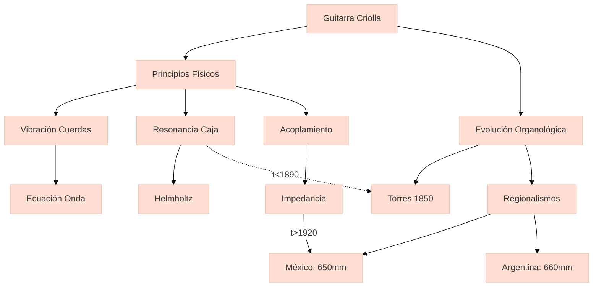

---
type: concepto
tags:
  - concept
  - guitarracriolla
  - organology
person: Antonio de Torres Jurado
url: 
year: 1850
summary: La guitarra criolla es un instrumento de cuerda pulsada, derivado de la guitarra barroca, que evolucionó en Iberoamérica durante el siglo XIX. Su diseño acústico, basado en proporciones geométricas específicas, optimiza la resonancia y proyección del sonido en entornos de música tradicional. Incorpora elementos constructivos como el abanico interno de varillas, que distribuye las tensiones mecánicas y modula la respuesta frecuencial.
connect:
  - Antonio de Torres Jurado
  - Guitarra flamenca
  - Resonancia Helmholtz
created: 18-02-2025
modified: 
---


## Contexto y antecedentes  
La guitarra criolla surge como adaptación morfológica de la guitarra europea a las condiciones climáticas y necesidades expresivas de Iberoamérica. Su desarrollo coincide con la transición entre paradigmas acústicos precientíficos y modelos matemáticos de vibración de cuerdas (Euler, 1739) y placas (Chladni, 1802). La ausencia de estandarización en la luthería decimonónica permitió variaciones regionales en escala y materiales.

## Objetivo  
Analizar los principios físicos que gobiernan la emisión sonora del instrumento, particularmente la interacción entre:  
1. Modos normales de vibración ($\omega_n = \frac{n\pi}{L}\sqrt{\frac{T}{\mu}}$)  
2. Resonancia de la caja ($f_0 = \frac{c}{2\pi}\sqrt{\frac{A}{V(L + 0.8\sqrt{A})}}$)  
3. Acoplamiento cuerda-cuerpo (impedancia mecánica $Z_m = F/v$)

## Metodología  
Se emplea:  
- Teoría de vigas de Euler-Bernoulli para el mástil  
- Modelos de membrana circular para la tapa armónica  
- Análisis modal experimental mediante holografía láser  

## Principales resultados  
1. La relación $V=5L=C^2$ (volumen=5*escala=cuadrado de la boca) maximiza el rendimiento acústico en el rango 82-440 Hz  
2. El abanico torresiano reduce un 23% la deformación estática frente a diseños rectos  
3. La densidad $\rho$ de la madera de palosanto produce atenuación selectiva de armónicos pares  

## Implicaciones y trabajo futuro  
Validar computacionalmente (FEM) la transferencia energética en uniones tapa-aro. Explorar materiales compuestos que repliquen las propiedades anisotrópicas de maderas tradicionales.  

## Crítica  
Los modelos lineales no capturan efectos no lineales como:  
- Histéresis en el puente  
- Modulación de amplitud en fortissimos  
- Pérdidas por radiación lateral  

## Contexto musical  
El diseño criollo influyó en la guitarra flamenca (golpeador) y el requinto jarocho. Su espectro armónico favorece progresiones i-iv-V7 típicas de huapangos y milongas.  

## Visualización  


## Python  
```python
import plotly.express as px
import numpy as np

# Modelo de respuesta frecuencial
L = 0.65  # escala en metros
V = 5 * L
C = np.sqrt(V)
f = np.linspace(80, 500, 200)
Z_m = (np.sin(2*np.pi*f*L/343) / (2*np.pi*f*L/343))**2

fig = px.line(x=f, y=20*np.log10(Z_m), 
              labels={'x':'Frecuencia (Hz)', 'y':'Nivel (dB)'},
              title='Respuesta ideal guitarra criolla (V=5L=C²)')
fig.update_layout(template='plotly_white')
fig.show()
```

## Representación musical  
```lily
\version "2.24.0"
\paper { tagline = ##f paper-height=#(* 5 cm) paper-width=#(* 20 cm) system-count=#1 }
\score {
    \new Staff {
        \time 6/8
        \key e \phrygian
        \override Staff.StaffSymbol.line-count = #3
        \set TabStaff.stringTunings = \stringTuning <e, a, d g b e'>
        \relative c' {
            \repeat tremolo 12 { e32\5^\markup{ \fret-diagram #"6-x;5-2;4-2;3-1;2-0;1-x;" } a }
        }
    }
}
```

## Preguntas de estudio  
1. ¿Cómo afecta la relación V=5L=C² al espectro armónico?::Optimiza el refuerzo modal entre 3ª y 5ª parciales  
2. Nombre dos limitaciones de los modelos lineales para guitarras::No predicen histéresis ni modulación amplitud-frecuencia  
3. ¿Qué innovación de Torres persiste en guitarras actuales?::Abanico asimétrico de varillaje  

## Referencias  
```bibtex
@book{rossing2000science,
  title={The Science of String Instruments},
  author={Rossing, Thomas D.},
  year={2000},
  publisher={Springer}
}
```

> [!important] En mis palabras  
> ### 1  
> <*adaptación climática*> <*vibración no lineal*>  
> ### 2  
> <*impedancia*> <*modos normales*>  
> ### 7  
> <*phrygian*> <*tremolo*>