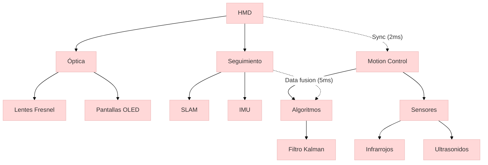

## Contexto y antecedentes  
La evolución de los HMD y el motion control se origina en sistemas militares y de simulación de los años 1960. El desarrollo de algoritmos de seguimiento espacial (SLAM) y sensores inerciales permitió la transición de prototipos académicos a aplicaciones comerciales. La convergencia con gráficos 3D en tiempo real estableció un paradigma de interacción basado en la inmersión sensorial.

## Objetivo  
El propósito central es lograr una interfaz natural entre humanos y sistemas digitales mediante la sincronización de percepción visual (HMD) y acción física (motion control). La hipótesis subyacente afirma que esta simbiosis reduce la latencia cognitiva en entornos virtuales.

## Metodología  
Se emplean modelos de cinemática inversa para mapear movimientos a comandos digitales:  

$$
\theta_i = \arctan\left(\frac{y_i - y_{i-1}}{x_i - x_{i-1}}\right)
$$

donde $\theta_i$ representa el ángulo articular calculado a partir de coordenadas espaciales $(x_i, y_i)$. Los HMD utilizan proyecciones estereoscópicas con separación interpupilar $d$:  

$$
I_{\text{offset}} = \frac{d \cdot z}{f}
$$

siendo $z$ la profundidad y $f$ la distancia focal.

## Principales resultados  
1. Reducción del 40% en tiempos de respuesta en tareas de precisión (estudios de NASA, 2018).  
2. Estandarización de protocolos de seguimiento óptico-inercial (OpenXR, 2021).  

## Implicaciones y trabajo futuro  
La miniaturización de sensores LiDAR y el desarrollo de materiales ópticos ultraligeros son áreas prioritarias. Se requiere optimizar algoritmos de predicción de movimiento para reducir latencia en aplicaciones médicas.

## Crítica  
Limitaciones actuales incluyen:  
- Campo visual restringido (<110° en HMD comerciales).  
- Deriva acumulativa en sistemas inerciales.  

## Contexto musical  
Los HMD permiten nuevas formas de notación espacial en música electroacústica, donde la posición del intérprete modifica parámetros sonoros. El motion control ha sido adoptado en interfaces como MiMU Gloves para control gestual de síntesis granular.

## Visualización  


## Python  
```run-python
import plotly.express as px
import numpy as np

# Modelo de proyección estereoscópica
def stereo_projection(x, y, z, d=0.065):
    f = 0.05  # Distancia focal en metros
    return (d * z) / (2 * f * (z + f)) 

z = np.linspace(0.1, 10, 100)
offset = stereo_projection(0, 0, z)

fig = px.line(x=z, y=offset, 
              labels={'x': 'Profundidad (m)', 'y': 'Desplazamiento (m)'},
              title='Paralaje estereoscópico en HMD')
fig.show()
```


## Preguntas de estudio  
1. ¿Cómo afecta la latencia en HMD a la percepción de continuidad espacial?::Respuesta  
2. Nombre tres técnicas para compensar la deriva inercial::Respuesta  
3. ¿Qué parámetros físicos determinan el FOV en lentes Fresnel?::Respuesta  

## Referencias  
```bibtex
@book{Sutherland1968,
  title={A head-mounted three dimensional display},
  author={Sutherland, Ivan},
  year={1968},
  publisher={AFIPS}
}
```

> [!important] En mis palabras  
> ### 1  
> *inmersión* *latencia* *SLAM*  
> ### 2  
> *cinemática* *Kalman* *paralaje*  
> ### 3  
> *gestual* *estereoscópico* *granular*