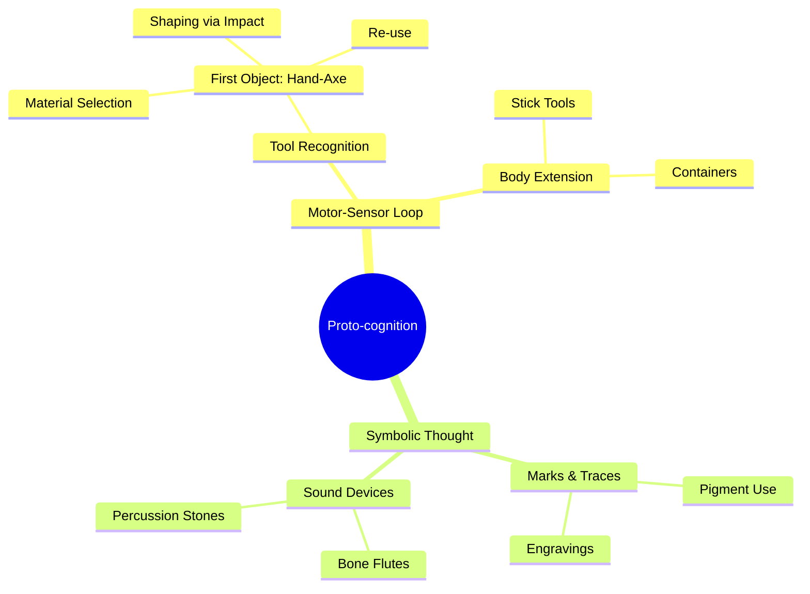

Este estudio pertenece al cruce entre la antropología cognitiva, la arqueología de la tecnología, la etología comparada y la filosofía de la técnica. Implica identificar los umbrales cognitivos y condiciones ecológicas y corporales necesarias para la aparición del objeto técnico como exo-cuerpo, es decir, como extensión exterior del cuerpo que no es simplemente un uso del entorno, sino una invención con continuidad operacional.

---

Estudio del momento de aparición de objetos tecnológicos

1. Marco teórico
	- Objeto técnico: No todo objeto artificial es técnico. Para Simondon (1958), un objeto técnico surge cuando existe una operación estructuralmente estable y reutilizable, con una concretización funcional que responde a condiciones físicas y no solo culturales.
	- Cognición material: Teoría según la cual los objetos son parte activa del pensamiento. No hay cognición “pura” previa a la técnica; la técnica permite pensar de nuevas maneras (Malafouris, 2013).
	- Primera herramienta humana: Se considera el chopper (hacha de filo simple) del Paleolítico inferior, datado en más de 2.5 millones de años (Olduvayense), como primer objeto técnico en sentido estricto, aunque otros primates usen piedras o palos como herramientas.

---

2. Condiciones mínimas para la emergencia del objeto técnico

A. Cognitivas
	1.	Agenciamiento recursivo: Capacidad de imaginar una acción futura con una herramienta que aún no existe. Esta es una forma primitiva de planificación motora extendida.
	2.	Representación causal: Saber que al golpear una piedra con otra se produce una forma cortante, y que esa forma es útil en una operación futura.
	3.	Memoria operativa transindividual: La técnica es transmisible: se aprende socialmente. La existencia de cultura técnica requiere imitación especializada y retención de procedimientos.

B. Biológicas
	1.	Oposición del pulgar: Permite manipulación fina.
	2.	Bipedestación: Libera las manos para manipular.
	3.	Cerebro expandido (a partir de Homo habilis): Crecimiento de regiones asociativas, particularmente el lóbulo parietal y el prefrontal, fundamentales en el control de la acción.

C. Técnicas y materiales
	1.	Disponibilidad de materias primas líticas: Debe haber acceso a piedras como sílex, cuarcita o basalto.
	2.	Aparición de cadenas operatorias: No basta con golpear una piedra. Se requiere una secuencia de acciones ordenadas, que produce un resultado predecible: forma, filo, resistencia.

---

3. Caso ejemplar: el hacha de filo simple (Olduvayense)
	- Lugar: Valle de Olduvai, Tanzania
	- Fecha: ~2.6 millones de años
	- Especie: Homo habilis

Operaciones implicadas
	1.	Recolección de núcleos líticos adecuados → selección basada en dureza, fractura conchoidal.
	2.	Golpe de percusión → uso de percutor de piedra para generar lascas.
	3.	Intención de simetría funcional → optimización del filo, aunque rudimentaria.
	4.	Uso múltiple: corte de carne, raspado de huesos, procesamiento de vegetales.

Justificación científica
	- Evidencias arqueológicas muestran núcleos y lascas con patrones repetidos de extracción.
	- Las marcas en huesos fosilizados demuestran el uso repetido y dirigido de las herramientas.
	- Asociaciones con restos de fauna y cambios en dieta y organización del grupo.

---

4. Conclusión y extrapolación

El objeto técnico surge cuando convergen:
	- Una estructura corporal que permite manipular;
	- Un sistema cognitivo que anticipa y representa acciones;
	- Una cultura social que transmite saberes;
	- Un entorno material que ofrece medios adecuados.

---

Aplicación especulativa (ejemplo en Júpiter)

Al estudiar organismos en atmósferas densas como Júpiter, podemos extrapolar que un objeto técnico joviano surgiría cuando:
	- Existe una estructura de manipulación adaptada a presión y flotación (ej. flagelos tubulares prensiles);
	- Se puede almacenar y transferir patrones de acción mediante descargas químicas o radioluminescencia;
	- La sustancia usada es semiestabilizada por campo electromagnético (objetos de plasma controlado o sólidos efímeros).

---




Referencias

```bibtex
@book{Simondon1958,
  author = {Gilbert Simondon},
  title = {Du mode d’existence des objets techniques},
  year = {1958},
  publisher = {Aubier}
}

@book{Malafouris2013,
  author = {Lambros Malafouris},
  title = {How Things Shape the Mind: A Theory of Material Engagement},
  year = {2013},
  publisher = {MIT Press}
}

@article{Toth1985,
  author = {Nicholas Toth},
  title = {The Oldowan Reassessed: A Close Look at Early Stone Artifacts},
  journal = {Journal of Archaeological Science},
  volume = {12},
  number = {2},
  year = {1985},
  pages = {101–120}
}


```
