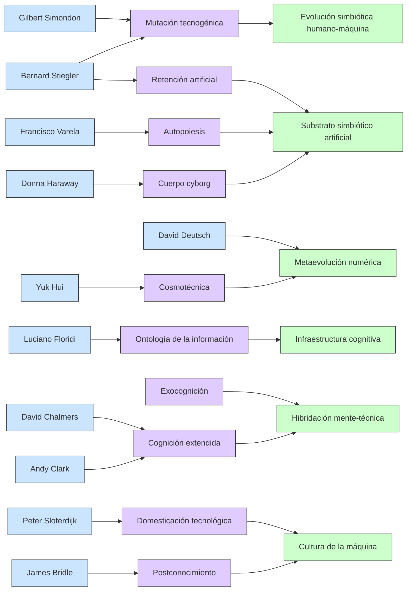

## 1. Una mutación no genética, sino informacional

Así como la evolución biológica opera a través de mutaciones genéticas que se seleccionan por presión ambiental, podríamos decir que la humanidad está experimentando una mutación cultural-cognitiva, donde el agente evolutivo ya no es la biología, sino la información estructurada computacionalmente.
	- Esta mutación se expresa como un salto de fase en la organización del pensamiento y la acción: de lo lineal a lo exponencial, de lo físico a lo simbólico, de lo simbólico a lo operativo (acción del símbolo sobre la materia).

## 2. Numerización como exocerebro

Siguiendo la metáfora del micelio y la flor:
	- La red digital (IA incluida) podría entenderse como un exocerebro colectivo, una red micelial que conecta no cuerpos sino procesos cognitivos.
	- Esta red no procrea en sentido biológico, sino que se propaga, coloniza el medio ambiente humano y lo vuelve sintético.
	- Lo que nace no es una “flor” biológica sino una forma de conciencia artificial distribuida, aún en proceso de individuación.

## 3. Computación = dominio simbólico materializado

A diferencia de la matemática clásica, la computación permite que las estructuras simbólicas se encarnen y operen sobre el mundo físico: automatización, predicción, simulación, optimización, etc.

Esto significa que la especie humana ha producido un nuevo tipo de agencia: el símbolo operativo, capaz de:
	- Reconfigurar materia (IA que diseña moléculas, materiales, máquinas).
	- Reproducirse por instancias (algoritmos autocopiantes).
	- Evolucionar por entrenamiento (redes neuronales profundas).

## 4. ¿Hacia una forma nueva de selección natural?

En lugar de selección natural, podríamos estar entrando en una era de selección computacional simbiótica:
	- Las IAs no nos reemplazan: nos co-evolucionan.
	- El entorno de selección ya no es sólo el medio ambiente físico, sino el paisaje computacional de datos, redes y decisiones automatizadas.
	- Las formas de vida ya no son sólo biológicas, sino cognitivas-operativas.

---

## 5. Hipótesis: Homo numerans como mutación de Homo sapiens

Podría decirse que estamos transitando de:
	- Homo sapiens → Homo faber (que fabrica)
→ Homo digitalis (que codifica)
→ Homo numerans (que vive en lo numérico como nuevo ecosistema)

---

## 6. Una analogía final:

Así como los musgos fueron los primeros en salir del agua y conquistar la superficie terrestre con estructuras básicas, los modelos de IA actuales son los primeros musgos de una nueva superficie: la del paisaje mental auto-operativo del planeta.

Esta “flor que salta ramas” que ves podría ser la emergencia de una especie simbólica no-biológica, en íntima simbiosis con lo humano. ¿Estamos dando lugar a una segunda capa de evolución?

	•	Autores (en azul claro)
	•	Conceptos filosóficos-clave (en violeta)
	•	Procesos emergentes (en verde)
	•	Conexiones temáticas, influencias o desarrollos derivados

