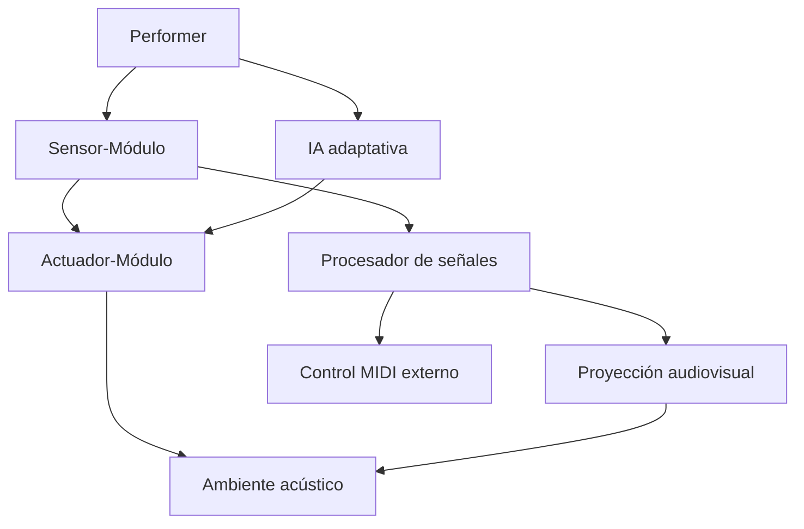

<grid drag="60 55" drop="5 10" bg="black" align="left">
# interfaces e interacciones 1
</grid>
<grid drag="-5 10" drop="5 -10" bg="black">
![[i2-header]]
</grid>
<grid drag="25 55" drop="-5 10" bg="black" align="top">
→ affordance<br>
→ hapticidad<br>
→ sesgos de ai<br>
</grid>

---

### estructura de la clase

- affordance
- hapticidad
- sesgos de ai
- tp lectura 

---

# affordance (*afordancia*)

- lo que el instrumento proyecto / propone desde los materiales. 

## affordance theory 

percibimos el mundo no solo en cuando a la forma de los objetos y sus relaciones espaciales, sino también en términos de las posibilidades de acción que nos sugiere nuestro entorno, y esto es porque nuestra percepción dirige nuestras acciones.

<ref> Gibson, James (1979)</ref>


---

Para Gibson va a haber tres tipos de afordancias 

1.  **perceptible** lo que ofrece el objeto de modo explícito.
2. **oculta** lo que el objeto posibilita pero no está explícito.
3. **falsa** lo que el objeto no posibilita. 


aplicación

- diseño industrial
- UX de plataformas Web
- dispositivos móviles 

---

# learnability *aprendibilidad*

- el grado de inmediatez entre un objeto técnico para interactuar con los agentes sin necesidad de explicaciones, indicadores , etiquetas o manuales. 
-  A mayor **afordancia perceptibe** mayor el grado de aprendibilidad.


---

### Objetos físicos
Una silla permite sentarse en ella, el pomo de una puerta permite tirar de él o empujarlo y el interruptor de la luz permite pulsarlo.

Las ranuras de una máquina expendedora permiten introducir monedas, el tapón de una botella permite desenroscarlo y la palanca de un dispensador de agua permite tirar de él.

Un cuchillo permite cortar, un palo golpear y un martillo golpear.


---


---

### Objetos digitales

La pantalla de un smartphone permite deslizar, tocar, pellizcar y desplazarse.
Un botón de inicio de sesión en un sitio web permite hacer clic.

Un menú de hamburguesa (☰) permite ampliar un panel de navegación, y un icono de carrito de la compra (🛒) permite añadir artículos a un carrito.


---

# neuroergonomía 
<ref> Parasuranam, Raja (2008)</ref>

- utiliza los conocimientos del cerebro para mejorar la ineracción entre los humanos y un sistema. 
- introduce la idea del *empan* (talla), refiréndose a la cualidad de ciertos objetos como más agarrables por el cerebro, asi como un objeto con una manija es más agarrable por la mano. 

---
# bambú


(Puerto Maldonado - Tambopata , Amazonas, Perú)

---

### sikus / zampoñas


---


# quitiplas

<iframe title="Quitiplás de Arenita, en San José, Barlovento." src="https://www.youtube.com/embed/uegjZ6bKH-k?feature=oembed" height="150" width="200" allowfullscreen="" allow="fullscreen" style="aspect-ratio: 1.33333 / 1; width: 100%; height: 100%;"></iframe>

---

# fangufangu

<iframe width="560" height="315" src="https://www.youtube.com/embed/cOI3ZMlHxr0?si=1Km2q6Y3M8-0AVed" title="YouTube video player" frameborder="0" allow="accelerometer; autoplay; clipboard-write; encrypted-media; gyroscope; picture-in-picture; web-share" referrerpolicy="strict-origin-when-cross-origin" allowfullscreen></iframe>

Tonga, Lapaha, Mua, Polinesia.

---

- sikus, quitiplas y fangufangu comparten el mismo material, (un primer grado de la *disposición material*), pero si distinguen por el tipo de **afordancia** , observado desde la neuroergonomía. 
- La definición neuro-ergonométrica está condicionada por factores climático-geográficos (acceso y época de los materiales) y culturales (herencia y transmisión)/

---

# Affordancia distribuida

- no existe el instrumento como objeto aislado, sino una red de affordances entre cuerpo, objeto y cultura.
- un instrumento no solo ofrece tocar, sino también **estructurar** (trb.gliss, siku.hoquetus), **modular** (midi, osc, DMI) o improvisar. 
- affordance cultural: la emergencia de distintos usos segun tradición, locación, herencia. REMEDIACIÓN.


---

# un método de afordancia

## 1. análisis ecológico
1. **del agente** capacidades relevantes físicas perceptuales cognitivas (motricidad, parte del cuerpo, memoria visual)
2. **del entorno** en que condiciones se usará la interfaz.

---
 
## 2 diseño de **afordancia primaria**
1. proponer un objeto de interacción que proponga una acción evidente (máxima *learnability*)
	1. la forma debe sugerir la acción (kiki-bouba, sombra del botón)
	2. textura, color y aspectos gráficos pueden guiar a la acción. (slider, botón)

---
## 3.  Diseñar una **Afordancia composicional** (afordancia secundaria)
3. componer acciones combinables.
	1. en vez de clickear, clickear y arrastrar.
	2. modular un parámetro en flujo (slider, pitch bend)
	3. pensar en la suma de expresiones. 
---
## 4. inclusión de affordances culturales. 

 1. íconos o formas geométricas o colores, que sugieren determinada acción.

---

## 5. feedback y análisis

- que feedback háptico voy a proponer luego de la interacción? 
- resonancia de affordances, 
	- Testear: ¿Los usuarios detectan y usan las affordances como se espera?
	- Si no:
	- Rediseñar las propiedades del objeto.
	- Ajustar la relación affordance-capacidad del usuario.

Utilizar técnicas como:
	- Pruebas de usabilidad.
	- Observación directa (ecológica, no dirigida).
	- Captura de gestos o interacción espontánea.

---


# Interfaes actuales

---


# Interfaces Expandidas  
## Música Contemporánea y Experimental (2005–2025)

---

## 1. Michel Waisvisz – *The Hands*

- Interfaz: sensores integrados en guantes
- Gesto y control espacial en tiempo real
- El cuerpo como instrumento directo, sin intermediación
- Cada movimiento se convierte en mensaje performativo

<iframe title="Michel Waisvisz - Hyper Instruments Part 1" src="https://www.youtube.com/embed/pYfRORkuPX8?feature=oembed" height="150" width="200" allowfullscreen="" allow="fullscreen" style="aspect-ratio: 1.33333 / 1; width: 100%; height: 100%;"></iframe>

<ref>
Waisvisz, M. (2004). Physical gestures and the performance of electronic music. *Leonardo Music Journal*, 14, 13–17.
</ref>

---

## 2. Laetitia Sonami – *The Lady's Glove*

- Interfaz: guante con sensores de presión, flexión y posición
- Controla múltiples capas de sonido en tiempo real
- Extensión del cuerpo en forma escénica y sonora

<iframe title="Laetitia Sonami (FR/US): Lady's Glove (II)" src="https://www.youtube.com/embed/f_4EiQBYkoc?start=51&amp;feature=oembed" height="113" width="200" allowfullscreen="" allow="fullscreen" style="aspect-ratio: 1.76991 / 1; width: 100%; height: 100%;"></iframe>

<ref>
Tanaka, A., & Knapp, R. B. (2002). Multimodal interaction in music using the Electromyogram and relative position sensing. *NIME*.
</ref>

---

<iframe title="Laetitia Sonami at Active Music Series" src="https://www.youtube.com/embed/3CcARSWvxBM?start=458&amp;feature=oembed" height="113" width="200" allowfullscreen="" allow="fullscreen" style="aspect-ratio: 1.76991 / 1; width: 100%; height: 100%;"></iframe>

---


## 3. Atau Tanaka – *BioMuse / Myoelectric Performance*

- Interfaz: captación EMG (electromiografía)
- Control sin contacto de sistemas de síntesis sonora
- El gesto interno (tensión muscular) como señal creativa

<ref>
Tanaka, A. (2000). Musical performance practice on sensor-based instruments. *Trends in Gestural Control of Music*, 389–405.
</ref>

---

## 4. Zimoun – *Sound Sculptures*

- Interfaz: sistemas electromecánicos minimalistas
- Sonoridades generadas por fricción, rotación y vibración
- Reemplazo del gesto humano por procesos materiales autónomos

<ref>
Zimoun. (n.d.). *Sound Sculptures and Installations*. Retrieved from https://www.zimoun.net
</ref>

---

## 5. Ellen Fullman – *The Long String Instrument*

- Interfaz: cuerdas de 20+ metros afinadas microtonalmente
- El cuerpo se desplaza físicamente para activar el sonido
- Arquitectura e instrumento se integran en una única interfaz

<ref>
Fullman, E. (2015). Long String Instrument. In Cox, C. & Warner, D. (Eds.), *Audio Culture* (2nd ed.). Bloomsbury.
</ref>

---

## 6. Ryoji Ikeda – *Supercodex / datamatics*

- Interfaz: estructuras de datos convertidas en sonido y visual
- Interacción abstracta con la información como materia musical
- Reemplazo del instrumento por algoritmos puros
- 
<iframe title="Ryoji Ikeda - Datamatics" src="https://www.youtube.com/embed/eaIrSZIyxxk?feature=oembed" height="150" width="200" allowfullscreen="" allow="fullscreen" style="aspect-ratio: 1.33333 / 1; width: 100%; height: 100%;"></iframe>

<ref>
Ikeda, R. (2010). *datamatics series*. Retrieved from https://www.ryojiikeda.com
</ref>

---

## 7. Marco Donnarumma – *Corpus Nil*

- Interfaz: sensores biométricos, IA y prótesis sonoras
- El cuerpo se convierte en campo de tensión entre lo humano y lo maquínico
- Instrumento encarnado, alterado por algoritmos

<iframe title="Performance &quot;Corpus Nil&quot; de Marco Donnarumma" src="https://www.youtube.com/embed/SdWxG5NgPG8?feature=oembed" height="113" width="200" allowfullscreen="" allow="fullscreen" style="aspect-ratio: 1.76991 / 1; width: 100%; height: 100%;"></iframe>

<ref>
Donnarumma, M. (2016). *Corpus Nil*. Retrieved from https://marcodonnarumma.com/works/corpus-nil/
</ref>

---

## 8. Pamela Z – *Breathing, Body, Voice*

- Interfaz: sensores de proximidad, voz y procesamiento en vivo
- Gestos vocales y corporales se cruzan en capas sonoras
- Extensión expresiva de la voz por medios digitales


<iframe src="https://www.youtube.com/embed/ebxvVJwGWek?list=PLYRe4EHgYjyJQ4hUfu-YvQwBW4eCTpEtI" height="113" width="200" allowfullscreen="" allow="fullscreen" style="aspect-ratio: 1.76991 / 1; width: 100%; height: 100%;"></iframe>

<ref>
Z, P. (n.d.). *Pamela Z Performance Works*. Retrieved from https://www.pamelaz.com
</ref>

---

## 9. Jonas Bohatsch / Time’s Up – *BodySPIN*

- Interfaz: ropa como interfaz táctil y de control
- El cuerpo vestido se transforma en superficie performativa
- Fusión de moda, electrónica y gesto musical

<iframe title="timecode vinyl - video enhanced - prototype 2 (v+)" src="https://www.youtube.com/embed/xOj9D72ZZyE?feature=oembed" height="150" width="200" allowfullscreen="" allow="fullscreen" style="aspect-ratio: 1.33333 / 1; width: 100%; height: 100%;"></iframe>

<ref>
Time's Up. (2010). *BodySPIN Project*. Retrieved from https://www.timesup.org
</ref>


---

## 10. Remy Siu Foxconn Frequency no 2

<iframe title="Remy Siu -- Foxconn Frequency (no.2) - for one visibly Chinese performer [m/score]" src="https://www.youtube.com/embed/7U4WO2ATuTE?feature=oembed" height="113" width="200" allowfullscreen="" allow="fullscreen" style="aspect-ratio: 1.76991 / 1; width: 100%; height: 100%;"></iframe>


---


# Modularidad y Sistemas de Sistemas (SoS)

---

## Introducción

La **modularidad** y el concepto de **Sistemas de Sistemas (SoS)** permiten pensar los instrumentos musicales como *entidades abiertas y recombinantes*, capaces de reorganizarse, actualizarse y mutar según la interacción con otros sistemas y contextos performáticos.

---

## Definiciones

- **Módulo**: unidad funcional autónoma, con entradas y salidas definidas.
- **Sistema de Sistemas (SoS)**: conjunto de sistemas independientes que colaboran para generar funciones emergentes no posibles por separado.

<ref>
Maier, M. W. (1998). Architecting principles for systems-of-systems. *Systems Engineering*, 1(4), 267–284.
</ref>

---

## Aplicación en Organología especulativa

- Cada componente de un instrumento puede entenderse como un **módulo**: sensor, excitador, resonador, actuador, procesador.
- Un **instrumento modular** permite reconfiguración, adaptación y personalización extrema.
- Un **SoS musical** integra múltiples instrumentos-modulares, performers, algoritmos, interfaces, y ambientes acústicos.

<ref>
Dolan, E. (2013). *The Orchestral Revolution: Haydn and the Technologies of Timbre*. Cambridge University Press.
</ref>

---

## Mermaid: Representación de un SoS Musical




---

#### Casos de estudio

- Módulos M4L: cada subpatch es un nodo de función especializada.
- Max como SoS: interfaz conectando micrófono, análisis, motores, síntesis, OSC.
- Instrumentos en HTML+JS: sistema modular de entrada, procesamiento, y salida sonora.

<ref>
Chadabe, J. (1997). *Electric Sound: The Past and Promise of Electronic Music*. Prentice Hall.
</ref>


---

#### Ejercicio en clase (Max/MSP, M4L, o HTML+JS)

**Objetivo**: diseñar un mini-instrumento modular basado en el paradigma SoS.

Componentes mínimos
1.	Input: sensor simulado (slider, mouse, oscilador).
2.	Procesador: efecto (delay, filtro, pitch).
3.	Output: síntesis o sample playback.

---

### Opciones de implementación

#### Max/MSP
- Usa cycle~ como oscilador básico.
- Conecta un number~ como controlador de frecuencia.
- Añade un filtergraph~ como módulo de coloración sonora.

#### M4L
- Desarrolla un módulo con live.dial que controle un delay~.
- Usa send~ y receive~ para estructurar modularidad.


--- 

#### HTML+JS (con consola)

```html
<button onclick="play()">Play Module</button>
<script>
function play() {
const ctx = new AudioContext();
const osc = ctx.createOscillator();
const gain = ctx.createGain();
osc.frequency.value = Math.random() * 500 + 100;
osc.connect(gain);
gain.connect(ctx.destination);
osc.start();
osc.stop(ctx.currentTime + 0.3);
}
</script>
```


---

Cierre y discusión
- ¿Qué tipo de modularidad surgió en tu diseño?
- ¿Pudiste pensar tu instrumento como parte de un sistema más grande?
- ¿Qué funciones emergentes podrían aparecer al conectar varios diseños?

---

 Referencias
<ref>

- Maier, M. W. (1998). Architecting principles for systems-of-systems. *Systems Engineering*, 1(4), 267–284.

- Dolan, E. (2013). *The Orchestral Revolution: Haydn and the Technologies of Timbre*. Cambridge University Press.

- Chadabe, J. (1997). *Electric Sound: The Past and Promise of Electronic Music*. Prentice Hall.
</ref>

