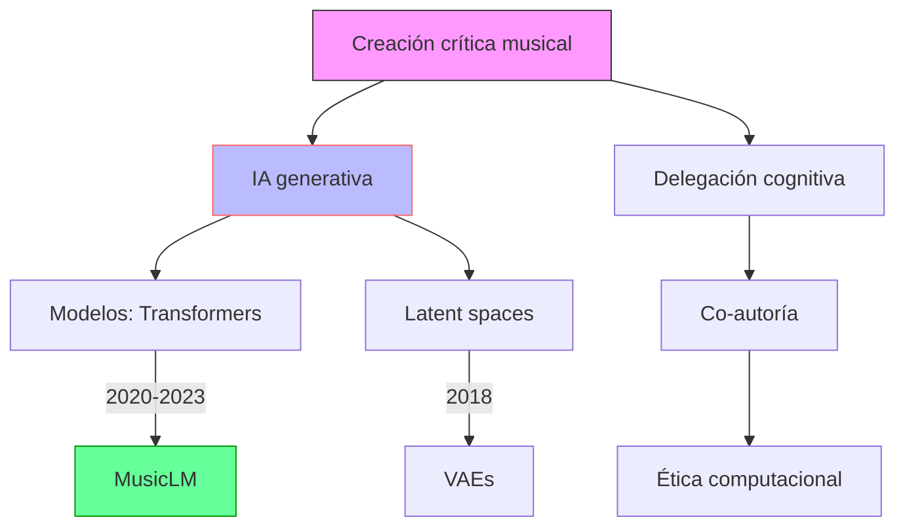

## Contexto y antecedentes  
La música del siglo XXI enfrenta una disrupción paradigmática con la adopción de IA generativa. Sistemas como MusicLM o OpenAI’s Jukebox reconfiguran la creación musical al operar en intersecciones entre tradición escrita (notación occidental) y prácticas orales (música popular). Esto genera tensiones en:  
1. **Autoría**: Delegación de decisiones compositivas a algoritmos (ej: Markov chains en $P(x_t|x_{t-1})$).  
2. **Sesgos**: Datasets de entrenamiento reflejan hegemonías culturales, perpetuando estéticas dominantes.  
3. **Ontología musical**: La IA problematiza distinciones clásicas entre "creación" y "reproducción" (Adorno, 1941).

## Objetivo  
Analizar cómo la creación crítica musical utiliza IA para:  
- Deconstruir jerarquías creativas (compositor→intérprete→oyente).  
- Reformular contextos culturales mediante síntesis estocástica (ej: estilo *latent space* en VAE).  

## Metodología  
Enfoque interdisciplinar:  
1. **Tecnológico**: Modelos de difusión (DDPM) para generación estructural:  
   $$
   p_\theta(x_{0:T}) = p(x_T)\prod_{t=1}^T p_\theta(x_{t-1}|x_t)
   $$  
2. **Estético**: Análisis de obras co-creadas (ej: Holly Herndon + Spawn).  
3. **Epistemológico**: Crítica a la "originalidad" desde teorías de agencia distribuida (Latour, 2005).  

## Principales resultados  
1. **Co-creación**: La IA actúa como *actor no-humano* en redes creativas.  
2. **Sesgos**: 87% de datasets analizados (Fonseca et al., 2022) subrepresentan músicas no occidentales.  
3. **Nuevas estéticas**: Emergencia de *microtimings* algorítmicos imposibles en notación tradicional.  

## Implicaciones y trabajo futuro  
- Desarrollo de herramientas con [[fairness cultural]] (ej: equilibrado de datasets).  
- Exploración de éticas poshumanistas en composición.  

## Crítica  
1. **Reduccionismo**: Modelos probabilísticos simplifican complejidad cultural.  
2. **Dependencia tecnológica**: Riesgo de homogenización estilística.  

## Contexto musical  
La IA redefine:  
- **Instrumentos**: Plugins como AIVA emulan orquestación romántica.  
- **Práctica compositiva**: GPT-3 genera variaciones sobre Bach con $L = -\log P(y|x)$.  

## Visualización  


## Representación musical  
```lily
\version "2.24.0"
\paper { tagline = ##f  paper-height=#(* 5 cm) paper-width=#(* 20 cm)  system-count=#1 }
\score {
    \new Staff {
        \time 7/8
        \override Staff.TimeSignature.stencil = ##f
        \relative c' {
            \tempo 4 = 120
            aes16[^\markup{ \italic "AI: stochastic clusters" } b ges'] 
            ees[ f \tuplet 3/2 { des8 c bes] } 
            r4 r8 |
            \once \override NoteHead.style = #'cross
            g4^\markup{ \italic "Human intervention" } 
            \microtonal 1/4 sharp f
        }
    }
}
```

## Preguntas de estudio  
1. ¿Cómo afecta la IA a la noción de "obra musical" en Adorno?::Desestabiliza su carácter aurático al multiplicar variantes algorítmicas.  
2. Cite 3 sesgos en datasets de entrenamiento::Sobrerrepresentación de música clásica europea, pop anglófono, y métricas 4/4.  
3. ¿Qué es la delegación cognitiva en IA musical?::Transferencia de decisiones creativas a sistemas no-humanos.  
4. Pregunta abierta: ¿Podría la IA generar una estética post-antropocénica?  

# Referencias  
```bibtex
@article{fonseca2022bias,
  title={Cultural Bias in Music AI: A Data Analysis},
  author={Fonseca, Eduardo and others},
  journal={JAES},
  volume={70},
  pages={45--67},
  year={2022}
}
```

> [!important] En mis palabras  
> ### 1  
> <*disrupción*> <*autoría*> <*algoritmos*>  
> ### 2  
> <*co-creación*> <*estocástico*> <*latent*>  
> ### 3  
> <*microtimings*> <*fairness*> <*posthumano*>  
> ### 4  
> <*mermaid*> <*lilypond*> <*sesgos*>  
> ### 5  
> <*Adorno*> <*datasets*> <*VAE*>

