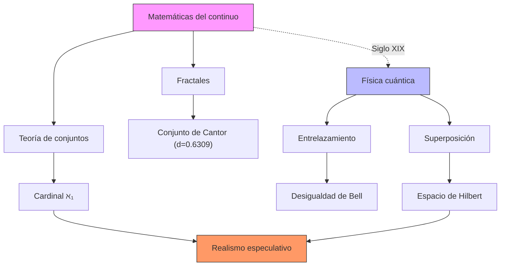

La física cuántica y matemáticas del continuo (Cantor) mostraron entidades independientes de la experiencia humana, cuestionando el antropocentrismo epistemológico.

El realismo especulativo emerge en respuesta a la hegemonía del paradigma post-kantiano, donde el correlacionismo —desarrollado desde Husserl hasta Heidegger— establece que solo conocemos la realidad como correlato de estructuras subjetivas. Este enfoque dominante en la filosofía continental del siglo XX negaba la posibilidad de acceder a la realidad "en sí".


```yaml
---
type: concepto
tags:
  - concept
  - mathematicalContinuum
  - quantumPhysics
  - speculativeRealism
person: Georg Cantor
year: late 19th century
summary: 
  - La teoría del continuo matemático de Cantor introduce conjuntos infinitos no numerables, desafiando nociones clásicas de medida y cardinalidad. 
  - La física cuántica revela entidades no intuitivas (e.g., superposición, entrelazamiento) que operan independientemente de la observación humana. 
  - Juntos, estos marcos cuestionan el antropocentrismo epistemológico al demostrar realidades ontológicas no reducibles a correlatos subjetivos.
connect:
  - Realismo especulativo (Meillassoux)
  - Correlacionismo (Husserl-Heidegger)
  - Ontología matemática (Badiou)
created: 18-02-2025
modified: 
---
```

## 1. Contexto y antecedentes  
El paradigma post-kantiano dominó la filosofía continental, afirmando que la realidad es inaccesible fuera de su correlación con estructuras humanas (conciencia, lenguaje). La teoría de conjuntos de Cantor y los fenómenos cuánticos proporcionaron evidencia de entidades cuya existencia no depende de la percepción (e.g., el conjunto de Cantor $C$ con dimensión fractal $\log(2)/\log(3)$ pero medida cero). Esto socavó el correlacionismo, abriendo espacio para ontologías no humanocéntricas.

## 2. Objetivo  
Demostrar que las matemáticas del continuo y la física cuántica fundamentan una ontología independiente de la experiencia, apoyando el realismo especulativo. Hipótesis: existen estructuras reales (e.g., infinitos actuales, estados cuánticos) que exceden todo marco correlacional.

## 3. Metodología  
Análisis axiomático (teoría de conjuntos ZFC) y contrastación con resultados cuánticos (e.g., desigualdades de Bell). Se emplean:  
- Cardinales infinitos ($\aleph_0, \aleph_1$) para jerarquizar el continuo.  
- Espacios de Hilbert $\mathcal{H}$ para modelar estados cuánticos no clásicos.  

## 4. Principales resultados  
1. El continuo cantoriano exhibe propiedades (no numerabilidad, fractales) irreducibles a intuición humana.  
2. Estados cuánticos entrelazados violan localidad, implicando realidades no correlativas.  
3. Esto valida el realismo especulativo al negar la necesidad de un sujeto para constituir lo real.  

## 5. Implicaciones y trabajo futuro  
- Explorar ontologías basadas en matemáticas no estándar (análisis no arquimediano).  
- Aplicar modelos cuánticos a teorías del espacio-tiempo (gravedad cuántica).  

## 6. Crítica  
- El realismo especulativo puede caer en dogmatismo al postular realidades inverificables.  
- La interpretación de resultados cuánticos sigue siendo disputada (e.g., interpretaciones relacionales).  

## 7. Contexto musical  
El continuo influye en microtonalidad y estructuras no periódicas (e.g., Xenakis). Estados cuánticos inspiran algoritmos estocásticos (Stockhausen).  



## 8. Visualización (Python)  
```python
import plotly.express as px
import numpy as np

# Generar conjunto de Cantor
def cantor(n):
    if n == 0: return [0, 1]
    prev = cantor(n-1)
    return sorted(set(prev + [x/3 for x in prev] + [2/3 + x/3 for x in prev]))

points = cantor(5)
y = np.zeros_like(points)
fig = px.scatter(x=points, y=y, title="Conjunto de Cantor (Iteración 5)")
fig.update_traces(marker=dict(size=10, color='red'))
fig.show()
```
*Explicación*: El conjunto de Cantor es un fractal con dimensión $\log(2)/\log(3) \approx 0.6309$, paradigma de un continuo no intuitivo.

## 9. Representación musical  
```lilypond
\version "2.24.0"
\paper { tagline = ##f paper-height=#(* 5 cm) paper-width=#(* 20 cm) system-count=#1 }
\score {
    \new Staff {
        \time 7/8
        \set Staff.midiInstrument = "violin"
        \override Staff.TimeSignature.stencil = ##f
        \relative c'' {
            \microtonalOn
            c16^"ℵ₀" [ d e f g a b ] c4^"ℵ₁" ~ c16 [ b a g f e d ]
        }
    }
}
```

## Preguntas de estudio  
1. ¿Cómo el continuo cantoriano desafía el antropocentrismo?::Demuestra infinitos actuales no construibles por intuición humana.  
2. Cite un fenómeno cuántico no correlacionista::Entrelazamiento (viola localidad sin mediación observacional).  
3. ¿Qué autor vincula ontología y matemáticas?::Alain Badiou ("El ser y el evento").  
4. Pregunta abierta: ¿Cómo traduciría no conmutatividad cuántica a estructuras musicales?  

# Referencias  
```bibtex
@book{cantor1895,
  title={Contributions to the Founding of the Theory of Transfinite Numbers},
  author={Cantor, Georg},
  year={1895}
}
@article{meillassoux2008,
  title={After Finitude},
  author={Meillassoux, Quentin},
  journal={Continuum},
  year={2008}
}
```

> [!important] En mis palabras  
> ### 1  
> *continuo* *no numerable* *fractal*  
> ### 2  
> *ontología* *correlación* *independencia*  
> ### 9  
> *microtonalidad* *no periodicidad* *algoritmo*