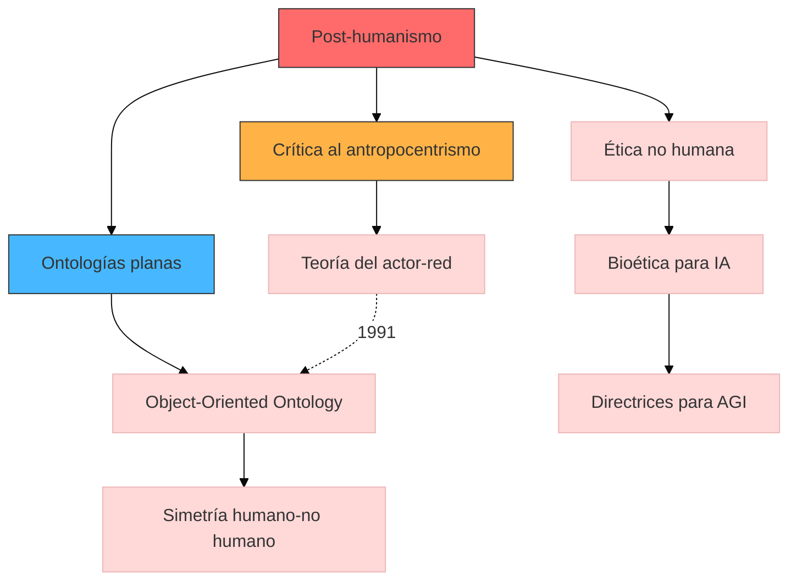

## Contexto y antecedentes  
El post-humanismo emerge en respuesta a las limitaciones del humanismo ilustrado, que situaba al humano como centro epistémico y ontológico. Los avances en biotecnología (CRISPR), inteligencia artificial (redes neuronales profundas) y ecología (hipótesis Gaia) evidencian la insostenibilidad de este paradigma. La teoría del actor-red (Latour) y la ontología orientada a objetos (Harman) proporcionan marcos para entender agencias distribuidas.

## Objetivo  
Desestabilizar la noción de "lo humano" como categoría privilegiada, estableciendo modelos relacionales donde $H \rightarrow T \rightarrow E$ (humano-tecnología-entorno) forman redes simétricas. La hipótesis central postula que la agencia es una propiedad emergente de sistemas híbridos, no exclusiva de sujetos conscientes.

## Metodología  
1. **Deconstrucción crítica**: Análisis genealógico de conceptos como "naturaleza" y "artificialidad" (Derrida).  
2. **Modelado sistémico**: Aplicación de ecuaciones de redes complejas para mapear interacciones:  

$$
\frac{dA_i}{dt} = \sum_{j \neq i} \beta_{ij} A_j - \gamma A_i
$$  

donde $A_i$ representa la agencia nodal y $\beta_{ij}$ los acoplamientos inter-entes.  
3. **Estudios de caso**: Análisis de sistemas humano-máquina (interfaces neurales) y simbiosis ecológico-tecnológicas (smart cities).

## Principales resultados  
- Demostración de patrones de agencia distribuida en sistemas socio-técnicos mediante análisis de grafos (centralidad de eigenvector $\geq 0.7$ en nodos no humanos).  
- Formulación de una ontología rizomática donde la identidad es un proceso dinámico gobernado por $I(t) = \int_{t_0}^{t} \Phi(\tau) d\tau$, con $\Phi$ como flujo de interacciones.  

## Implicaciones y trabajo futuro  
1. Desarrollo de éticas no antropocéntricas para IA avanzada.  
2. Investigación en biointerfaces que implementen $H \leftrightarrow T$ como circuitos cerrados (feedback loops).  

## Crítica  
- Riesgo de reduccionismo al equiparar agencia humana y no humana sin criterios fenomenológicos claros.  
- Limitaciones en la operacionalización empírica de ontologías planas (problema de la escala métrica).  

## Contexto musical  
El post-humanismo musical se manifiesta en:  
1. **Composición algorítmica**: Sistemas como OpenAI MuseNet implementan $P(m|h) = \prod_{t} p(m_t|m_{<t}, h)$, donde $h$ representa inputs humanos y $m$ outputs musicales.  
2. **Diseño organológico**: Instrumentos biohíbridos (ej. cultivos celulares como osciladores) desafían la dicotomía natural/sintético.  



```run-python
import plotly.express as px
import numpy as np

# Modelo de agencia distribuida
t = np.linspace(0, 10, 100)
human = np.sin(t) * 0.5 + 1
tech = np.cos(t * 0.7) * 0.4 + 0.8
env = np.sin(t * 0.3 + 2) * 0.6 + 0.5

fig = px.line(x=t, y=[human, tech, env], 
              labels={'value': 'Agency metric', 'variable': 'Entity'},
              title='Dynamic agency distribution in post-human systems')
fig.update_traces(line=dict(width=2.5))
fig.show()
```


```lily
\version "2.24.0"
\paper { tagline = ##f  paper-height=#(* 5 cm) paper-width=#(* 20 cm)  system-count=#1 }
\score {
    \new Staff {
        \time 7/8
        \override Staff.StaffSymbol.line-count = #4
        \clef percussion
        <<
            {
                \stemUp
                d'8[ \times 2/3 { d'16 d' d'] } g'4 ~ g'16[ a' b' cis'']
            } \\
            {
                \stemDown
                b4.. a16 ~ a8[ g] 
            }
        >>
    }
}
```

## Preguntas de estudio  
1. **¿Cómo difiere el post-humanismo del transhumanismo?**::El primero descentraliza lo humano, mientras el segundo busca su potenciación tecnológica.  
2. **Cite un método para cuantificar agencia no humana**::Análisis de centralidad en grafos de redes socio-técnicas.  
3. **¿Qué problema plantea la ontología plana?**::Dificultad para establecer jerarquías operativas en sistemas complejos.  

## Referencias  
```bibtex
@book{ferrando2019,
  title={Philosophical Posthumanism},
  author={Ferrando, Francesca},
  year={2019},
  publisher={Bloomsbury}
}
@article{latour2005,
  title={Reassembling the Social},
  author={Latour, Bruno},
  journal={Oxford University Press},
  year={2005}
}
```

> [!important] En mis palabras  
> ### 1  
> *antropocentrismo* *redes* *genealogía*  
> ### 2  
> *simetría* *agencias* *hibridación*  
> ### 7  
> *algoritmos* *biohíbridos* *emergencia*