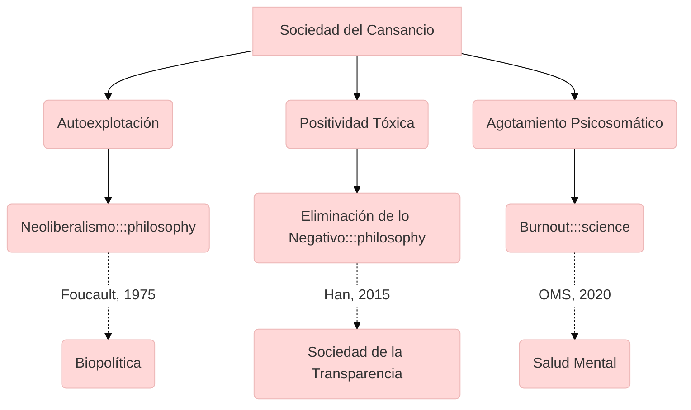

## Contexto y antecedentes  
El concepto emerge como crítica a las teorías de las sociedades disciplinarias (Foucault) y de control (Deleuze). Han propone que el paradigma neoliberal sustituye la represión externa por autoexigencia ilimitada, donde el sujeto se explota a sí mismo bajo la ilusión de libertad. La hiperactividad y el rendimiento se convierten en normas patológicas, eliminando la capacidad de negación y resistencia.

## Objetivo  
Demostrar que el cansancio contemporáneo no es un fracaso individual, sino un síntoma de una estructura social basada en la positividad total. La hipótesis central afirma que la supresión de lo negativo (conflicto, límites) conduce a una saturación patológica del sistema psicosomático.

## Metodología  
Análisis filosófico-sociológico que combina:  
1. Teoría crítica (Escuela de Frankfurt) para examinar las formas de dominación posmodernas.  
2. Fenomenología del agotamiento, contrastando con conceptos como *otredad* (Lévinas) y *negatividad* (Hegel).  
3. Datos empíricos sobre el aumento de patologías mentales en sociedades hiperconectadas (OMS, 2019).

## Principales resultados  
1. La autooptimización genera una paradoja: cuanto más libre se cree el individuo, más se somete a lógicas de explotación.  
2. La sociedad del rendimiento produce sujetos frágiles, incapaces de enfrentar el fracaso o la pausa.  
3. La conectividad digital intensifica el agotamiento al eliminar límites entre trabajo y ocio.

## Implicaciones y trabajo futuro  
1. Investigar modelos alternativos de productividad que integren la negatividad (ej. ética del cuidado).  
2. Estudiar tecnologías que promuevan la desconexión (diseño *slow tech*).  
3. Revisar políticas laborales desde la neurodiversidad y límites saludables.

## Crítica  
1. Sobreenfatiza el aspecto psíquico, ignorando factores económicos materiales (Marx).  
2. Generaliza patologías occidentales a contextos globales con dinámicas distintas.  
3. Carece de propuestas concretas para superar el paradigma del rendimiento.

## Contexto musical  
El concepto se relaciona con:  
- **Composición**: Uso de silencios y estáticas (ej. Morton Feldman) como resistencia al exceso.  
- **Performance**: Fatiga física en obras como *Piano Phase* (Reich), donde la repetición refleja autoexplotación.  
- **Tecnología**: Música algorítmica que critica la hiperproductividad (ej. *Everyday Algorithm* de Nikki Sheth).



```python
import plotly.express as px
import numpy as np

# Modelo matemático del agotamiento: función logística con saturación
t = np.linspace(0, 10, 100)
K = 1  # Capacidad máxima de rendimiento
r = 1.5  # Tasa de autoexigencia
P0 = 0.01  # Rendimiento inicial
P = K / (1 + ((K - P0)/P0) * np.exp(-r * t))

fig = px.line(x=t, y=P, labels={'x': 'Tiempo', 'y': 'Rendimiento'},
              title='Agotamiento por autoexplotación: $P(t) = \\frac{K}{1 + (\\frac{K-P_0}{P_0})e^{-rt}}$')
fig.update_layout(template='plotly_white')
fig.show()
```

```lily
\version "2.24.0"
\paper { tagline = ##f  paper-height=#(* 5 cm) paper-width=#(* 20 cm)  system-count=#1 }
\score {
    \new Staff {
        \time 4/4
        \override Staff.TimeSignature.stencil = ##f
        \set Staff.midiInstrument = #"piano"
        <<
        {
            \repeat unfold 8 { c'16\pp\< c' c' c' c' c' c' c'\! } 
            \repeat percent 4 { c'4\ff\> c' c' c'\! }
        }
        \\
        {
            \repeat tremolo 32 { s32 \parenthesize s32 }
            s1*4
        }
        >>
    }
}
```

## Preguntas de estudio  
1. **¿Cómo difiere la sociedad del cansancio de las sociedades disciplinarias?**::Reemplaza la coerción externa por autoexplotación internalizada.  
2. **Nombre dos patologías vinculadas al concepto**::Burnout y depresión.  
3. **¿Qué autor influyó en Han con la idea de biopolítica?**::Michel Foucault.  
4. **Pregunta abierta: ¿Cómo representar musicalmente la positividad tóxica?**::Uso de crescendos constantes sin resolución armónica.  

# Referencias  
```bibtex
@book{han2010,
  author = {Han, Byung-Chul},
  title = {La sociedad del cansancio},
  year = {2010},
  publisher = {Herder}
}
@article{who2019,
  author = {WHO},
  title = {Burnout as occupational phenomenon},
  year = {2019},
  journal = {ICD-11}
}
```

> [!important] En mis palabras  
> ### 1  
> *autoexplotación* *neoliberalismo* *agotamiento*  
> ### 2  
> *positividad* *negatividad* *patologías*  
> ### 3  
> *silencios* *repetición* *algoritmos*