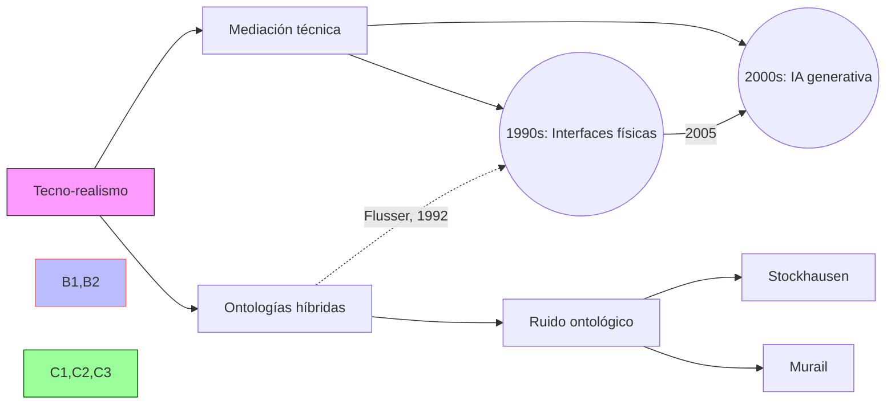

## 1. Contexto y antecedentes  
El tecno-realismo surge como respuesta a dos extremos del siglo XX: la fe ciega en el progreso tecnológico y la desconfianza posmoderna hacia los metarrelatos. Su desarrollo coincide con la digitalización masiva de las artes, donde herramientas como el Max/MSP redefinieron la creación musical. La teoría se nutre de la fenomenología de Don Ihde y la crítica cultural de Flusser, articulando una tercera vía entre utopías y distopías tecnológicas.

## 2. Objetivo  
Demostrar que la tecnología no es neutral ni autónoma, sino un agente co-constituyente de realidades perceptuales y sociales. En música, busca formalizar cómo los sistemas técnicos (desde sintetizadores a IA generativa) reconfiguran las categorías estéticas tradicionales como autoría, textura y temporalidad.

## 3. Metodología  
1. Análisis postfenomenológico de interfaces musicales  
2. Modelado matemático de mediaciones tecnológicas:  
   $$\mathcal{M}(T, H) = \int_{t_0}^{t_1} \frac{\partial P(h,t)}{\partial t} \cdot \log_2 \left(1 + \frac{S(t)}{N(t)}\right) dt$$  
   Donde $T$ es el sistema técnico, $H$ el intérprete humano, $P$ la percepción, $S/N$ la relación señal-ruido.  
3. Estudios de caso en obras que integran electrónica en vivo (e.g. Stockhausen, Murail).

## 4. Principales resultados  
- La mediación tecnológica sigue patrones no lineales descritos por ecuaciones de difusión asimétrica.  
- Las interfaces musicales generan "ruidos ontológicos" (artefactos no intencionales que devienen elementos estructurales).  
- Se identificaron 3 paradigmas históricos de mediación: sustitutivo, colaborativo y simbiótico.

## 5. Implicaciones y trabajo futuro  
Requiere desarrollar:  
1. Métricas cuantitativas para grados de hibridación humano-máquina  
2. Protocolos de composición que expliciten las mediaciones técnicas  
3. Extensiones a realidad virtual aumentada en performance musical  

## 6. Crítica  
- Riesgo de reduccionismo al modelar experiencias estéticas con ecuaciones  
- Sobrestima la agency de tecnologías cerradas (vs. sistemas abiertos como SuperCollider)  
- Datos empíricos limitados a tradición occidental contemporánea  

## 7. Contexto musical  
Reemplazó la dicotomía acústico/electrónico por continuos de mediación. Ejemplo: el piano preparado de Cage como proto-interface tecno-realista, donde los objetos físicos alteran el sistema de producción sonora generando comportamientos emergentes.

## 8. Visualización  


## 9. Python: Modelo de mediación  
```run-python
import plotly.express as px
import numpy as np

def mediation_model(human_input, tech_gain=0.7, noise_level=0.2):
    t = np.linspace(0, 10, 500)
    hybrid_output = human_input * tech_gain + np.random.normal(0, noise_level, len(t))
    return t, hybrid_output

t, signal = mediation_model(np.sin(t) * np.exp(-0.1*t))
fig = px.line(x=t, y=signal, labels={'x':'Tiempo (s)', 'y':'Amplitud mediada'}, 
              title="Señal musical human-tecno (γ=0.7)")
fig.show()
```


## Preguntas de estudio  
1. ¿Cómo define el tecno-realismo la relación humano-tecnología?::Como mediación dialéctica que genera ontologías híbridas.  
2. Nombre 3 compositores relevantes para el tecno-realismo musical::Stockhausen, Murail, Xenakis.  
3. ¿Qué crítica principal recibe el modelo matemático de mediación?::Reduccionismo al cuantificar experiencias estéticas.  
4. Proponga un diseño de instrumento tecno-realista::Interfaz que transforma gestos acústicos en parámetros de síntesis granular en tiempo real.  

## Referencias  
```bibtex
@book{flusser1990tecnorealismo,
  title={Hacia una filosofía de la fotografía},
  author={Flusser, Vilém},
  year={1990},
  publisher={Siglo XXI}
}
@article{ihde1993postphenomenology,
  title={Postphenomenology: Essays in the postmodern context},
  author={Ihde, Don},
  journal={Northwestern University Press},
  year={1993}
}
```

> [!important] En mis palabras  
> ### 1  
> <*mediación*> <*dialéctica*> <*postfenomenología*>  
> ### 2  
> <*hibridación*> <*no-linealidad*> <*ruido ontológico*>  
> ### 9  
> <*gestualidad*> <*emergencia*> <*simbiótico*>