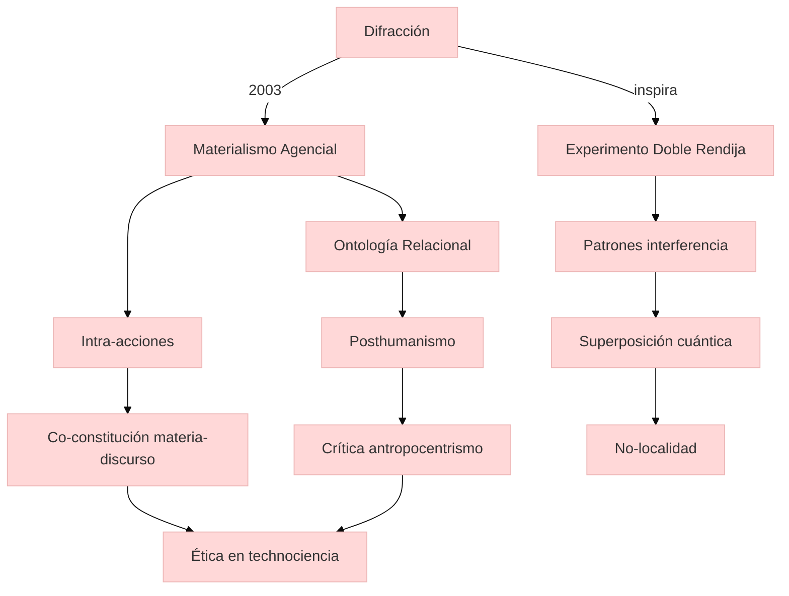

## Contexto y antecedentes  
El materialismo agencial de Barad surge como crítica al constructivismo social y realismo clásico, proponiendo una ontología relacional donde materia y significado se co-producen. La difracción, originalmente un fenómeno físico ($I(\theta) = I_0 \left[\frac{\sin(\pi a \sin\theta/\lambda)}{\pi a \sin\theta/\lambda}\right]^2$), se reformula como herramienta epistemológica para analizar cómo las diferencias emergen a través de patrones de interferencia, no de oposiciones binarias.

## Objetivo  
Desarrollar un marco metodológico que evite representaciones estáticas, enfocándose en cómo los fenómenos se constituyen dinámicamente a través de intra-acciones (término clave que reemplaza "interacciones" para denotar ausencia de entidades preexistentes).

## Metodología  
1. **Análisis difractivo**: Contrasta con métodos reflexivos al rechazar correspondencias miméticas entre conocimiento y objeto.  
2. **Estudios de caso cuánticos**: Ejemplo: Reinterpretación del experimento de la doble rendija, donde el aparato experimental no mide sino que co-crea el fenómeno.  
3. **Lentes posthumanistas**: Descentra al humano como único agente, integrando materialidad y discurso en simetría.  

## Principales resultados  
- La realidad es un proceso de devenir, no un conjunto de entidades discretas.  
- Las fronteras entre "natural" y "social" son efectos de prácticas materiales específicas.  
- El conocimiento es un fenómeno material, no una representación externa.  

## Implicaciones y trabajo futuro  
Aplicaciones en estudios de technociencia (ej.: CRISPR), donde ética y ontología se entrelazan. Reto: Desarrollar métricas para intra-acciones en sistemas complejos.  

## Crítica  
- Dificultad operacional: Falta de protocolos estandarizados para análisis difractivo.  
- Riesgo de oscurecer agencias humanas en contextos de injusticia estructural.  

## Contexto musical  
La difracción podría modelar composiciones donde timbre y estructura emergen de interferencias entre gestos instrumentales (ej.: música espectral). Un acorde no es una entidad fija, sino un nodo en una red de relaciones materiales (vibraciones, resonancias corporales).  



```python
import numpy as np
import plotly.express as px

# Simulación de patrón de difracción
lambda_ = 500e-9  # Longitud de onda (m)
a = 1e-6          # Ancho rendija (m)
theta = np.linspace(-np.pi/4, np.pi/4, 300)
I = (np.sin(np.pi * a * np.sin(theta)/lambda_) / (np.pi * a * np.sin(theta)/lambda_))**2
I = np.nan_to_num(I)

fig = px.line(x=np.degrees(theta), y=I, 
              labels={'x': 'Ángulo (grados)', 'y': 'Intensidad'},
              title="Patrón de difracción - Doble Rendija")
fig.update_layout(template="plotly_white")
fig.show()
```

## representación musical  
```lilypond
\version "2.24.0"
\paper { tagline = ##f  paper-height=#(* 5 cm) paper-width=#(* 20 cm)  system-count=#1 }
\score {
    \new Staff {
        \time 4/4
        \override Staff.StaffSymbol.line-count = #4
        \clef percussion
        <<
            {
                \stemUp \repeat unfold 4 { c'16^"Intra-acción" c' c' c' }
            } \\
            {
                \stemDown \repeat unfold 4 { fisis4..\harmonic_"Superposición" g16 }
            }
        >>
    }
}
```

## Preguntas de estudio  
1. **¿Cómo difiere la difracción de la reflexión en Barad?**::La difracción analiza patrones de interferencia entre conceptos, mientras la reflexión presupone dualismos sujeto-objeto.  
2. **Cite un experimento cuántico clave para el materialismo agencial**::El experimento de la doble rendija, donde observador y fenómeno son inseparables.  
3. **¿Qué crítica recibe el enfoque difractivo?**::Dificultad para traducirlo a metodologías aplicables en ciencias sociales.  

# Referencias  
```bibtex
@book{barad2007,
  title={Meeting the Universe Halfway: Quantum Physics and the Entanglement of Matter and Meaning},
  author={Barad, Karen},
  year={2007},
  publisher={Duke University Press}
}
```

> [!important] En mis palabras  
> ### 1  
> *interferencia* *co-constitución* *no-binario*  
> ### 2  
> *cuántico* *performative* *relacional*  
> ### 7  
> *espectral* *emergente* *corporal*