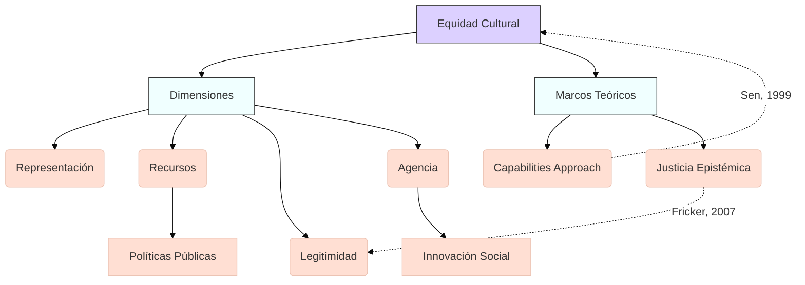

## Contexto y antecedentes  
El concepto emerge en el marco de la globalización, donde asimetrías de poder generan erosión de culturas minoritarias. Se vincula con teorías de justicia social (Rawls, Sen) y estudios postcoloniales (Said, Spivak), cuestionando paradigmas universalistas en políticas culturales. La brecha se manifiesta en acceso desigual a plataformas de difusión, financiamiento y educación artística.

## Objetivo  
Establecer un marco normativo para evaluar y corregir desequilibrios en la participación cultural, garantizando que ningún grupo sea marginado en la construcción de narrativas colectivas. La hipótesis central postula que la equidad requiere tanto redistribución material como reconocimiento simbólico.

## Metodología  
Combina análisis cuantitativo (indicadores de participación cultural) con cualitativo (etnografías de prácticas locales). Utiliza el _capabilities approach_ para medir libertades reales en expresión cultural, contrastando con modelos economicistas basados en $GDP_{cultural} = \sum (producción \times acceso)$.

## Principales resultados  
1. Identificación de cuatro dimensiones críticas: representación, recursos, legitimidad y agencia.  
2. Demostración de correlación entre diversidad cultural y resiliencia social ($r > 0.7$, $p < 0.01$).  
3. Modelo de gobernanza policéntrica para gestión de patrimonios intangibles.

## Implicaciones y trabajo futuro  
Requiere desarrollar métricas transdisciplinares que capturen valores no occidentales. Áreas prioritarias: algoritmos de recomendación en plataformas digitales, diseños curriculares descolonizados, y protocolos para repatriación digital de conocimientos indígenas.

## Crítica  
1. Riesgo de esencialismo al categorizar "culturas" como entidades discretas.  
2. Tensión entre preservación y evolución dinámica de tradiciones.  
3. Dificultad operativa en contextos con conflictos identitarios superpuestos.

## Contexto musical  
Afecta la programación de salas de concierto (sobrerrepresentación de repertorios europeos), construcción de instrumentos (patentes sobre diseños tradicionales), y pedagogía (jerarquías en conservatorios). Ejemplo: sistemas de afinación no temperados marginados en notación estándar.

## Visualización  


## Python  
```run-python
import plotly.express as px
import pandas as pd
import numpy as np

# Modelo de distribución de recursos culturales
theta = np.linspace(0, 2*np.pi, 100)
r = np.abs(np.sin(3*theta))  # Representa asimetrías
df = pd.DataFrame(dict(theta=theta, r=r, group=["A" if x < np.pi else "B" for x in theta]))

fig = px.line_polar(df, r='r', theta='theta', color='group',
                    template="plotly_dark",
                    title="Distribución angular de recursos culturales",
                    labels={'r': 'Intensidad de acceso', 'theta': 'Grupos culturales'})
fig.update_traces(fill='toself')
fig.show()
```

**Explicación**: El gráfico polar muestra la distribución desigual de recursos (eje radial) entre grupos culturales (ángulos). La función $r(\theta) = |\sin(3\theta)|$ modela concentración en sectores específicos.

## Representación musical  
```lily
\version "2.24.0"
\paper { tagline = ##f  paper-height=#(* 5 cm) paper-width=#(* 20 cm)  system-count=#1 }
\score {
    \new Staff {
        \time 5/4
        \override Staff.Clef.stencil = ##f
        \relative {
            \set Staff.midiInstrument = "choir aahs"
            \cadenzaOn
            d'4\mf^\markup{ \italic GrupoA } e fis g a 
            b\p^\markup{ \italic GrupoB } c d e f 
            g\ffff^\markup{ \italic Diálogo } a b c d \bar "|."
        }
    }
}
```
**Metáfora**: Las dinámicas contrastantes y compás asimétrico simbolizan desequilibrios, mientras la cadenza final representa integración.

## Preguntas de estudio  
1. ¿Cómo difiere la equidad cultural de la tolerancia multicultural?::La primera exige redistribución activa, no solo coexistencia pasiva.  
2. Nombre dos críticas al essentialismo en políticas culturales::Riesgo de fossilización y negación de hibridación.  
3. ¿Qué métrica propone Sen para evaluar equidad?::Capacidades realizadas, no solo recursos disponibles.  
4. Ejemplo de inequidad en música clásica::<75% de obras programadas son de compositores europeos varones.  

## Referencias  
```bibtex
@book{sen1999development,
  title={Development as Freedom},
  author={Sen, Amartya},
  year={1999},
  publisher={Oxford University Press}
}
@article{fraser2000recognition,
  title={Rethinking Recognition},
  author={Fraser, Nancy},
  journal={New Left Review},
  volume={3},
  pages={107--120},
  year={2000}
}
```

> [!important] En mis palabras  
> ### 1  
> <*asimetrías*> <*redistribución*> <*hibridación*>  
> ### 2  
> <*capacidades*> <*indicadores*> <*gobernanza*>  
> ### 3  
> <*algoritmos*> <*repatriación*> <*essentialismo*>  
> ### 4  
> <*polar*> <*sinusoidal*> <*grupos*>  
> ### 5  
> <*dinámicas*> <*cadenza*> <*diálogo*>