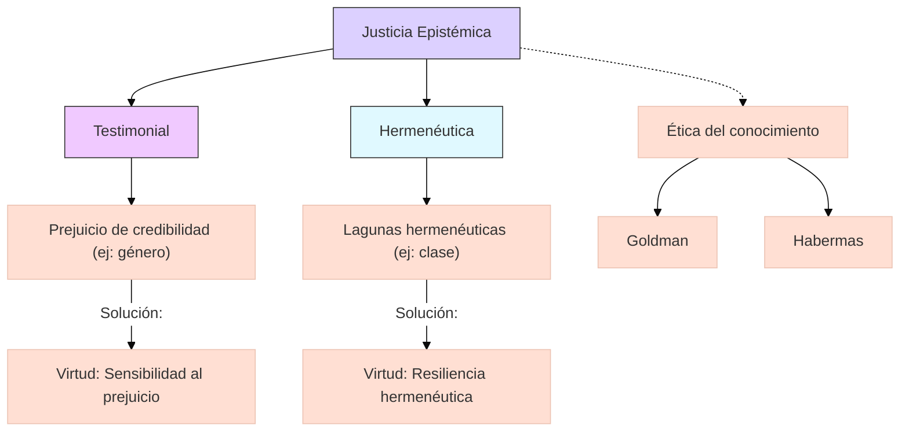

## 1. Contexto y antecedentes  
La teoría emerge como respuesta a limitaciones en la epistemología tradicional, que ignoraba el contexto social de la producción de conocimiento. Fricker identifica que prejuicios sistémicos distorsionan la atribución de credibilidad, generando "injusticias epistémicas". Esto conecta con trabajos previos en filosofía feminista (Code, Harding) y teoría crítica (Habermas).

## 2. Objetivo  
Demostrar que la injusticia epistémica es una forma de opresión distinta, con mecanismos específicos que afectan la capacidad de los sujetos para participar en prácticas cognitivas colectivas. La hipótesis central postula que estas injusticias son estructurales y requieren soluciones institucionales.

## 3. Metodología  
Fricker emplea análisis conceptual filosófico combinado con estudios de casos históricos (como el testimonio de víctimas de discriminación). Utiliza herramientas de la epistemología social (Goldman) y teoría del reconocimiento (Honneth), evitando reduccionismos empiristas o idealistas.

## 4. Principales resultados  
1. Identificación de dos tipos de injusticia: testimonial (devaluación del habla por prejuicios) y hermenéutica (vacíos conceptuales que impiden expresar experiencias).  
2. Propuesta de virtudes epistémicas correctivas: "sensibilidad al prejuicio" para oyentes y "resiliencia hermenéutica" para hablantes.  

## 5. Implicaciones y trabajo futuro  
Aplicaciones en educación (currículos inclusivos), derecho (valoración de testimonios) y ciencia (diversificación de fuentes). Líneas abiertas incluyen estudiar injusticias epistémicas en inteligencia artificial y su relación con la justicia distributiva.

## 6. Crítica  
1. Dificultad para cuantificar el daño epistémico.  
2. Riesgo de esencialismo al categorizar grupos afectados.  
3. Críticas desde el pragmatismo (Rorty) sobre la viabilidad de soluciones normativas.  

## 7. Contexto musical  
En música, se manifiesta en la exclusión de tradiciones no occidentales de los cánones académicos. Ejemplo: descredito de sistemas tonales africanos por no ajustarse a armonía funcional europea. Proyectos actuales como el "Global Music Archive" buscan corregir estas asimetrías.

## 8. Visualización  


## 9. Python (Modelo de distribución de credibilidad)  
```python
import plotly.express as px
import numpy as np

# Modelo: Distribución de credibilidad en función de atributos sociales
groups = ['Grupo A (dominante)', 'Grupo B (minorizado)']
credibility = np.array([[0.8, 0.6], [0.3, 0.7]])  # [prejuicio_activado, prejuicio_corregido]

fig = px.imshow(credibility, x=['Con prejuicio', 'Con virtud epistémica'], 
                y=groups, color_continuous_scale='Viridis',
                labels=dict(x="Condición", y="Grupo", color="Credibilidad"))
fig.update_layout(title="Efecto de las virtudes epistémicas en la atribución de credibilidad")
fig.show()
```

## 10. Representación musical  
```lily
\version "2.24.0"
\paper { tagline = ##f  paper-height=#(* 5 cm) paper-width=#(* 20 cm)  system-count=#1 }
\score {
    \new Staff {
        \time 4/4
        \override Staff.TimeSignature.transparent = ##t
        <<
            { \clef treble \tempo 4 = 60 
              c'4^\markup{ \italic "Voz dominante" } g' e' f' }
            \\
            { \clef bass \stemDown 
              a,2^\markup{ \italic "Voz silenciada" } \parenthesize a, }
        >>
    }
}
```

## 11. Preguntas de estudio  
1. ¿Qué distingue la injusticia testimonial de la hermenéutica?::La primera afecta la recepción del testimonio; la segunda, la capacidad de articular experiencias.  
2. Nombre un crítico de la justicia epistémica::Richard Rorty, por su escepticismo sobre soluciones normativas.  
3. ¿Cómo aplicaría virtudes epistémicas en educación musical?::Incluyendo sistemas tonales no occidentales como objetos de estudio válidos.  

## 12. Referencias  
```bibtex
@book{fricker2007epistemic,
  title={Epistemic Injustice: Power and the Ethics of Knowing},
  author={Fricker, Miranda},
  year={2007},
  publisher={Oxford University Press}
}
```

> [!important] En mis palabras  
> ### 1  
> <*desigualdad*> <*credibilidad*> <*estructura*>  
> ### 2  
> <*virtud*> <*corrección*> <*institución*>  
> ### 9  
> <*sesgo*> <*matriz*> <*corrección*>