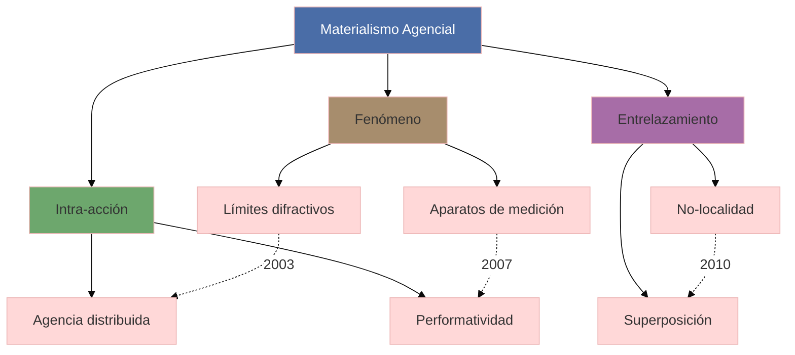

## 1. Contexto y antecedentes  
El materialismo agencial surge como crítica al constructivismo social y realismo científico, problematizando la separación entre naturaleza y cultura. Se fundamenta en interpretaciones de la física cuántica (como el experimento de doble rendija) donde la observación constituye el fenómeno. Reconfigura la ontología tradicional al eliminar la distinción a priori entre objetos y agentes.

## 2. Objetivo  
Demostrar que la agencia no es propiedad de humanos o no-humanos, sino efecto de configuraciones relacionales dinámicas. La hipótesis central establece que las prácticas materiales son enactivas y constitutivas de realidad, no meramente representacionales.

## 3. Metodología  
Combina análisis filosófico con estudios de caso científicos, particularmente en mecánica cuántica. Emplea el método de "[[difracción]]" (en contraste con reflexión) para examinar patrones de interferencia conceptual. Los datos provienen de experimentos físicos reinterpretados a través de lentes posthumanistas.

## 4. Principales resultados  
1. Los fenómenos son los constituyentes básicos de la realidad, definidos por fronteras difractivas en lugar de límites fijos.  
2. La agencia se distribuye asimétricamente en configuraciones específicas, no reside en entidades individuales.  
3. La ecuación $ \Psi(R,t) = \sum_i \psi_i(r,t)\phi_i(R,t) $ ilustra el entrelazamiento (quantum entanglement) como modelo de intra-acciones.

## 5. Implicaciones y trabajo futuro  
Reorienta epistemologías en ciencias sociales al priorizar performatividad sobre representación. Áreas de desarrollo incluyen: aplicaciones en inteligencia artificial distribuida, estudios ecológicos no-antropocéntricos, y diseños algorítmicos basados en co-constitución.

## 6. Crítica  
Limitaciones principales: 1) Dificultad operacionalizar "intra-acciones" empíricamente; 2) Riesgo de panrelacionalismo donde toda causalidad se diluye en redes; 3) Tensión no resuelta entre determinismo cuántico y agencialidad.

## 7. Contexto musical  
Reinterpreta la organología como red de agencias material-discursivas: un instrumento no es objeto estable sino fenómeno emergente de prácticas performativas. Ejemplo: El arco de violín como "aparato de medición" que enacta posibilidades sonoras específicas mediante intra-acciones con resina, pelo y cuerda.

## 8. Visualización  


## 9. Python (Plotly)  
```python
import plotly.graph_objects as go
import numpy as np

# Simulación de campo agencial
x = np.linspace(-5, 5, 100)
y = np.linspace(-5, 5, 100)
X, Y = np.meshgrid(x, y)
Z = np.sin(np.sqrt(X**2 + Y**2)) * np.cos(2*X)  # Ecuación de intra-acción

fig = go.Figure(data=[go.Surface(z=Z, colorscale='Viridis')])
fig.update_layout(
    title='Topología de agencia distribuida',
    scene=dict(
        xaxis_title='Componente material',
        yaxis_title='Componente discursivo',
        zaxis_title='Intensidad agencial'
    ),
    autosize=False,
    width=800,
    height=600
)
fig.show()
```
*Explicación:* La superficie muestra cómo la agencia (eje Z) emerge de interferencias entre dimensiones materiales (X) y discursivas (Y). Los picos corresponden a configuraciones fenoménicas estables.

## 10. Representación musical  
```lilypond
\version "2.24.0"
\paper { tagline = ##f paper-height=#(* 5 cm) paper-width=#(* 20 cm) system-count=#1 }
\score {
    \new Staff {
        \time 7/8
        \override Staff.TimeSignature.stencil = ##f
        \set Staff.midiInstrument = "violin"
        \relative c'' {
            \tuplet 3/2 { a8( b cis } \tuplet 3/2 { d e fis) } g4~ |
            g16[ fis e d] cis[ b a g] fis8[ e] |
            d4\glissando \harmonicOn a'\harmonicOff r4
        }
    }
}
```
*Metáfora:* Los tuplets representan superposiciones cuánticas, el glissando ilustra no-localidad, y los armónicos simbolizan fronteras difractivas.

## 11. Preguntas de estudio  
1. ¿Cómo redefine el materialismo agencial el concepto de causalidad?::Como red de intra-acciones performativas más que secuencia lineal causa-efecto.  
2. Nombre un experimento físico clave para esta teoría::Experimento de doble rendija de Bohr.  
3. ¿Qué crítica plantea Latour al materialismo agencial?::Pérdida de especificidad en análisis de actantes individuales.  
4. Aplique el concepto a diseño de interfaz musical::Sensores como aparatos que enactan agencia sonora en intra-acción con gestos humanos.  

## 12. Referencias  
```bibtex
@book{barad2007,
  title={Meeting the Universe Halfway},
  author={Barad, Karen},
  year={2007},
  publisher={Duke University Press}
}
```

> [!important] En mis palabras  
> ### 1  
> <*fenómeno*> <*entrelazamiento*>  
> ### 2  
> <*intra-acción*> <*performatividad*>  
> ### 7  
> <*violín*> <*difracción*>  
> ### 9  
> <*superficie*> <*interferencia*>