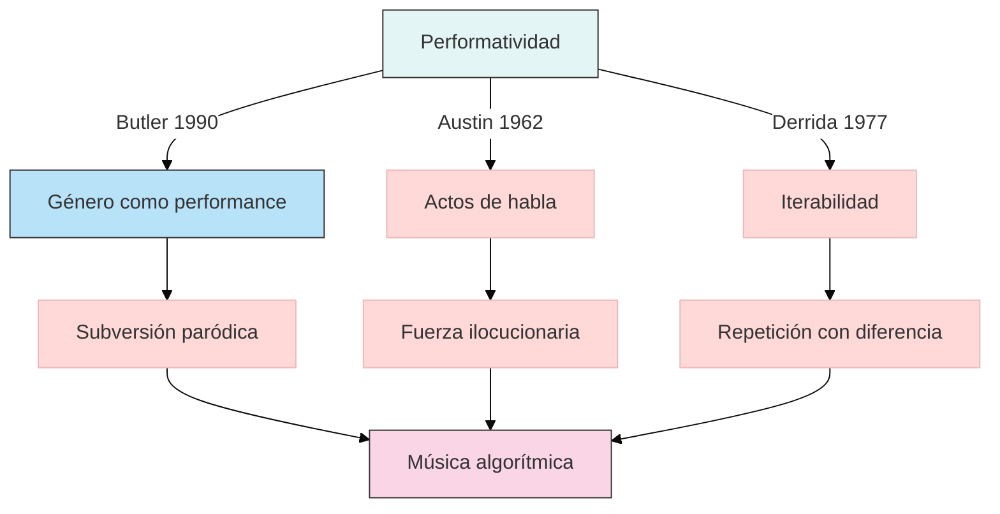

```yaml
---
type: concepto
tags:
  - concept
  - performativity
  - philosophy
person: Judith Butler
year: 1990
summary: 
  - La performatividad describe cómo las identidades y normas sociales se construyen mediante actos repetidos y citacionales, no como esencias preexistentes.
  - Se origina en teoría del lenguaje (Austin) y se expande a género y poder (Butler), cuestionando la dicotomía naturaleza/cultura.
  - Su aplicación trasciende lo lingüístico, analizando cómo cuerpos y prácticas materializan discursos hegemónicos.
connect:
  - John L. Austin (actos de habla)
  - Michel Foucault (poder/discurso)
  - Jacques Derrida (iterabilidad)
created: 18-02-2025
modified: 
---
```

## 1. Contexto y antecedentes  
La performatividad emerge como crítica al esencialismo en filosofía del lenguaje y teoría feminista. Austin (1962) establece que ciertos enunciados ("te declaro marido y mujer") realizan acciones, no solo las describen. Butler (1990) radicaliza esto: el género es un efecto de prácticas performativas repetidas bajo reglas discursivas, no una identidad fija. Foucault provee el marco sobre cómo el poder produce sujetos mediante normas internalizadas.

## 2. Objetivo  
Demostrar que identidad y realidad social son construcciones iterativas, no dadas. La hipótesis central es que la repetición estilizada de actos bajo coerción discursiva genera la ilusión de sustancia natural.

## 3. Metodología  
Análisis crítico de:  
1. **Actos de habla** (Austin): distinción constativo/performativo.  
2. **Deconstrucción** (Derrida): iterabilidad como condición de todo signo.  
3. **Genealogía** (Foucault): historicidad de las categorías identitarias.  

## 4. Principales resultados  
- El género es una performance sin actor previo (Butler, *Gender Trouble*).  
- La materialidad del cuerpo es efecto, no causa, de prácticas significantes.  
- La subversión ocurre mediante repeticiones paródicas que exponen la contingencia de las normas.  

## 5. Implicaciones y trabajo futuro  
Aplicaciones en:  
- **Tecnología**: Interfaces que desestabilizan binarismos (ej. voces no humanoides en IA).  
- **Música**: Prácticas performativas que cuestionan autoría/identidad (ej. música algorítmica).  
Líneas abiertas: performatividad en entornos no humanos (robots, ecosistemas digitales).  

## 6. Crítica  
- **Materialismo**: ¿Cómo interactúa lo discursivo con condiciones materiales (Barad)?  
- **Agencia**: Riesgo de reducir al sujeto a mero efecto de estructuras.  

## 7. Contexto musical  
La performatividad explica:  
- **Instrumentos**: El violín como tecnología de género (McClary, *Feminine Endings*).  
- **Composición**: Repetición/ruptura en minimalismo (Reich) como crítica a normas estéticas.  

## 8. Visualización  


## 9. Python (Plotly)  
Visualización de la iterabilidad como serie de repeticiones con desviación:  
```python
import plotly.express as px
import numpy as np

t = np.linspace(0, 10, 100)
base_wave = np.sin(t)
variations = [base_wave + np.random.normal(0, 0.2, 100) for _ in range(5)]

fig = px.line(title="Iterabilidad en performatividad")
for i, wave in enumerate(variations):
    fig.add_scatter(x=t, y=wave, name=f"Iteración {i+1}")
fig.update_layout(xaxis_title="Tiempo", yaxis_title="Amplitud (norma/desviación)")
fig.show()
```

## 10. Representación musical  
```lily
\version "2.24.0"
\paper { tagline = ##f  paper-height=#(* 5 cm) paper-width=#(* 20 cm)  system-count=#1 }
\score {
    \new Staff {
        \time 4/4
        \override Staff.TimeSignature.stencil = ##f
        \repeat unfold 4 { 
            c'4^\markup{ \small \italic "Norma" } e' g' e' 
            c'4^\markup{ \small \italic "Desviación" } f' a' dis' 
        }
    }
}
```

## 11. Preguntas de estudio  
1. **¿Cómo difiere la performatividad en Butler de los actos de habla en Austin?**::Butler extiende lo performativo más allá del lenguaje a la materialización corporal, mientras Austin se limita a enunciados.  
2. **Nombre un ejemplo musical de performatividad de género**::La voz castrato como performance de feminidad construida (Feldman, *The Castrato*).  
3. **¿Qué crítica feminista existe a la performatividad?**::Materialistas como Nancy Fraser argumentan que ignora condiciones económicas de opresión.  

## 12. Referencias  
```bibtex
@book{butler1990gender,
  title={Gender Trouble},
  author={Butler, Judith},
  year={1990},
  publisher={Routledge}
}
@article{austin1962performative,
  title={How to do things with words},
  author={Austin, John L.},
  year={1962},
  publisher={Oxford University Press}
}
```

> [!important] En mis palabras  
> ### 1  
> *construcción* *repetición* *discurso*  
> ### 2  
> *identidad* *ilusión* *normas*  
> ### 9  
> *variación* *serie* *desviación*