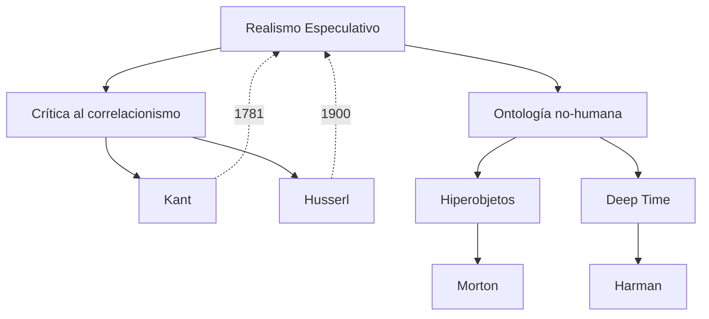

1. argumenta que la existencia de la realidad es independiente de la experiencia humana. 
2. emerge como una reacción a ciertos aspectos de la filosofía post-kantiana y lo que es conocido como 
	1. correlacionismo: la idea de que nuestro entendimiento de la realidad está siempre mediado por nuestra conciencia. 


## Contexto y antecedentes  
El realismo especulativo emerge en respuesta a la hegemonía del paradigma post-kantiano, donde el correlacionismo —desarrollado desde Husserl hasta Heidegger— establece que solo conocemos la realidad como correlato de estructuras subjetivas. Este enfoque dominante en la filosofía continental del siglo XX negaba la posibilidad de acceder a la realidad "en sí". La física cuántica y [[matemáticas del continuo]](Cantor) mostraron entidades independientes de la experiencia humana, cuestionando el antropocentrismo epistemológico.

## Objetivo  
Demostrar que la realidad posee una existencia autónoma mediante argumentos especulativos que evaden el círculo correlacional. La hipótesis central afirma que lo real es cognoscible sin reducirlo a condiciones trascendentales de acceso.

## Metodología  
1. **Crítica inmanente**: Identifica contradicciones internas en el correlacionismo (ej. paradoja del arque-fósil en Meillassoux).  
2. **Matematización de lo real**: Usa modelos matemáticos (e.g., teoría de conjuntos) para describir estructuras ontológicas no-humanas.  
3. **Especulación racional**: Deriva consecuencias ontológicas desde principios no-empíricos (principio de factialidad).

## Principales resultados  
- **Necesidad contingente**: Las leyes físicas son necesarias pero podrían cambiar sin causa (facticidad radical).  
- **Tiempo no humano**: Lo real precede y excede toda subjetividad, con temporalidades ajenas a la fenomenología (Deep Time de Harman).  

## Implicaciones y trabajo futuro  
Reconfigura la ontología para incluir entidades "hiperobjetos" (Morton) y abre vías para:  
1. Epistemologías no-correlacionales en IA.  
2. Modelado matemático de realidades inobservables (materia oscura).  

## Crítica  
1. **Falta de verificabilidad**: La especulación pura carece de criterios empíricos de validación.  
2. **Reduccionismo matemático**: Asume que lo real es siempre formalizable (criticado por Brassier).  

## Contexto musical  
Aplicable a composiciones que exploren:  
- Microtonalidades como estructuras independientes de la percepción (Xenakis).  
- Algorithmos generativos que operan fuera de parámetros humanos (C++ en SuperCollider).  

## Visualización  


## Representación musical  
```lily
\version "2.24.0"
\paper { tagline = ##f  paper-height=#(* 5 cm) paper-width=#(* 20 cm)  system-count=#1 }
\score {
    \new Staff {
        \time 7/4
        \tempo 4 = 60
        \override Staff.StaffSymbol.line-count = #4
        \clef percussion
        c'4^\markup{Hiperobjeto} g'\harmonic b\microtonal ##5 a'\glissando 
        \break
        r4_"Deep Time" \tuplet 5/4 { f''16\mf\> e'''\pp } d''\sustainOn
    }
}
```

## Preguntas de estudio  
1. **¿Qué problema resuelve el realismo especulativo?**::La inaccesibilidad de lo real fuera de la correlación humano-mundo.  
2. **Nombre un argumento contra el correlacionismo**::El arque-fósil muestra realidades pre-humanas no correlacionadas.  
3. **¿Cómo aplica esto a la música?**::Composición basada en algoritmos no-antrópicos.  

## Referencias  
```bibtex
@book{meillassoux2008,
  title={After Finitude},
  author={Meillassoux, Quentin},
  year={2008},
  publisher={Continuum}
}
```

> [!important] En mis palabras  
> ### 1  
> *correlación* *autonomía* *facticidad*  
> ### 2  
> *matemáticas* *hiperobjeto* *Xenakis*  
> ### 7  
> *microtonalidad* *algoritmo* *no-humano*