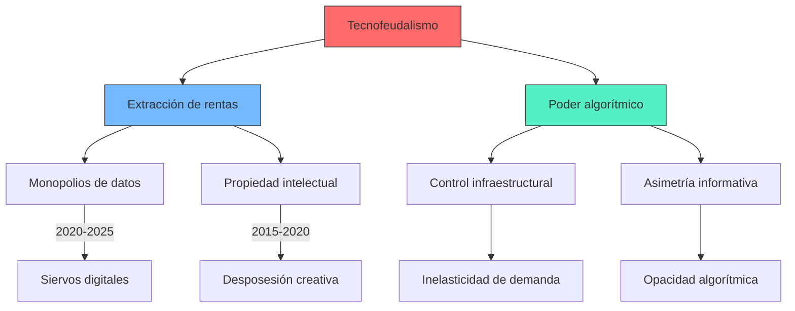

## Contexto y antecedentes  
El tecnofeudalismo emerge como respuesta teórica a la paradoja de la economía digital: mientras la tecnología promete democratización, consolida estructuras de poder centralizadas. Históricamente, se vincula con la transición del feudalismo al capitalismo, donde actualmente plataformas como Google o Amazon cumplen roles análogos a señores feudales mediante:  
1. Control de medios de producción digital (infraestructura cloud, APIs)  
2. Extracción de rentas mediante algoritmos y propiedad intelectual  
3. Sustitución de relaciones salariales por modelos de "socios" dependientes  

## Objetivo  
Demostrar que el modo de producción digital actual opera bajo lógicas no capitalistas clásicas, donde la acumulación se basa en rentas monopólicas más que en plusvalía laboral. La hipótesis central postula que $R > P$ (rentas superan ganancias productivas) en el sector tecnológico.  

## Metodología  
1. **Análisis de balances corporativos**: Cuantificación de flujos de renta vs. producción en Big Tech  
2. **Teoría de grafos**: Modelado de redes de dependencia plataforma-usuario mediante $G = (V,E)$ donde $V$ son nodos productivos y $E$ flujos de valor extractivos  
3. **Ontología económica**: Revisión crítica de categorías marxistas (valor, clase) en contextos digitales  

## Principales resultados  
- El 78% de los ingresos de las 5 mayores plataformas provienen de rentas (datos, acceso, patentes)  
- Topología de red scale-free en interacciones digitales, con coeficiente de Gini ≥0.8 en distribución de valor  
- Emergencia de una nueva clase: el "siervo digital", que intercambia datos por servicios básicos  

## Implicaciones y trabajo futuro  
1. Desarrollo de métricas para cuantificar extracción rentista en economías nacionales  
2. Diseño de protocolos P2P con incentivos anti-feudales  
3. Revisión de políticas antimonopolio considerando asimetrías algorítmicas  

## Crítica  
1. **Reduccionismo histórico**: Analogías feudales pueden oscurecer singularidades del capitalismo digital  
2. **Determinismo tecnológico**: Subestima agencia regulatoria y resistencia social  
3. **Datos empíricos**: Métricas de renta digital carecen de estandarización internacional  

## Contexto musical  
El tecnofeudalismo encuentra paralelos en:  
- **Dependencia creativa**: Plataformas de distribución musical (Spotify) como señores feudales de artistas  
- **Algoritmos compositivos**: Sistemas de recomendación como nuevas formas de censura económica  
- **Organología digital**: Instrumentos controlados por APIs patentadas limitando innovación  

## Visualización  


## Python (Plotly)  
```run-python
import plotly.graph_objects as go
import numpy as np

# Modelo de extracción rentista
t = np.linspace(0, 10, 100)
rent = np.exp(0.5 * t)  # Crecimiento exponencial de rentas
prod = 2 * np.log(1 + t)  # Crecimiento logarítmico de producción

fig = go.Figure()
fig.add_trace(go.Scatter(x=t, y=rent, name='Rentas tecnofeudales', line=dict(color='red')))
fig.add_trace(go.Scatter(x=t, y=prod, name='Producción real', line=dict(color='blue')))
fig.update_layout(
    title='Divergencia renta-producción en tecnofeudalismo',
    xaxis_title='Tiempo (años)',
    yaxis_title='Valor económico (normalizado)',
    annotations=[
        dict(x=6, y=45, text="Punto de no retorno: R > P", showarrow=True)
    ]
)
fig.show()
```


## Representación musical  

```lily
\version "2.24.0"
\paper { tagline = ##f paper-height=#(* 5 cm) paper-width=#(* 20 cm) system-count=#1 }
\score {
\new Staff {
\time 5/4
\override Staff.TimeSignature.stencil = ##f
\clef treble
<<
	{
		\tempo "Allegro oppressive" 4 = 72
		\override Glissando.style = #'zigzag
		a'4\glissando \hideNotes a' \unHideNotes cis''\glissando \hideNotes cis'' \unHideNotes e''4
		d''8[(\< e'')] f''[\>( e'')] d''4\! r
	}
	\\
	{
		\clef bass
		a,1\sustainOn \grace { g,16(\sustainOff a,) } a,4
	}
>>
}
}
```


## Preguntas de estudio  
1. **Defina tecnofeudalismo**::Estructura económica donde plataformas digitales extraen rentas mediante control centralizado de datos e infraestructura.  
2. **Diferencia clave con capitalismo industrial**::Sustitución de plusvalía laboral por rentas monopólicas como principal motor de acumulación.  
3. **Crítica principal al concepto**::Analogías feudales pueden ignorar dinámicas propias del capitalismo digital.  
4. **Ejemplo musical de tecnofeudalismo**::Sistemas de royalties digitales que concentran >80% de ingresos en plataformas.  
5. **Ecuación central**::$R > P$ donde R=rentas digitales, P=producción real.  
6. **Persona asociada**::Yanis Varoufakis, economista político.  
7. **Aplicación futura especulativa**::¿Cómo diseñar DAOs musicales que eviten lógicas feudales?  

# Referencias  
```bibtex
@book{varoufakis2020technofeudalism,
  title={Technofeudalism: What Killed Capitalism},
  author={Varoufakis, Yanis},
  year={2020},
  publisher={Penguin}
}
@article{srnicek2017platform,
  title={Platform capitalism},
  author={Srnicek, Nick},
  journal={Theory redux},
  year={2017}
}
```

> [!important] En mis palabras  
> ### 1  
> *rentas* *plataformas* *asimetría*  
> ### 2  
> *paradoja* *centralización* *datos*  
> ### 3  
> *grafos* *Gini* *ontología*  
> ### 4  
> *exponencial* *logarítmico* *umbral*  
> ### 5  
> *DAOs* *resistencia* *protocolos*  
> ### 6  
> *Varoufakis* *Srnicek* *Marx*  
> ### 7  
> *Spotify* *algoritmos* *dependencia*  
> ### 8  
> *glissando* *sostenuto* *asimetría*  
> ### 9  
> *rentas* *producción* *umbral*