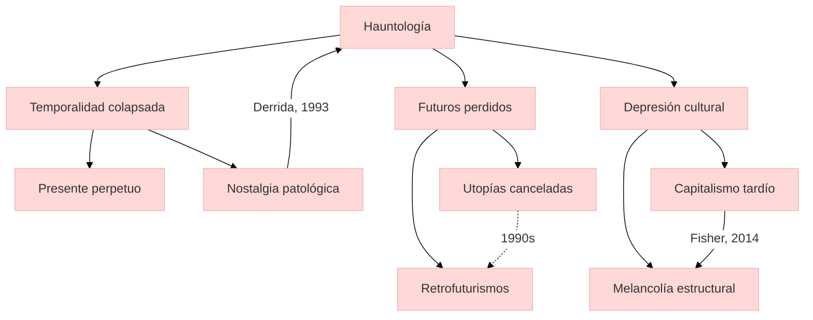

### Mark Fisher

<iframe title="Mark Fisher on why Modern Life causes Depression ITA sub" src="https://www.youtube.com/embed/QmvuFOlUfnU?feature=oembed" height="113" width="200" allowfullscreen="" allow="fullscreen" style="aspect-ratio: 1.76991 / 1; width: 100%; height: 100%;"></iframe>

<rev>Fisher, Mark. Ghosts of My Life</rev>


---

https://archive.org/stream/MarkFisherGhostsOfMyLifeWritingsOnDepreBookZZ.org/%5BMark_Fisher%5D_Ghosts_of_My_Life_Writings_on_Depre%28BookZZ.org%29_djvu.txt


---

### hauntología


  - La hauntología, en la obra de Mark Fisher, describe la persistencia de futuros culturales cancelados que "fantasmean" el presente, manifestándose como nostalgia patológica o melancolía por lo que nunca ocurrió. 
  - Surge de la crisis de la imaginación futura bajo el capitalismo tardío, donde lo nuevo es reemplazado por reciclajes de formas culturales pasadas (ej. retrofuturismos, remakes).

---

### futuros perdidos


  - Fisher vincula este fenómeno a la depresión colectiva, argumentando que la incapacidad de proyectar futuros alternativos colapsa la temporalidad en un presente perpetuo.

#### conexiones
  - Jacques Derrida (Specters of Marx)
  - Franco "Bifo" Berardi
  - Kodwo Eshun (Afrofuturism)

---

## Contexto y antecedentes  
La hauntología emerge en el posfordismo como crítica a la estancación cultural (Fisher, 2014). Derrida (1993) acuñó el término para describir cómo el marxismo "fantasmeaba" Europa post-1989, pero Fisher lo adapta para analizar la música electrónica y cultura popular. Su tesis central: el capitalismo neoliberal ha colonizado el futuro, reemplazando la innovación por pastiche (Jameson, 1991) y generando depresión como afecto estructural.

---

## Objetivo  
Demostrar que la depresión contemporánea no es solo patología individual sino síntoma de un colapso en la imaginación histórica, donde los "futuros perdidos" de proyectos utópicos (ej. socialismo, afrofuturismo) persisten como ecos en la producción cultural.

---
## Metodología  
Fisher emplea análisis crítico de:  
1. **Música**: Contrasta el futurismo de la electrónica de los 90 (ej. Jungle) con el retrofuturismo de los 2000 (ej. vaporwave).  
2. **Cine**: Estudia la recurrencia de estéticas "hauntológicas" (ej. filmes de Christopher Nolan).  
3. **Teoría cultural**: Combina marxismo (Jameson), psicoanálisis (Freud/Lacan) y estudios de medios (Kittler).

---
## Principales resultados  
1. **Temporalidad colapsada**: La cultura contemporánea opera en "tiempo muerto" (Fisher, 2012), sin progresión narrativa.  
2. **Depresión como síntoma**: La imposibilidad de futuro se internaliza como afecto (cf. Berardi, 2011).  
3. **Música como archivo hauntológico**: Géneros como el hauntology (ej. Leyland Kirby) materializan este fenómeno.

---
## Implicaciones y trabajo futuro  
- Estudiar contracorrientes (ej. afrofuturismo) que resisten esta lógica.  
- Analizar plataformas digitales como espacios de futuros alternativos.  


---

## Crítica  
1. **Determinismo cultural**: Ignora prácticas marginales que sí generan futuros (Haraway, 2016).  
2. **Eurocentrismo**: Prioriza experiencias occidentales (Mbembe, 2016).  

## Contexto musical  
Fisher analiza cómo el jungle de los 90 encarnaba un futuro posracial, mientras que el vaporwave de los 2010 fetichiza tecnologías obsoletas (ej. samples de Windows 95). Propone que la música hauntológica usa:  
- **Sampling de medios antiguos** (ej. cintas VHS deterioradas).  
- **Armonías suspendidas** (acordes menores con delays infinitos).  



## Representación musical  
```lily
\version "2.24.0"
\paper { tagline = ##f  paper-height=#(* 5 cm) paper-width=#(* 20 cm)  system-count=#1 }
\score {
    \new Staff {
        \time 4/4
        \clef treble
        \tempo "Hauntológico" 4 = 60
        \override Glissando.style = #'trill
        <e g b>1\glissando \acciaccatura {dis16 e} <f a c>2\sustainOn 
        \tuplet 3/2 { <e g b>8\sustainOff\glissando <dis fis a> <e g b> } 
        r4 r2
    }
}
```

## Preguntas de estudio  
1. **¿Cómo define Fisher la relación entre hauntología y depresión?**::Como internalización afectiva de la imposibilidad de futuros alternativos bajo el capitalismo tardío.  
2. **Nombre un género musical hauntológico**::Vaporwave o música de Leyland Kirby.  
3. **Crítica principal a la hauntología**::Eurocentrismo y determinismo cultural.  

# Referencias  
```bibtex
@book{fisher2014ghosts,
  title={Ghosts of My Life},
  author={Fisher, Mark},
  year={2014},
  publisher={Zero Books}
}
```

> [!important] En mis palabras  
> ### 1  
> *Futuros cancelados* *Melancolía estructural*  
> ### 2  
> *Sampling como fantasma* *Tiempo muerto*  
> ### 3  
> *Música suspendida*