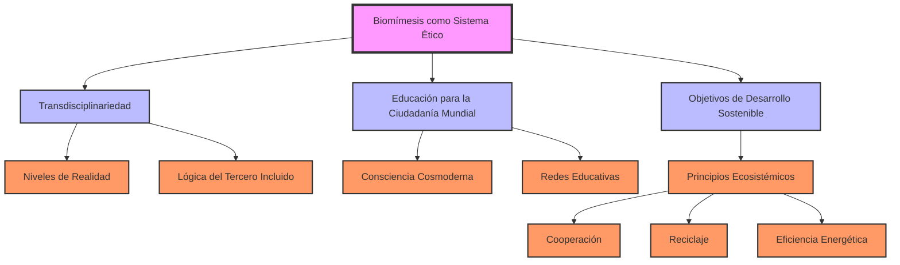

## Contexto y antecedentes
La biomímesis como sistema ético surge en respuesta a la crisis civilizatoria actual, caracterizada por la insostenibilidad del modelo capitalista y los límites planetarios. Este enfoque se enmarca en la Educación para la Ciudadanía Mundial (ECM) y los Objetivos de Desarrollo Sostenible (ODS) de la ONU, buscando reformular sistemas humanos a través de la imitación de principios naturales.

## Objetivo
El propósito central es integrar la biomímesis en la educación y la producción cultural, asignando valor a la sostenibilidad y generando cohesión social a través de la imitación de principios ecosistémicos como la cooperación, el reciclaje y la eficiencia energética.

## Metodología
La metodología se basa en la transdisciplinariedad, utilizando los niveles de realidad y la lógica del tercero incluido de Nicolescu, y en los principios operacionales de la biomímesis de Benyus. Estos enfoques permiten comprender la multidimensionalidad humana y aplicar principios naturales a estructuras sociales, políticas y educativas.

## Principales resultados
1. **Consciencia cosmoderna**: Enseñar la Gran Historia para contextualizar la humanidad en la Tierra-Patria.
2. **ODS y biomímesis**: Reorganizar el conocimiento con principios naturales para un desarrollo sostenible.
3. **Redes educativas**: Crear "Constelaciones de Escuelas-ONG Hermanadas" usando TIC para conectar globalmente y alcanzar los ODS.

## Implicaciones y trabajo futuro
La biomímesis como sistema ético tiene implicaciones significativas para la educación y la producción cultural, promoviendo una ciudadanía global solidaria y ecológica. Futuras investigaciones podrían explorar su aplicación en tecnologías sostenibles y en la integración con otros sistemas éticos.

## Crítica
Una limitación de la biomímesis como sistema ético es su dependencia de la cooperación global, lo que puede ser difícil de lograr en un mundo fragmentado. Además, su enfoque pragmático puede ser visto como insuficiente para abordar problemas metafísicos o espirituales.

## Contexto musical
La biomímesis podría influir en la creación musical contemporánea, inspirando composiciones que imiten patrones naturales o que utilicen materiales sostenibles en la construcción de instrumentos. Por ejemplo, una obra musical podría imitar los ciclos naturales o utilizar sonidos ambientales para promover la conciencia ecológica.

## Visualización


## Preguntas de estudio
1. **¿Qué es la biomímesis como sistema ético?**::Un enfoque que imita principios naturales para reformular sistemas humanos sostenibles.
2. **¿Cuáles son los principios ecosistémicos clave en la biomímesis?**::Cooperación, reciclaje y eficiencia energética.
3. **¿Cómo se relaciona la biomímesis con la Educación para la Ciudadanía Mundial?**::Integra sostenibilidad y educación para formar ciudadanos globales conscientes.
4. **¿Qué crítica se puede hacer a la biomímesis como sistema ético?**::Depende de la cooperación global y puede ser insuficiente para problemas metafísicos.
5. **¿Cómo podría la biomímesis influir en la creación musical contemporánea?**::Inspirando composiciones que imiten patrones naturales o utilicen materiales sostenibles.

# Referencias
```bibtex
@article{ColladoRuano2016,
  author = {Javier Collado Ruano},
  title = {Una perspectiva transdisciplinar y biomimética de la educación para la ciudadanía mundial},
  journal = {Educere},
  volume = {20},
  number = {65},
  pages = {113-129},
  year = {2016},
  url = {}
}
```

> [!important] En mis palabras 
> ### 1 
>   <*biomímesis*> <*sostenibilidad*> <*transdisciplinariedad*>
> ### 2 
>  <*educación*> <*cooperación*> <*eficiencia*>
> ### 3 
>  <*crisis civilizatoria*> <*límites planetarios*> <*ODS*>
> ### 4 
>  <*consciencia cosmoderna*> <*redes educativas*> <*principios ecosistémicos*>
> ### 5 
>  <*crítica*> <*cooperación global*> <*pragmatismo*>
> ### 6 
>  <*música contemporánea*> <*patrones naturales*> <*materiales sostenibles*>
> ### 7 
>  <*visualización*> <*mermaid*> <*jerarquía*>
> ### 8 
>  <*preguntas de estudio*> <*Anki*> <*conciencia ecológica*>
> ### 9 
>  <*referencias*> <*BibTeX*> <*rigor académico*>


# Resumen: Una perspectiva transdisciplinar y biomimética de la educación para la ciudadanía mundial

**Autor:** Javier Collado Ruano  
**Fuente:** Educere, vol. 20, núm. 65, pp. 113-129, 2016  
**Universidad:** Universidad Federal da Bahía, Brasil  

## Contexto
- Reflexiona sobre la **Educación para la Ciudadanía Mundial (ECM)** y los **Objetivos de Desarrollo Sostenible (ODS)** aprobados en 2015 por la ONU.
- Analiza eventos clave: 2º Foro UNESCO de ECM (enero), 2º Foro Mundial de Educación (mayo), y Cumbre del Milenio (septiembre).
- Critica el modelo capitalista actual como insostenible frente a los límites planetarios.

## Metodología
- **Transdisciplinariedad**: Basada en Nicolescu (niveles de realidad, lógica del tercero incluido, complejidad) para comprender la multidimensionalidad humana.
- **Biomímesis**: Inspirada en Benyus, imita principios de la naturaleza (9 principios operacionales) para reformular sistemas humanos sostenibles.

## Ideas principales
- La crisis económica global es una crisis civilizatoria que requiere nuevas herramientas epistémicas.
- La ECM debe integrar sostenibilidad y educación para formar ciudadanos globales conscientes.
- Identifica principios ecosistémicos (cooperación, reciclaje, eficiencia energética) para aplicarlos a estructuras sociales, políticas y educativas.

## Propuestas
1. **Consciencia cosmoderna**: Enseñar la Gran Historia para contextualizar la humanidad en la Tierra-Patria.
2. **ODS y biomímesis**: Reorganizar el conocimiento con principios naturales para un desarrollo sostenible.
3. **Redes educativas**: Crear "Constelaciones de Escuelas-ONG Hermanadas" usando TIC para conectar globalmente y alcanzar los ODS.

## Conclusión
- La ECM es una herramienta transformadora que une educación y sostenibilidad, promoviendo una ciudadanía global solidaria y ecológica frente a los desafíos del siglo XXI.

**Palabras clave:** ECM, ODS, biomímesis, transdisciplinariedad, Gran Historia.

#### ¿Qué es un sistema ético y cómo se define?
Un sistema ético, según tus pistas, es un marco que:
- **Asigna valor**: Determina qué es "bueno" o "malo" (premiación/disvalor).
- **Genera cohesión**: Une a individuos bajo un propósito compartido.
- **Orienta acciones**: Define fines teleológicos que guían el comportamiento.
- **Varía en autoridad**: Puede ser unívoco (autoritario) o democrático (plural).

#### La biomímesis como sistema ético
La biomímesis, en el contexto de Collado Ruano, puede interpretarse como un sistema ético porque:
- **Asigna valor**: Valora la naturaleza como modelo (ej. eficiencia energética, reciclaje) y penaliza el despilfarro capitalista (huella ecológica).
- **Genera cohesión**: Busca una ciudadanía global unida por la sostenibilidad y la "Tierra-Patria".
- **Fines específicos**: Su teleología es la armonía con los ecosistemas, imitando principios naturales (Benyus: "la naturaleza sabe lo que funciona").
- **Enfoque democrático**: Propone una red colaborativa (escuelas-ONG) frente a jerarquías, aunque guiada por ideales claros.

**Ejemplo en la producción cultural**: Una obra artística biomimética (como un edificio ecoeficiente inspirado en termiteros) encarna estos valores, premiando la sostenibilidad y criticando el exceso.

#### Comparación con otros sistemas éticos
1. **Sistemas religiosos**:
   - **Teleología**: Fines divinos (salvación, obediencia a un credo).
   - **Valor**: Lo sagrado es premiado; lo profano, castigado.
   - **Cohesión**: Comunidad de fieles unida por rituales.
   - **Diferencia con biomímesis**: Más unívoco y espiritual, mientras la biomímesis es práctica y secular, basada en procesos observables.

2. **Ciencia moderna**:
   - **¿Es un sistema ético?**: Sí, en parte. Asigna valor a la objetividad, el método empírico y el progreso tecnológico; castiga la subjetividad o el error no fundamentado.
   - **Teleología**: Conocer y dominar la realidad.
   - **Cohesión**: Comunidad científica unida por normas (peer review).
   - **Diferencia**: La ciencia prioriza el control (antropocéntrico), mientras la biomímesis busca integración con la naturaleza.

3. **Tribus urbanas**:
   - **Sistema ético**: Sí, con valores internos (ej. punk: rebeldía; hip-hop: autenticidad).
   - **Teleología**: Identidad grupal y oposición al mainstream.
   - **Cohesión**: Estética y códigos compartidos.
   - **Diferencia**: Más local y subjetivo que la biomímesis, que apunta a un objetivo global.

4. **Música clásica**:
   - **Sistema ético**: Valora la armonía, la estructura y la tradición; castiga la disonancia c```aótica.
   - **Teleología**: Belleza ordenada y perfección técnica.
   - **Diferencia**: Estética pura vs. funcionalidad práctica de la biomímesis.

5. **Música experimental**:
   - **Sistema ético**: Premia el caos, el ruido y lo inconmensurable; castiga la predictibilidad.
   - **Teleología**: Exploración sin límites.
   - **Diferencia**: Rechaza fines utilitarios, mientras la biomímesis tiene un propósito claro (sostenibilidad).

6. **Minimalismo musical**:
   - **Sistema ético**: Valora la simplicidad y repetición; castiga el exceso.
   - **Similitud con biomímesis**: Ambos optimizan recursos (naturaleza: "gasta lo que necesita").

#### Reflexión final
La biomímesis, como sistema ético, se alinea con tu teoría al guiar la producción cultural hacia fines sostenibles, asignando valor a la imitación de la naturaleza y generando cohesión planetaria. A diferencia de sistemas religiosos (metafísicos), científicos (controladores) o artísticos (estéticos), su teleología es pragmática y ecológica, con un enfoque democrático pero firme en sus principios. Podrías combinarla con otros sistemas éticos en un análisis comparativo:
- **Religioso + Biomímesis**: Espiritualidad ecológica (panteísmo).
- **Científico + Biomímesis**: Tecnología sostenible.
- **Experimental + Biomímesis**: Innovación disruptiva inspirada en el caos natural.


