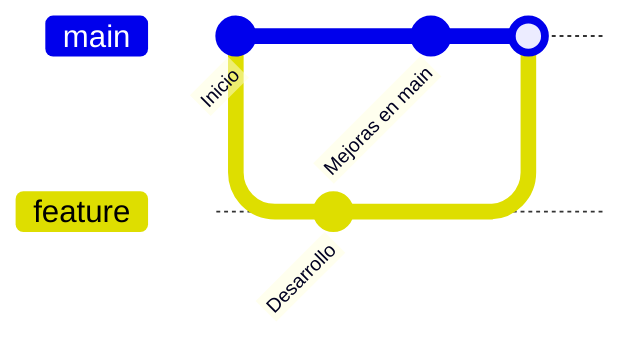
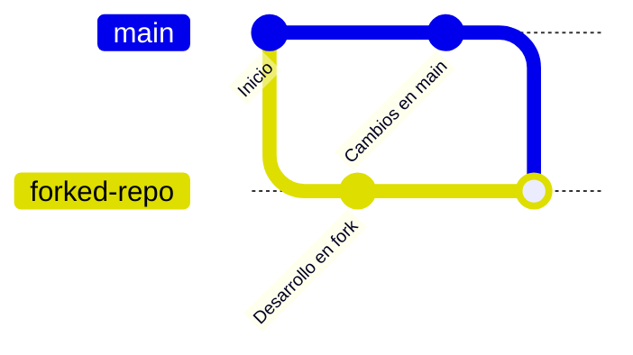
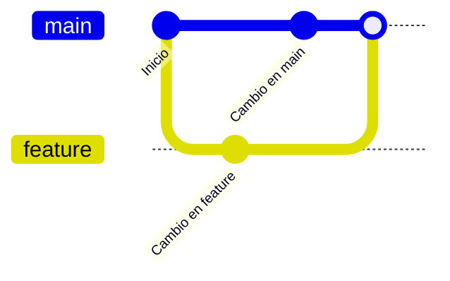

```mermaid
sequenceDiagram
    autonumber
    participant BitKeeper as 2002: BitKeeper
    participant Git as 2005: Creación de Git
    participant GitHub as 2008: Fundación de GitHub
    participant Microsoft as 2018: Microsoft compra GitHub
    participant Copilot as 2021: GitHub Copilot

    BitKeeper ->> Git: Herramienta inicial para el kernel de Linux
    Git ->> GitHub: Desarrollo como sistema distribuido
    GitHub ->> Microsoft: Adquisición por $7.5B
    Microsoft ->> Copilot: Lanzamiento de AI para programación
```

## ¿Qué es un repositorio?

- Un repositorio es un **almacén de código** que permite el **control de versiones**.
- Se puede almacenar de manera local o en plataformas en la nube como **GitHub, GitLab o Bitbucket**.
- Los repositorios contienen:
  - Archivos de código fuente.
  - Historial de cambios (commits).
  - Ramas (branches) para desarrollo paralelo.

---

## <span style="color:#FFD700;">📜 Reseña histórica: Origen de Git y GitHub</span>

| <span style="color:#FF4500;">Año</span> | <span style="color:#32CD32;">Tecnología</span> | <span style="color:#1E90FF;">Descripción</span> |
|------|-------------|-------------|
| **<span style="color:#FF4500;">2002</span>** | <span style="color:#32CD32;">BitKeeper</span> | <span style="color:#1E90FF;">Primer sistema usado en el desarrollo del kernel de Linux.</span> |
| **<span style="color:#FF4500;">2005</span>** | <span style="color:#32CD32;">Git</span> | <span style="color:#1E90FF;">Linus Torvalds desarrolla Git tras la ruptura con BitKeeper.</span> |
| **<span style="color:#FF4500;">2008</span>** | <span style="color:#32CD32;">GitHub</span> | <span style="color:#1E90FF;">Chris Wanstrath, P. Hyett y Tom Preston-Werner fundan GitHub.</span> |
| **<span style="color:#FF4500;">2018</span>** | <span style="color:#32CD32;">Microsoft compra GitHub</span> | <span style="color:#1E90FF;">Adquirido por Microsoft por $7.5B.</span> |
| **<span style="color:#FF4500;">2021</span>** | <span style="color:#32CD32;">GitHub Copilot</span> | <span style="color:#1E90FF;">AI que ayuda a escribir código con sugerencias automáticas.</span> |

---





---

## Comandos básicos de Git

```bash
# Inicializar un nuevo repositorio
git init

# Agregar archivos al seguimiento
git add archivo.txt
git add .

# Crear un commit con un mensaje
git commit -m "Primer commit"

# Ver historial de commits
git log --oneline

# Subir cambios al repositorio remoto
git push origin main

# Obtener cambios del repositorio remoto
git pull origin main
```

---

## Listar archivos en el repositorio

```bash
# Ver archivos en el directorio de trabajo
ls

# Ver archivos en staging
git status

# Ver archivos en commit
git log --name-status
```

---

## Trabajar con ramas (branches)

```bash
# Crear una nueva rama
git branch nueva-rama

# Cambiar de rama
git checkout nueva-rama

# Listar todas las ramas
git branch -a

# Traer actualizaciones del remoto
git fetch

# Cambiar de rama asegurándose de traer cambios
git checkout -b nueva-rama origin/nueva-rama
```

---


---


---

## `push --force`: ¿Cuándo usarlo?

```bash
git push --force
```

- **Úsalo con cuidado** ⚠️.
- Reescribe el historial en el remoto.
- Solo debe usarse si nadie más ha trabajado en la misma rama.
- Alternativa segura: `git push --force-with-lease`.

---

## Forks y Pull Requests en GitHub



- Un **fork** es una copia de un repositorio para trabajar independientemente.
- Un **pull request (PR)** solicita la fusión de los cambios desde el fork al repositorio original.

---

## Merge y resolución de conflictos

```bash
# Unir una rama a main
git checkout main
git merge feature

# Resolver conflictos
git status
nano archivo_con_conflictos.txt
git add archivo_con_conflictos.txt
git commit -m "Conflicto resuelto"
```



---

## Conclusión y recursos

- **Git es fundamental** para el desarrollo de software moderno.
- **GitHub facilita la colaboración** en proyectos de código abierto y privados.
- **Practica con ramas y merges** para mejorar tu fluidez con Git.

 💡 **Recurso recomendado:**  
[Pro Git Book (Scott Chacon)](https://git-scm.com/book/en/v2)

---
