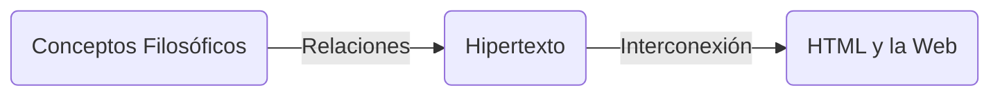
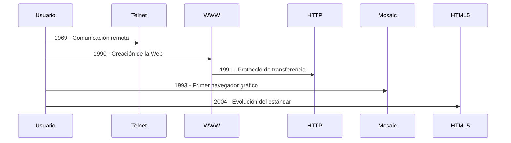
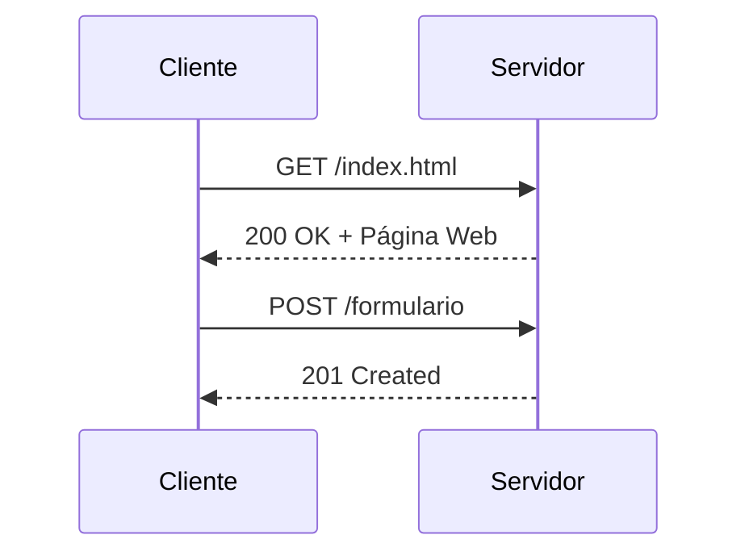
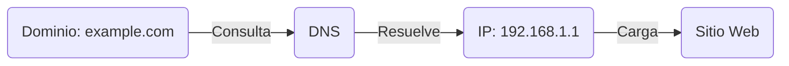
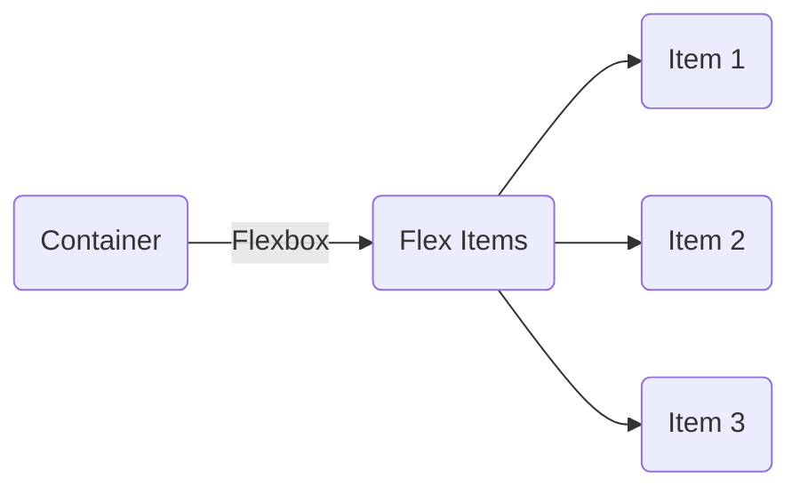

<grid drag="60 55" drop="5 10" bg="black" align="left">
## Introducción a HTML, CSS y JavaScript
#### Clase 1
</grid>

<grid drag="-5 10" drop="5 -10" bg="black">
![[i1-header]]
</grid>

<grid drag="25 55" drop="-5 10" bg="black" align="top">
→ Historia de HTML y los hipertextos<br>
→ protocolos web<br>
→ CSS y JavaScript<br>
</grid>

---

## 🌍 Orígenes de la Web y los hipertextos


---

- HTML nace como una **solución a la organización de la información** en la web.
- Predecesores:
  - **Vannevar Bush** (1945) - "Memex"
  - **Ted Nelson** (1965) - "Xanadu"
  - **Douglas Engelbart** (1968) - "NLS"
- Un **hipervínculo** es un concepto inspirado en la **topología matemática** y la **red de ideas en la filosofía**

---



---

## 📜 Cronología de la Web

<p class="fragment"> <b>1969</b>  Telnet  Comunicación remota entre computadoras. </p>
 <p class="fragment"><b> 1990</b>   WWW   Tim Berners-Lee crea la World Wide Web. </p>
 <p class="fragment"><b> 1991</b>   HTTP   Primer protocolo de transferencia de hipertexto.  </p>
 <p class="fragment"><b> 1993</b>   Mosaic   Primer navegador con soporte gráfico.  </p>
<p class="fragment"> <b>2004</b>   HTML5   Nueva versión con soporte multimedia.  </p>
note:
# Historia de la Web: Avances Tecnológicos y Conexiones con la Ciencia, la Matemática y la Filosofía

La evolución de la Web es un reflejo de la interacción entre el progreso tecnológico, los fundamentos matemáticos y científicos, y la filosofía que ha guiado la construcción de sistemas abiertos, descentralizados y accesibles. A través de cinco hitos fundamentales—Telnet (1969), la creación de la World Wide Web (1990), el desarrollo de HTTP (1991), el navegador Mosaic (1993) y la llegada de HTML5 (2004)—se puede trazar un recorrido desde los primeros experimentos en redes hasta la infraestructura digital actual.

## **1969: Telnet y la Comunicación Remota**
Telnet fue una de las primeras herramientas que permitieron la comunicación remota entre computadoras a través de redes. Desarrollado en el marco de **ARPANET**, su función principal era permitir el acceso remoto a sistemas informáticos, estableciendo la base para la interconexión global.

Desde el punto de vista matemático y computacional, Telnet dependía de los primeros modelos de **computación distribuida** y **teoría de redes**, con especial énfasis en los protocolos de comunicación de paquetes desarrollados por **Leonard Kleinrock**. A nivel filosófico, este avance encajaba con la idea cibernética de **Norbert Wiener**, quien postulaba la comunicación como un elemento clave en los sistemas de control y en la evolución de la inteligencia artificial.

> *Contexto socioeconómico:* La Guerra Fría impulsó la creación de ARPANET como una red resistente a fallos, lo que marcó el inicio de la digitalización estratégica.

## **1990: La Creación de la World Wide Web**
Tim Berners-Lee, un físico y programador británico, desarrolló la **World Wide Web** en el CERN con el objetivo de compartir información científica entre investigadores. Su modelo se basó en **hipertexto**, una estructura no lineal de navegación que había sido teorizada por **Ted Nelson** en los años 60.

Desde la matemática, la Web puede entenderse como un **grafo dirigido**, en el cual los nodos representan páginas y los enlaces las conexiones entre ellas. A nivel filosófico, la Web representó un cambio en la epistemología del conocimiento: la información dejó de organizarse de manera jerárquica y se convirtió en un sistema **reticular y descentralizado**, en línea con la visión de la **hipertextualidad de Derrida** y la **rizomática de Deleuze y Guattari**.

> *Contexto socioeconómico:* El final de la Guerra Fría trajo consigo un período de optimismo tecnológico, donde la información comenzó a verse como un bien público.

## **1991: HTTP y el Protocolo de Transferencia de Hipertexto**
El **Hypertext Transfer Protocol (HTTP)** fue desarrollado como el estándar para la comunicación entre clientes y servidores web. Su importancia radica en que estableció una **arquitectura cliente-servidor**, basada en la solicitud y respuesta de recursos digitales.

Desde un punto de vista técnico, HTTP introdujo un modelo basado en **sockets y estados efímeros**, optimizado bajo los principios de la teoría de la información de **Claude Shannon**. En términos filosóficos, HTTP consolidó la Web como un espacio de acceso abierto, en línea con las ideas del **software libre** defendidas por **Richard Stallman**.

> *Contexto socioeconómico:* La globalización de las telecomunicaciones impulsó la adopción masiva de Internet en ámbitos académicos y gubernamentales.

## **1993: Mosaic, el Primer Navegador Gráfico**
El navegador Mosaic, desarrollado por Marc Andreessen y su equipo en el **NCSA (National Center for Supercomputing Applications)**, fue el primer software en ofrecer una interfaz gráfica amigable para la navegación web.

Matemáticamente, Mosaic representó una aplicación práctica de las **interfaces gráficas de usuario (GUI)**, una línea de desarrollo basada en la geometría computacional y la representación visual de datos. Filosóficamente, marcó el inicio de la **navegación hipermedial**, una forma de exploración del conocimiento que retomaba la idea de la **enciclopedia digital soñada por Vannevar Bush** en su concepto de *Memex*.

> *Contexto socioeconómico:* El auge de las computadoras personales permitió la masificación de la Web, llevando la información digital a usuarios no especializados.

## **2004: HTML5 y la Evolución de la Web Semántica**
El estándar **HTML5**, lanzado en 2004, representó un avance significativo al incorporar soporte nativo para **video, audio y gráficos interactivamente** sin necesidad de complementos externos como Flash.

Desde la perspectiva matemática y computacional, HTML5 reforzó el modelo de **documentos estructurados en árboles DOM**, optimizando su procesamiento con tecnologías como **JSON y AJAX**. A nivel filosófico, HTML5 impulsó la **Web semántica**, una idea propuesta por Tim Berners-Lee que buscaba dotar de significado a los datos en la Web, en línea con los principios de la **lingüística computacional** y la **inteligencia artificial simbólica**.

> *Contexto socioeconómico:* La Web 2.0 consolidó la era de la interactividad, permitiendo la expansión de redes sociales y plataformas colaborativas.

## **Conclusión**
La historia de la Web es un testimonio de la convergencia entre ciencia, matemática y filosofía. Desde los primeros protocolos de conexión hasta la hiperconectividad actual, cada avance ha estado ligado a una concepción del conocimiento, la comunicación y la interacción digital, impulsada por los desafíos y oportunidades de cada época.

---

## 🔗 HTTP, HTTPS y el flujo de datos en la web

- **HTTP**: "HyperText Transfer Protocol"
- **Tipos de métodos**:
  - `GET` 📥 (Solicitar datos)
  - `POST` 📤 (Enviar datos)
  - `PUT` 📝 (Actualizar datos)
  - `DELETE` ❌ (Eliminar datos)
- **HTTPS**: HTTP + Seguridad (cifrado con SSL/TLS).

---


---

## 🌎 Dominios, Hosts y DNS

- **Host**: Un servidor en la red.
- **Dominio**: Nombre que identifica un sitio web (ej. `example.com`).
- **DNS**: Traductor de nombres a direcciones IP.



---

## 🏗️ Estructura básica de HTML

```html
<!DOCTYPE html>
<html lang="es">
<head>
  <meta charset="UTF-8">
  <title>Mi primera página</title>
</head>
<body>
  <h1>¡Hola, mundo!</h1>
  <p>Bienvenido a mi sitio web.</p>
</body>
</html>
```

---

## 🚀 Atajos con Emmet

- `! + Tab` → Plantilla base HTML.
- `ul>li*5` → Lista con 5 ítems.
- `div#caja.clase1.clase2` → `<div id="caja" class="clase1 clase2"></div>`

---

## 🎨 CSS: Introducción y Flexbox

```css
body {
  background-color: black;
  color: white;
  display: flex;
  justify-content: center;
  align-items: center;
  height: 100vh;
}
```



---

## 🔥 Introducción a JavaScript

```js
// Mostrar un mensaje en la consola
console.log("Hola, JavaScript!");

// Manejo de variables
let nombre = "Luciano";
alert("Bienvenido, " + nombre);
```

---

## 🎮 Interacción con HTML

```html
<button id="miBoton">Haz clic</button>
<input type="text" id="miInput">
```

```js
document.getElementById("miBoton").addEventListener("click", function() {
  let valor = document.getElementById("miInput").value;
  alert("Escribiste: " + valor);
});
```

---

## 🎯 Conclusión

- HTML estructura el contenido.
- CSS lo estiliza.
- JavaScript lo hace interactivo.
- **Próxima clase:** Profundizando en eventos y lógica en JS.

💡 **Recurso recomendado:**
[MDN Web Docs - Guía de HTML, CSS y JS](https://developer.mozilla.org/)

---
