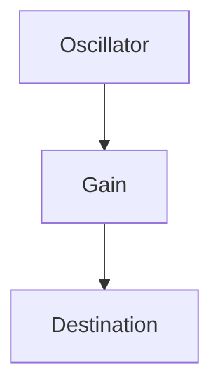
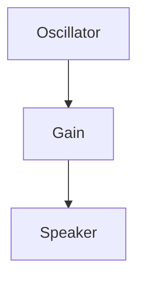
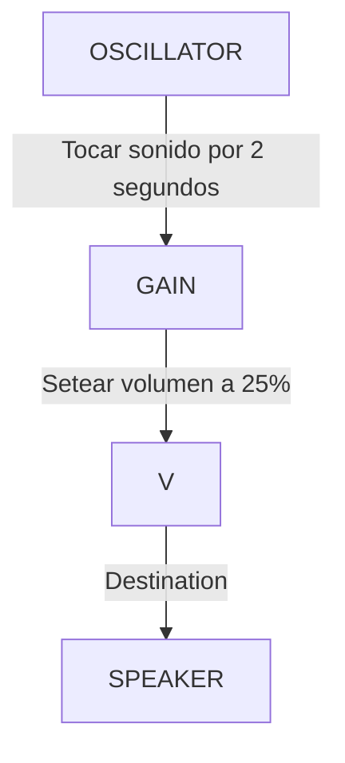

![[https://miro.medium.com/v2/resize:fit:1400/1*4Os1vrHcjSxsUiMb1fVoMQ.jpeg]]
---

# Web Audio API
- Una API web de alto nivel para procesar y sintetizar audio en aplicaciones web (es decir, JavaScript)
- Recomendación del W3C: [https://www.w3.org/TR/webaudio/](https://www.w3.org/TR/webaudio/)
- Desarrollado por el Grupo de Trabajo de Audio del W3C (Apple, BBC, Google, Mozilla...)
- Soporte maduro entre navegadores: [https://caniuse.com/audio-api](https://caniuse.com/audio-api)
---
# Web Audio API: Características
- Enrutamiento modular
- Flotadores de 32 bits para procesamiento de alto rango dinámico
- Reproducción de sonido programada con precisión de muestreo y baja latencia
- Automatización de parámetros de audio
- Integración con WebRTC y HTMLMediaElement
- Síntesis y procesamiento mediante JavaScript
---
# Web Audio API: Recursos
- Libro Web Audio API (Smus)
- MDN: API de audio web
- Repositorio de código de ejemplo de Music 220A
- W3C Web Audio API Spec
---

# Hipérfonos  I1
---
- Tu navegador preferido
- Su editor de código preferido (por ejemplo, [https://code.visualstudio.com/](https://code.visualstudio.com/))
- Terminal (para Windows)
- Opcional: Cuenta de GitHub ([https://github.com/](https://github.com/))
- Opcional: Cuenta Code Sandbox ([https://codesandbox.io/](https://codesandbox.io/))
---
# Tutorial:
**¡Hola Sinusoide!**
---


---

<pre><code data-line-numbers="1|2|3">const context = new AudioContext();
const osc = new OscillatorNode(context);
const amp = new GainNode(context);
</code></pre>

---


---

<pre><code data-line-numbers="1|2|3|4|5">const context = new AudioContext();
const osc = new OscillatorNode(context);
const amp = new GainNode(context);
osc.connect(amp);
amp.connect(context.destination);
// Or, osc.connect(amp).connect(context.destination);
</code></pre>
---

---

```javascript
const context = new AudioContext();
const osc = new OscillatorNode(context);
const amp = new GainNode(context);
osc.connect(amp);
amp.connect(context.destination);
// Or, osc.connect(amp).connect(context.destination);
osc.start(0.0);
osc.stop(2.0);
amp.gain.value = 0.25;
```
---
# Consejo:
**Reproducción automática y gestos del usuario**

---

```html
<button id="start">Start</button>
<script>
 const buttonEl = document.getElementById('start');
 buttonEl.addEventListener('click', () => {
 // Your Web Audio code should start here.
 osc.start();
 context.resume();
 }, {once: true});
</script>
```
---

https://hp001.surge.sh/
---

<iframe src="https://hp001.surge.sh/" allow="fullscreen" allowfullscreen="" style="height:100%;width:100%; aspect-ratio: 16 / 9; "></iframe>

---

<iframe src="https://soog.zztt.org" allow="fullscreen" allowfullscreen="" style="border:black;height:100%;width:100%; aspect-ratio: 16 / 9; "></iframe>

---
