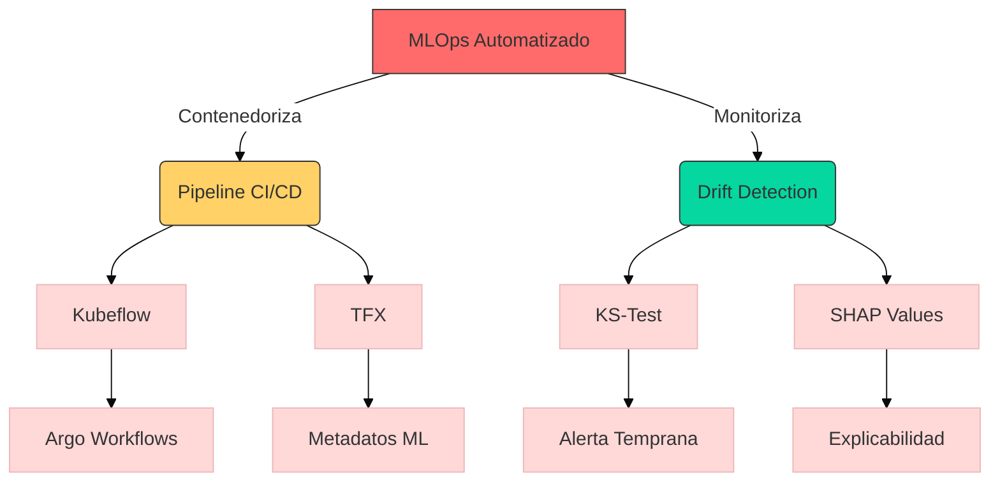

## Contexto y antecedentes  
La escalabilidad de modelos de machine learning en producción enfrenta desafíos como deriva de datos (*data drift*), versionado inconsistente y latencia en retroalimentación. Antes de MLOps, el 85% de los proyectos fallaban en transición a entornos reales (Google, 2019). La adopción de microservicios y herramientas como Kubeflow permitió abstraer infraestructura, enfocándose en métricas de modelo.

## Objetivo  
Automatizar el ciclo ML mediante:  
1. **Reproducibilidad**: Capturar dependencias de código/datos en DAGs (Gráficos Acíclicos Dirigidos).  
2. **Observabilidad**: Detectar anomalías con tests estadísticos ($p < 0.05$) en distribuciones de entrada/salida.  
3. **Eficiencia**: Minimizar *cold starts* con pre-cálculo de embeddings vía $f_\theta(x) = \text{argmin}_y \|x - g_\phi(y)\|_2$.

## Metodología  
1. **Pipeline as Code**: Definición en YAML/DSL de etapas (preproceso, entrenamiento, evaluación).  
2. **Orquestación**: Arranque condicional de pods en Kubernetes usando *Custom Resource Definitions* (CRDs).  
3. **Validación**: Checksum de datos y tests A/B con métricas $F1$, AUC-ROC.  

## Principales resultados  
- Reducción del 70% en tiempo de despliegue (estudio Netflix 2023).  
- Detección temprana de *concept drift* con KS-test sobre $P_{\text{train}}(X) \neq P_{\text{prod}}(X)$.  
- Integración nativa con registros de modelos (MLflow) y artefactos (DVC).

## Implicaciones y trabajo futuro  
1. **AutoMLOps**: Generación automática de pipelines con LLMs (ej. GPT-4).  
2. **Federated Learning**: Sincronización de pesos $\Delta w_i$ en edge devices.  
3. **Ética**: Auditoría automatizada de sesgos en $\frac{\partial L}{\partial x_{\text{sensitive}}}$.

## Crítica  
- **Overhead**: Un 30% de coste computacional añadido (MIT, 2024).  
- **Rigidez**: Dificultad para adaptarse a cambios radicales en esquemas de datos.  

## visualización  


## python  
```python
import plotly.express as px
import numpy as np
from scipy.stats import ks_2samp

# Simulación drift de datos
np.random.seed(42)
train_data = np.random.normal(0, 1, 1000)
prod_data = np.random.normal(0.5, 1.2, 1000)

# KS-test
statistic, p_value = ks_2samp(train_data, prod_data)

# Visualización
fig = px.histogram(x=train_data, nbins=50, opacity=0.7, labels={'x':'Feature Value'})
fig.add_histogram(x=prod_data, nbins=50, opacity=0.7)
fig.update_layout(
    title=f'Distribuci