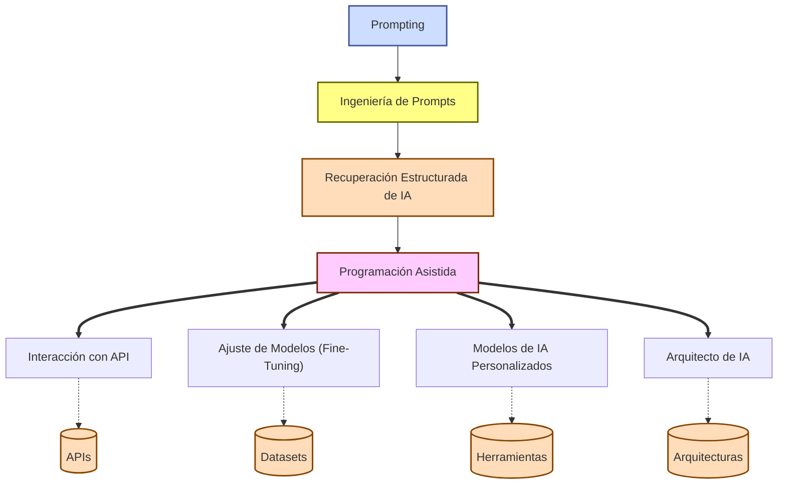

1. **Prompting** → Uso básico de IA mediante instrucciones directas.

2. **Ingeniería de Prompts** → Diseño estratégico de prompts para obtener respuestas optimizadas / estructura

3. **Recuperación Estructurada de IA** → Uso de IA para generar respuestas estructuradas basadas en bases de datos o modelos específicos.

4. **Programación Asistida** → Uso de asistentes de código como **Cursor, Copilot, Codeium, Amazon CodeWhisperer**, que completan y corrigen código en tiempo real. *VibeCoding*. 

5. **Interacción con API** → Integración de IA en flujos de trabajo mediante APIs (ej. OpenAI, Hugging Face, Cohere, Deepseek ).

6. **Ajuste de Modelos (Fine-Tuning)** → Modificación de modelos preexistentes con datasets personalizados (ej. Fine-tuning de GPT, Llama, T5).

7. **Modelos de IA Personalizados** → Creación de modelos propios a pequeña escala con herramientas como **BERT, LLaMA, Mistral, RWKV**.

8. **Arquitecto de IA** → Desarrollo de nuevos paradigmas en IA, diseñando arquitecturas, datasets y modelos desde cero.

  

Este nuevo **nivel 4 (“Programación Asistida”)** es clave porque se ha convertido en un **punto intermedio** entre la simple interacción con IA y la integración de APIs, marcando la transición hacia el uso productivo y técnico de la inteligencia artificial en el código.

