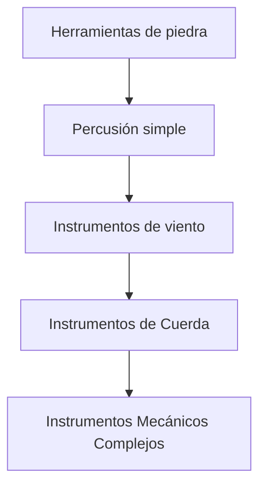
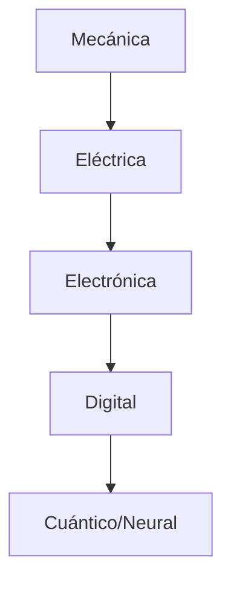

### 1️⃣ Proto-Cognición y Simbolismo Primitivo (~500.000 - 30.000 AEC)
**Cognición Humana** | **Complejidad de los Instrumentos Musicales**
--------------------------------------------|-------------------------------------------
Los neandertales experimentan con el fuego (~500.000 a.C.) | Golpeo de piedras (acción percusiva, sin resonancia)
Herramientas de piedra → lógica procedimental (~300.000 a.C.) | Soplado de tubos abiertos (huesos huecos, flautas naturales)
Pinturas rupestres → proto-simbolismo (~70.000 a.C.) | Canto (problemático debido a la complejidad del control de la laringe)
Lenguaje abstracto (~30.000 a.C.) | Arqueo (conexión entre anisotropía de la madera y resonancia)

### 2️⃣ Escritura y abstracción simbólica (~3.500 AEC - 1.000 AEC)
**Cognición humana** | **Complejidad de los instrumentos musicales**
--------------------------------------------|-------------------------------------------
Escritura cuneiforme (sumerios, ~3.300 a.C.) | Soplado de tubo cerrado (cuernos de concha, trompetas primitivas)
Alfabeto fenicio (~1.000 a.C.) | Tamborileo (percusiones de membrana, golpes de piel)
Aritmética de base 60 (babilonios, ~1.800 a.C.) | Tintineo de metales de la Edad de Bronce (campanas, gongs)

### 3️⃣ Geometría, lógica y pensamiento estructurado (~1.000 AEC - 300 AEC)
**Cognición humana** | **Complejidad de los instrumentos musicales**
--------------------------------------------|-------------------------------------------
Geometría euclidiana (~300 a.C.) | Pulsación de cuerdas (liras, arpas)
Formalismo lógico griego (~500 a.C.) | Cuencos (cuencos cantores en Asia)
Afinación pitagórica (~500 a.C.) | Batir de platos (címbalos)

### 4️⃣ Álgebra, Teoría de Números y Renacimiento (~300 EC - 1600 EC)
**Cognición humana** | **Complejidad de los instrumentos musicales**
--------------------------------------------|-------------------------------------------
Números hindúes-árabes (~500 d.C.) | Primeros instrumentos de arco (rebec, vielle)
Números complejos (Bombelli, ~1572 d.C.) | Primera mecanización del teclado (clavicordio, clave)
Geometría analítica de Descartes (~1637 d.C.) | Mecanismos de órgano (primera automatización de la música)

### 5️⃣ Cálculo, computación y la Ilustración (~1600 - 1900 CE)
**Cognición humana** | **Complejidad de los instrumentos musicales**
--------------------------------------------|-------------------------------------------
Leibniz y Newton inventan el cálculo (~1670 d.C.) | Pianoforte → evolución del control del sostenido y la resonancia
Álgebra de Boole (Boole, ~1854 d.C.) | Orquestas mecanizadas (cajas de música que se tocan solas)
Termodinámica (~1850 d.C.) | Materiales industriales en la fabricación de instrumentos (latón, cuerdas de acero)

### 6️⃣ Teoría de la Información y Computación Formal (~1900 - 1950 CE)
**Cognición humana** | **Complejidad de los instrumentos musicales**
--------------------------------------------|-------------------------------------------
Teorema de incompletitud de Gödel (~1931 EC) | Primeros instrumentos eléctricos (Theremin, Ondes Martenot)
Máquina universal de Turing (~1936 d.C.) | Música electrónica basada en cintas (musique concrète)
Teoría de la información de Shannon (~1948) | Primeros sintetizadores analógicos (Moog, Buchla)

### 7️⃣ IA, informática digital y tecnología moderna (~1950 - 2000 CE)
**Cognición humana** | **Complejidad de los instrumentos musicales**
--------------------------------------------|-------------------------------------------
Principios del aprendizaje profundo (~1960s) | MIDI (estandarización de instrumentos digitales)
Redes neuronales (~1990s) | Sintetizadores totalmente digitales (síntesis FM, DX7)
Principios de la computación cuántica (~2000s) | Producción musical virtual (DAWs, VSTs, composición algorítmica)

### 8️⃣ Aprendizaje automático y LLM (~2000 - Actualidad)
| **Cognición humana** | **Complejidad de los instrumentos musicales** |
| -------------------- | --------------------------------------------- |
| Transformer models (~2017 CE) | AI-generated music (Jukebox, OpenAI Musenet)             |
| GPT architectures (~2020 CE)  | Neural synthesis (DDSP, ML-assisted sound design)        |
| Neurosymbolic AI (~future?)   | Hyper-adaptive instruments, **AI-Augmented Composition** |


```bibtex
@book{deacon1997symbolic,
  author = {Terrence W. Deacon},
  title = {The Symbolic Species: The Co-evolution of Language and the Brain},
  year = {1997},
  publisher = {W. W. Norton & Company},
  address = {New York},
  keywords = {cognition, language, evolution}
}

@book{damerow2007development,
  author = {Peter Damerow},
  title = {The Development of Arithmetic Concepts and the Origin of Writing},
  year = {2007},
  publisher = {Springer},
  keywords = {numerical cognition, early writing, mathematics history}
}

@book{netz1999shaping,
  author = {Reviel Netz},
  title = {The Shaping of Deduction in Greek Mathematics: A Study in Cognitive History},
  year = {1999},
  publisher = {Cambridge University Press},
  keywords = {mathematics, cognition, Greek logic}
}

@book{kragh2018history,
  author = {Helge Kragh},
  title = {Quantum Generations: A History of Physics in the Twentieth Century},
  year = {2018},
  publisher = {Princeton University Press},
  keywords = {calculus, physics, computation}
}

@article{goodfellow2016deep,
  author = {Ian Goodfellow and Yoshua Bengio and Aaron Courville},
  title = {Deep Learning},
  journal = {MIT Press},
  year = {2016},
  keywords = {machine learning, AI, computation}
}

@book{hofstadter1979godel,
  author = {Douglas Hofstadter},
  title = {Gödel, Escher, Bach: An Eternal Golden Braid},
  year = {1979},
  publisher = {Basic Books},
  keywords = {cognition, self-reference, logic}
}
```


# Tecnología musical Evolución y desarrollo humano

## Cronología con referencias cruzadas

### Era Prehistórica (100.000+ AEC - 3.000 AEC)
#### Piedra y Percusión (100.000+ AEC)
- Desarrollo musical**: Golpeo de piedras, tamborileo de troncos
- Relación fisiológica**: Desarrollo de la motricidad fina de las manos
- Conexión matemática**: Conteo rítmico básico, división primitiva del tiempo

#### Primeros instrumentos de viento (35.000+ a.C.)
- Desarrollo musical**: Flautas de hueso, tubos abiertos
- Vínculo fisiológico**: Desarrollo del control de la respiración, destreza de los dedos
- Conexión matemática**: Descubrimiento de la serie armónica a través de los armónicos naturales

#### Descubrimiento de las cuerdas (15.000+ AEC)
- Desarrollo musical**: Arcos musicales, arpas primitivas
- Relación fisiológica**: Mejora de la coordinación mano-ojo
- Conexión matemática**: Comprensión de las relaciones entre la longitud de las cuerdas y la afinación

### Civilizaciones antiguas (3.000 a.C.-500 d.C.)
#### Metalurgia y música (3.000+ AEC)
- Desarrollo musical**: Campanas de bronce, instrumentos metálicos
- Relación fisiológica**: Aumento de la capacidad de discriminación auditiva
- Conexión matemática**: Desarrollo de sistemas de afinación precisos

#### Teclados primitivos (300 a.C.)
- Desarrollo musical**: Hydraulis, órganos de agua
- Enlace fisiológico**: Coordinación bilateral compleja
- Conexión matemática**: Comprensión de la neumática y la mecánica

## Tabla de análisis comparativo


| Era          | Musical Innovation | Physiological Development | Mathematical/Scientific Advance |
| ------------ | ------------------ | ------------------------- | ------------------------------- |
| 100,000+ BCE | Stone Percussion   | Motor Cortex Development  | Basic Counting                  |
| 40,000+ BCE  | Rattles/Shakers    | Rhythmic Body Movement    | Pattern Recognition             |
| 35,000+ BCE  | Bone Flutes        | Breath Control            | Harmonic Series Discovery       |
| 30,000+ BCE  | Open Tubes         | Respiratory Control       | Acoustic Physics (unconscious)  |
| 15,000+ BCE  | Bow String         | Fine Motor Skills         | String Length Ratios            |
| 3,000+ BCE   | Metal Bells        | Pitch Discrimination      | Bronze Age Mathematics          |
| 500 BCE      | Pythagoras Scale   | -                         | Mathematical Music Theory       |
| 300 BCE      | Water Organ        | Bilateral Coordination    | Mechanical Engineering          |
| 900 CE       | Mechanical Keys    | Complex Motor Planning    | Mechanical Computation          |
| 1700 CE      | Piano Action       | Enhanced Motor Precision  | Complex Mechanics               |
| 1800s        | Electronics        | -                         | Electromagnetic Theory          |
| 1900s        | Electronic Sound   | -                         | Signal Processing               |
| 2000s        | Digital Audio      | Brain-Computer Interface  | Digital Signal Processing       |


## Correlación del desarrollo cerebral

### Desarrollo del Procesamiento Acústico
1. **Percusión temprana (100.000+ AEC)**
   - Desarrollo del procesamiento del lóbulo temporal
   - Mayor reconocimiento del ritmo
   - Reconocimiento básico de patrones sonoros

2. **Instrumentos melódicos (35.000+ a. C.)**.
   - Desarrollo de centros de procesamiento del tono
   - Discriminación de frecuencias mejorada
   - Desarrollo de la memoria melódica

3. **Instrumentos complejos (3.000+ a.C.)**.
   - Integración de múltiples regiones cerebrales
   - Mejora del procesamiento cognitivo
   - Desarrollo del pensamiento musical abstracto

### Evolución de la comprensión matemática

#### Periodo temprano (100.000 - 30.000 a.C.)
- Conteo básico a través del ritmo
- Reconocimiento de patrones simples
- Organización temporal

#### Periodo Medio (30.000 - 3.000 a.C.)
- Comprensión de las proporciones a través de la longitud de las cuerdas
- Desarrollo de sistemas de escalas
- Comprensión básica de la física acústica

#### Periodo Avanzado (3.000 a.C. - Presente)
- Relaciones matemáticas complejas en la música
- Desarrollo de sistemas de afinación
- Integración de las matemáticas y la teoría musical

## Principales descubrimientos matemáticos relacionados con la música

4. **Relaciones pitagóricas**
   - Descubrimiento de las relaciones armónicas
   - Desarrollo de la teoría matemática de la música
   - Fundamento de los sistemas de afinación occidentales

5. **Las secuencias Fibonacci en la música**.
   - Relaciones armónicas naturales
   - Proporción áurea en la forma musical
   - Base matemática para la composición

6. **Conexiones matemáticas modernas
   - Análisis de Fourier en el sonido
   - Tratamiento digital de la señal
   - Composición algorítmica

## Progresión tecnológica y desarrollo cognitivo

### Tecnologías antiguas (100.000 AEC - 1 EC)



### Tecnologías Modernas (1700 CE - Presente)



## Notas sobre la fuerza de correlación

### Correlaciones Fuertes
- Desarrollo del ritmo y capacidad de contar
- Discriminación del tono y pensamiento matemático
- Control motor y complejidad instrumental

### Correlaciones moderadas
- Estructura musical y comprensión matemática
- Comprensión armónica y física ondulatoria
- Diseño de instrumentos y avances en ingeniería

### Correlaciones débiles o especulativas
- Complejidad musical e inteligencia general
- Diversidad instrumental y avances sociales
- Sofisticación musical y progreso tecnológico

## Implicaciones futuras

### Tecnologías emergentes
7. **Interfaces neuronales
   - Interacción directa cerebro-música
   - Mejora de la cognición musical
   - Nuevas formas de expresión musical

8. **Música cuántica
   - Nuevas posibilidades de afinación
   - Relaciones armónicas complejas
   - Síntesis de sonido revolucionaria

9. **Inteligencia artificial y música
   - Reconocimiento de patrones mejorado
   - Nuevas técnicas de composición
   - Análisis musical avanzado

## Metodologías de investigación utilizadas
10. Pruebas arqueológicas
11. Estudios antropológicos
12. Investigaciones neurocientíficas
13. 13. Análisis matemático
14. 14. Documentación histórica

## Referencias y lecturas complementarias
[Nota: Debido a la naturaleza teórica de algunas correlaciones, se recomienda seguir investigando para verificar afirmaciones específicas.]

#música #evolución #matemáticas #neurociencia #tecnología


# Cronología unificada de la cognición humana y la evolución musical

## Análisis cronológico por dominio


| Era           | Cognitive Development                    | Mathematical/Scientific Advances       | Musical Technology                         | Physiological Changes                           |
| ------------- | ---------------------------------------- | -------------------------------------- | ------------------------------------------ | ----------------------------------------------- |
| ~500,000 a.C. | Experimentación neandertal con fuego     | Razonamiento básico causa-efecto       | Golpeo de piedras, acción percusiva        | Desarrollo de la motricidad fina                |
| ~300.000 a.C. | Creación y uso de herramientas de piedra | Surgimiento de la lógica procedimental | Selección resonante de piedras             | Mejora de la coordinación mano-ojo              |
| ~70,000 a.C.  | Pinturas rupestres, proto-simbolismo     | Reconocimiento de patrones             | Primeros instrumentos de percusión         | Especialización de la corteza motora            |
| ~35.000 a.C.  | Desarrollo temprano del lenguaje         | Razonamiento espacial                  | Flautas de hueso, tubos abiertos           | Desarrollo del control de la respiración        |
| ~30.000 a.C.  | Formación del lenguaje abstracto         | Pensamiento secuencial                 | Arqueo, resonancia de la madera            | Adaptación del sistema respiratorio             |
| ~3.500 a.C.   | Escritura cuneiforme (sumerio)           | Aritmética de base 60                  | Soplado de tubo cerrado, cuernos de concha | Discriminación auditiva mejorada                |
| ~3.000 a.C.   | Primeros sistemas de escritura           | Matemáticas de la Edad de Bronce       | Campanas de bronce, instrumentos metálicos | Perfeccionamiento de la discriminación del tono |
| ~1.800 a.C.   | Matemáticas babilónicas                  | Cálculos en base 60                    | Percusión metálica, cámaras resonantes     | Planificación motora compleja                   |
| ~1,000 AEC    | Alfabeto fenicio                         | Conteo sistemático                     | Punteo de cuerdas, liras                   | Coordinación bilateral de manos                 |
| ~500 BCE      | Greek logic formalism                    | Pythagorean tuning                     | Rubbing bowls, plate beating               | Fine muscle control                             |
| ~300 BCE      | Euclidean geometry                       | Geometric reasoning                    | Water organs (Hydraulis)                   | Complex bilateral coordination                  |
| ~500 CE       | Hindu-Arabic numerals                    | Decimal system                         | Early bowed instruments                    | Enhanced finger dexterity                       |
| ~1500 CE      | Renaissance thinking                     | Complex numbers                        | Keyboard mechanization                     | Advanced motor precision                        |
| ~1670 CE      | Calculus development                     | Mathematical physics                   | Pianoforte mechanics                       | Refined touch sensitivity                       |
| ~1850 CE      | Boolean algebra                          | Binary logic                           | Mechanized orchestras                      | Industrial-era adaptations                      |
| ~1930 CE      | Formal logic systems                     | Incompleteness theorem                 | Early electrical instruments               | Electronic interface adaptation                 |
| ~1950 CE      | Computer theory                          | Information theory                     | Analog synthesizers                        | New gestural controls                           |
| ~1980 CE      | Digital computation                      | Digital signal processing              | MIDI, digital synthesis                    | Human-computer interface                        |
| ~2000 CE      | Neural networks                          | Machine learning                       | Virtual instruments                        | Brain-computer interfaces                       |
| Present       | Transformer models, LLMs                 | Quantum computing                      | AI-generated music, neural synthesis       | Neurofeedback adaptation                        |


## Referencias específicas

### Cognitive Development
```bibtex
@book{deacon1997symbolic,
  author = {Deacon, Terrence W.},
  title = {The Symbolic Species: The Co-evolution of Language and the Brain},
  year = {1997},
  publisher = {W. W. Norton & Company}
}

@book{damerow2007development,
  author = {Damerow, Peter},
  title = {The Development of Arithmetic Concepts and the Origin of Writing},
  year = {2007},
  publisher = {Springer}
}
```

### Mathematical/Scientific Advances
```bibtex
@book{netz1999shaping,
  author = {Netz, Reviel},
  title = {The Shaping of Deduction in Greek Mathematics},
  year = {1999},
  publisher = {Cambridge University Press}
}

@book{kragh2018history,
  author = {Kragh, Helge},
  title = {Quantum Generations: A History of Physics in the Twentieth Century},
  year = {2018},
  publisher = {Princeton University Press}
}
```

### Musical Technology
```bibtex
@book{montagu2017origins,
  author = {Montagu, Jeremy},
  title = {Origins and Development of Musical Instruments},
  year = {2017},
  publisher = {Scarecrow Press}
}

@article{roads1996computer,
  author = {Roads, Curtis},
  title = {The Computer Music Tutorial},
  journal = {MIT Press},
  year = {1996}
}
```

### Physiological Changes
```bibtex
@book{mithen2005singing,
  author = {Mithen, Steven},
  title = {The Singing Neanderthals: The Origins of Music, Language, Mind and Body},
  year = {2005},
  publisher = {Harvard University Press}
}

@article{zatorre2007structure,
  author = {Zatorre, Robert J. and Chen, Joyce L. and Penhune, Virginia B.},
  title = {When the Brain Plays Music: Auditory-Motor Interactions in Music Perception and Production},
  journal = {Nature Reviews Neuroscience},
  volume = {8},
  number = {7},
  year = {2007},
  pages = {547-558}
}
```


#evolución #cognición #tecnología #neurociencia