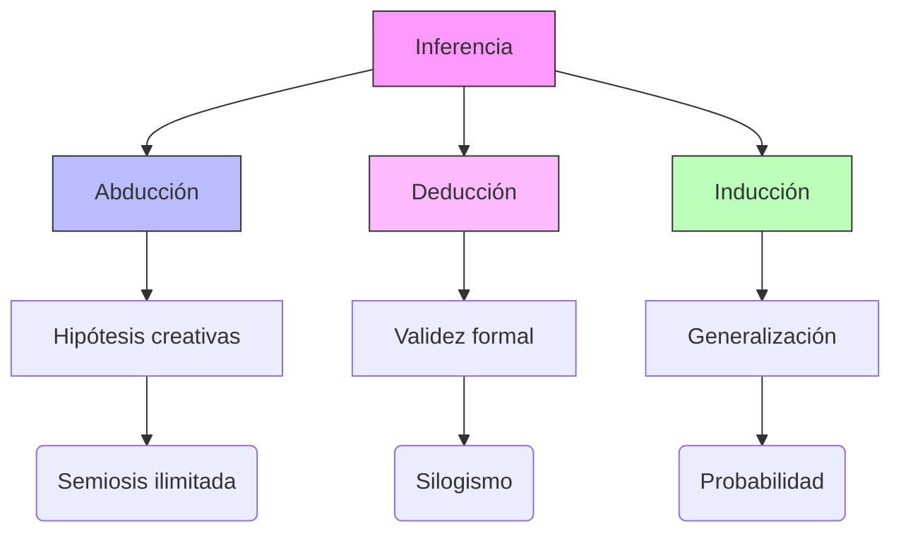

## 1. Contexto y antecedentes  
El problema central de la inferencia radica en la brecha entre observación y conocimiento. Históricamente, Aristóteles estableció las bases del silogismo deductivo, mientras que el empirismo moderno (Locke, Hume) cuestionó la validez de la inducción. Peirce amplió este marco al introducir la abducción como mecanismo para generar hipótesis explicativas ante datos ambiguos.

## 2. Objetivo  
El concepto busca formalizar cómo se asignan grados de plausibilidad a las conclusiones cuando las premisas son insuficientes. Esto implica distinguir entre certeza lógica (deducción), generalización probabilística (inducción) y creatividad hipotética (abducción).

## 3. Metodología  
Peirce empleó un enfoque triádico:  
1. **Análisis semiótico**: Relación entre signos, objetos e interpretantes.  
2. **Lógica modal**: Evaluación de posibilidades reales frente a necesarias.  
3. **Pragmatismo**: Validación mediante consecuencias prácticas.  

## 4. Principales resultados  
- La abducción explica el origen de hipótesis científicas ($H \rightarrow E$ donde $E$ es evidencia y $H$ la mejor explicación).  
- La inducción requiere probabilidad frecuentista: $P(E|H) > P(E|\neg H)$.  
- La deducción preserva la verdad: $\frac{A \rightarrow B, A}{\therefore B}$.  

## 5. Implicaciones y trabajo futuro  
Aplicaciones en IA para modelos generativos (ej. GPT-4 usa abducción implícita). Se requiere formalizar métricas para comparar hipótesis abductivas en contextos de alta incertidumbre.

## 6. Crítica  
La inferencia abductiva carece de un marco probabilístico riguroso (problema de la subdeterminación). Además, la inducción enfrenta el problema de la justificación (Hume).

## 7. Contexto musical  
En composición algorítmica, la abducción guía la generación de patrones a partir de restricciones parciales (ej. sistemas basados en Markov). La inducción subyace a modelos de estilo musical que aprenden de corpus históricos.

## 8. Visualización  


## 9. Python  
```run-python
import plotly.express as px
import numpy as np

# Modelo de plausibilidad abductiva
x = np.linspace(0, 10, 100)
y = np.exp(-(x - 5)**2 / 4)  # Distribución de hipótesis

fig = px.line(x=x, y=y, labels={'x': 'Espacio de hipótesis', 'y': 'Plausibilidad'})
fig.update_layout(title='Abducción como optimización de explicaciones')
fig.show()
```


## 11. Preguntas de estudio  
1. ¿Cómo difiere la abducción de la inducción en términos de certeza?::La abducción produce hipótesis plausibles pero inciertas, mientras la inducción generaliza patrones observados.  
2. Nombre un crítico de la inferencia inductiva::David Hume, por el problema de la justificación.  
3. ¿Qué aplicación musical tiene la abducción?::Generación de variaciones melódicas mediante restricciones parciales.  

## 12. Referencias  
```bibtex
@book{peirce1992reasoning,
  title={Reasoning and the logic of things},
  author={Peirce, Charles Sanders},
  year={1992},
  publisher={Harvard University Press}
}
```

> [!important] En mis palabras  
> ### 1  
> <*semiosis*> <*abducción*> <*pragmatismo*>  
> ### 2  
> <*hipótesis*> <*certeza*> <*silogismo*>  
> ### 3  
> <*probabilidad*> <*justificación*> <*Hume*>  
> ### 4  
> <*algoritmo*> <*Markov*> <*corpus*>  
> ### 5  
> <*plausibilidad*> <*incertidumbre*> <*GPT-4*>