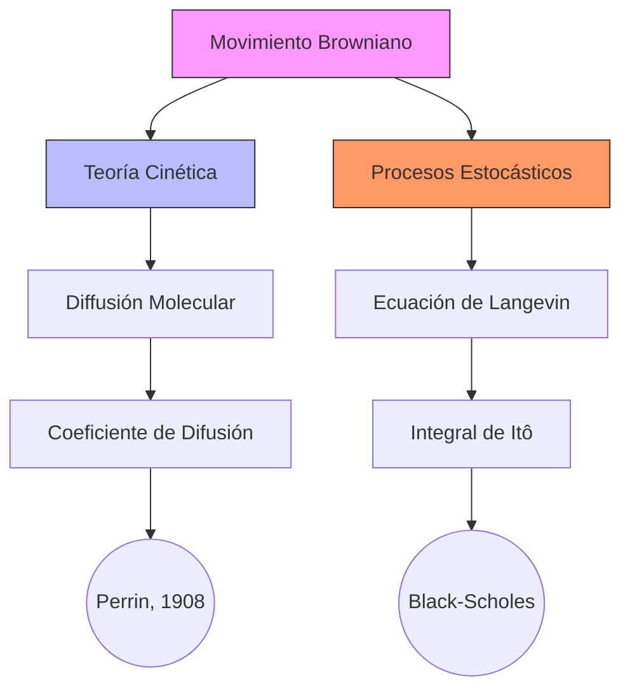

En 1827 Robert Brown, un botánico escocés, observó en el microscopio que unas partículas de polen llamadas amiloplastos se movían aleatoriamente cuando estaban suspendidas en agua, sin seguir un patrón definido. Pero no supo explicar por qué. Este misterioso movimiento pasó a ser conocido como “movimiento browniano”.


## Contexto y antecedentes  
A principios del siglo XIX, la naturaleza del calor y la materia era objeto de debate entre teorías continuistas (termodinámica clásica) y atomistas. La observación empírica de Brown carecía de marco teórico hasta que la mecánica estadística de Boltzmann y Gibbs estableció que el movimiento aleatorio era evidencia directa de la existencia de moléculas.  

## Objetivo  
Demostrar que el movimiento browniano surge de la agitación térmica molecular, cuantificando su relación con la temperatura y viscosidad del medio.  

## Metodología  
Einstein aplicó la ecuación de difusión de Fick a un ensemble de partículas, asumiendo que cada colisión molecular es independiente (proceso de Markov). La solución predice el desplazamiento cuadrático medio:  

$$
\langle x^2 \rangle = 2Dt
$$

donde $D$ es el coeficiente de difusión dado por:  

$$
D = \frac{k_B T}{6 \pi \eta r}
$$

($k_B$: constante de Boltzmann, $\eta$: viscosidad, $r$: radio de la partícula).  

## Principales resultados  
1. **Validación experimental** (Perrin, 1908): Mediciones precisas de $\langle x^2 \rangle$ confirmaron las predicciones de Einstein, estableciendo la realidad física de los átomos.  
2. **Generalización matemática**: Wiener (1923) formalizó el proceso como una función continua no diferenciable en casi todo punto.  

## Implicaciones y trabajo futuro  
- **Biología**: Modelado de transporte intracelular.  
- **Finanzas**: Simulación de mercados mediante caminos aleatorios geométricos.  
- **Open problem**: Extensión a medios no newtonianos con memoria (ecuaciones fraccionales).  

## Crítica  
La aproximación de Markov falla en sistemas con correlaciones temporales largas (e.g., polímeros en solución). Alternativas: ecuaciones de Langevin generalizadas.  

## Contexto musical  
El movimiento browniano ha inspirado estrategias compositivas aleatorias (Xenakis, *ST/48*, 1962), donde trayectorias de partículas se mapean a alturas y densidades sonoras. En síntesis granular, la distribución temporal de los granos sigue estadísticas brownianas.  

## Visualización  


## Python: Simulación de Trayectorias  
```python
import numpy as np
import plotly.express as px

def brownian_path(T=1, N=1000, dim=2):
    dt = T/N
    steps = np.random.normal(0, np.sqrt(dt), size=(N, dim))
    return np.cumsum(steps, axis=0)

paths = [brownian_path() for _ in range(50)]
fig = px.line(title="Trayectorias Brownianas 2D")
for path in paths:±±
    fig.add_scatter(x=path[:,0], y=path[:,1], mode='lines')
fig.update_layout(xaxis_title="x", yaxis_title="y")
fig.show()
```


## Representación musical  
```lily
\version "2.24.0"
\paper { tagline = ##f paper-height=#(* 5 cm) paper-width=#(* 20 cm) system-count=#1 }
\score {
    \new Staff {
        \time 4/4
        \override Stem.transparent = ##t
        \override Beam.transparent = ##t
        \relative c' {
            \repeat unfold 20 { 
                \tuplet 3/2 { c16[ d e] } f8[ g] a4 b\prall 
            }
        }
    }
}
```

## Preguntas de estudio  
1. **¿Cómo relaciona Einstein el movimiento browniano con la teoría atómica?**  
   :: Mediante la ecuación de difusión, vinculando el desplazamiento observable ($\langle x^2 \rangle$) con propiedades moleculares ($k_B$, $\eta$).  
2. **¿Qué limitaciones tiene el modelo de Wiener?**  
   :: Asume incrementos independientes, ignorando efectos de memoria en medios complejos.  
3. **Nombre una aplicación musical del concepto**  
   :: Generación estocástica de texturas en *ST/48* de Xenakis.  

## Referencias  
```bibtex
@article{einstein1905movement,
  title={On the movement of small particles suspended in a stationary liquid},
  author={Einstein, Albert},
  journal={Annalen der Physik},
  volume={17},
  pages={549--560},
  year={1905}
}
```

> [!important] En mis palabras  
> ### 1  
> *Fluctuaciones* *Difusión* *Markov*  
> ### 2  
> *Einstein* *Perrin* *Validación*  
> ### 7  
> *Xenakis* *Granular* *Estocástico*  


